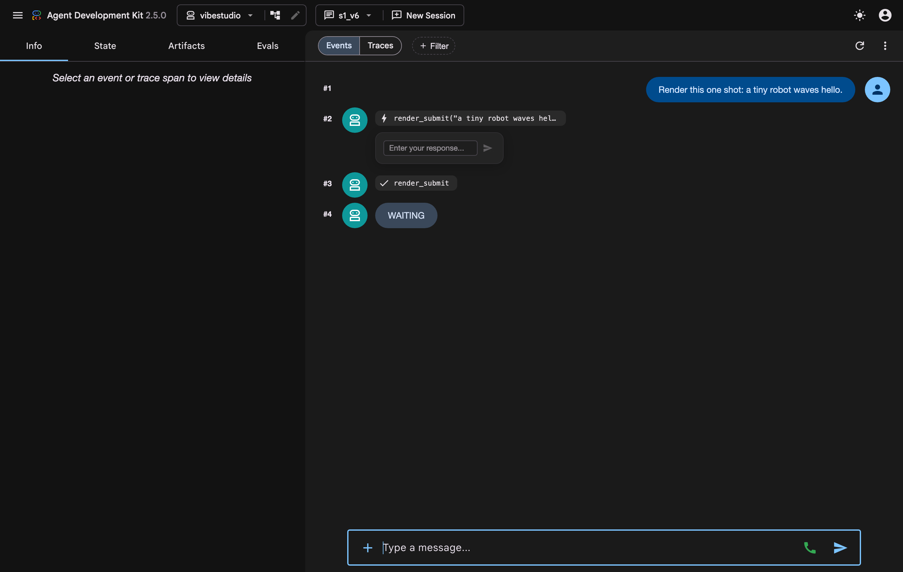
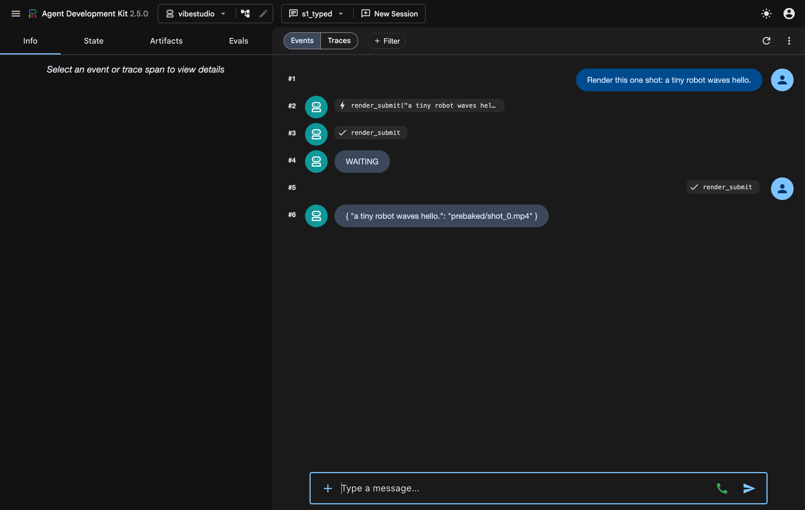
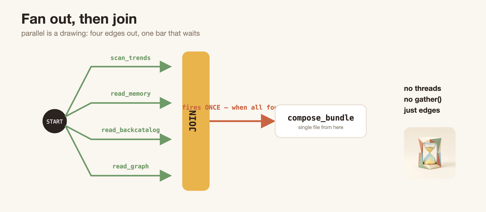
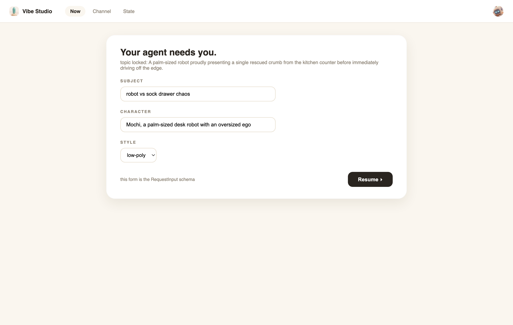
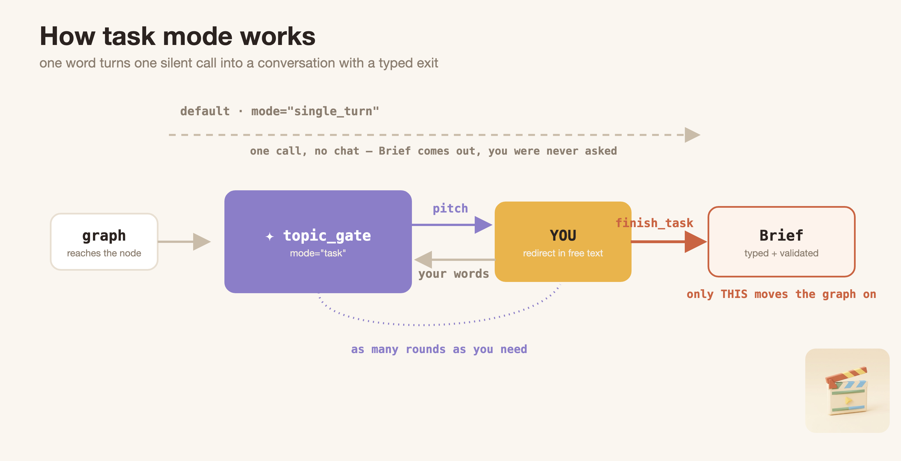
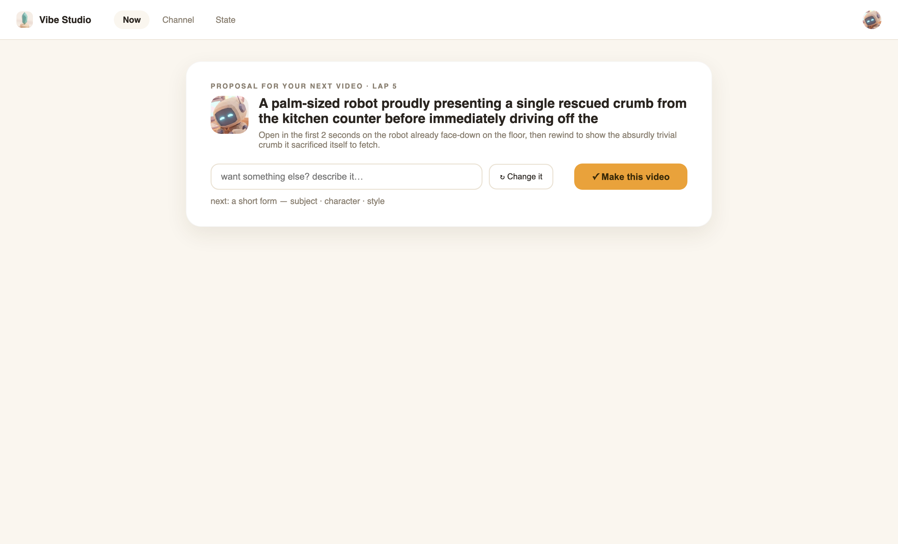
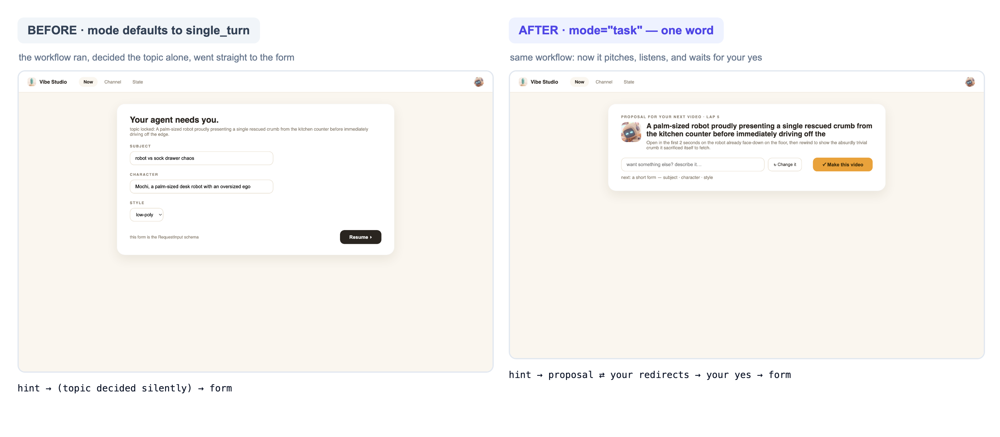
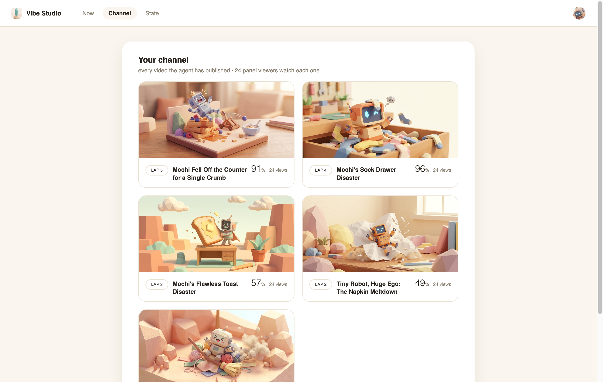
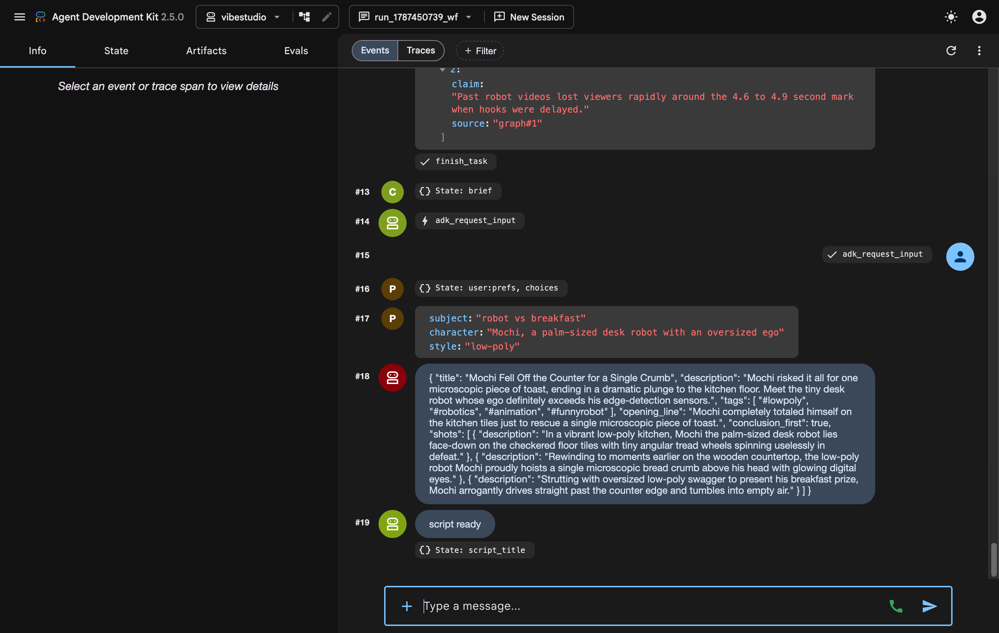

author: Annie Wang (cuppibla)
summary: Watch a long-running agent run a video channel — pauses that survive dead processes, human-in-the-loop pauses, and a five-layer state ladder ending in BigQuery and Memory Bank. You edit three tiny spots; everything else you watch run.
id: vibestudio
categories: adk,agents,bigquery,memory-bank,gemini
environments: Web
status: Draft
feedback link: https://github.com/cuppibla/vibe-studio-lab/issues

# Long-Running Workflows & Durable State with ADK

## Introduction
Duration: 0:03:00


You run a video channel. One agent does everything — but everything it does
is slow: renders take minutes, humans take longer, audiences answer tomorrow.
So the agent's real job is **waiting well**: pause without keeping a process
alive, ask you things mid-flight, and remember what matters when it comes
back.

Here is the workflow you will build, run, and open two conversations inside
of — every box is real code you will read:


Five knowledge points. The code ships complete — you read it, run it, and
watch it work:

| knowledge point | chapters | your hands-on |
|---|---|---|
| **long running** — pending is a value, not a thread | ⏳ 📬 | watch (the code ships filled) |
| **workflow** + human-in-the-loop pauses | 🗺️ 💬 🏁 📺 | one word: `mode="task"` |
| **state** — the ladder of lifetimes | 💾 | one prefix: `user:` |
| **BigQuery graph** — world state | 🌍 | watch |
| **Memory Bank** — learned state | 🧠 | one line: `memory.recall()` |

This lab is **two parts**, and every chapter belongs to exactly one:

**Part 1 · An agent that waits (⏳ 📬 🗺️ 💬 🏁 📺).** How a workflow becomes
a long-running agent: one wait resumed once, then a graph orchestrating many
waits and two human questions.

**Part 2 · State that survives (💾 🌍 🧠).** Four storage layers, and
for EACH one the same three questions get answered: *why this layer* ·
*how it connects* · *how the agent uses it*. Layer by layer: session files
(💾) → the BigQuery world graph (🌍) → Memory Bank: connect, write, and
watch the agent use it (🧠).

The app is only ever the frontend to both parts.

One law carries the whole lab: **a long-running agent is defined by where its
state lives, because its process is allowed to die.**

## 🧰 Setup
Duration: 0:08:00

This is the whole app's architecture — look at it before touching anything:


👀 What the picture shows: **Vibe Studio** (left) is the frontend — every
button on it just runs one of your backend commands. **Your backend** is the
middle box: two agents (the workflow and the render desk), the plain-python
drivers, and the `runs/` files where every wait and key lives on disk.
**adk web** (bottom) writes nothing — it reads the same `sessions.db` and
shows you raw events. And the **cloud** column is where durable state ends
up: the agent cites BigQuery and recalls Memory Bank. You will boot each
piece right before its first use.

- **What** — clone, install, and prove the toolchain is green. Nothing gets booted here.
- **Why** — every server in this lab starts right before the first step that needs it, so when a surface opens you know exactly which command owns it.
- **How** — one command block → read the map.

### Who is who

You are building the **backend** of a creator studio. `agent/` is that
backend. **Vibe Studio** (port 4600) is the frontend someone already built
for it — every button just runs one of your backend commands, and the grey
caption under each button names which one. **adk web** (port 8000) is the
inspector: it shows the raw events your backend writes, nothing more.

### Install

👉💻 In the Cloud Shell terminal (call it **tab 1** — every 👉💻 in this lab
means tab 1 unless it says otherwise). One block, and the last line proves
everything works:

```console
git clone https://github.com/cuppibla/vibe-studio-lab
cd vibe-studio-lab
uv sync
source .venv/bin/activate
cp .env.example .env
python scripts/preflight.py
```

*You should see* every line tick (Vibe Studio reports `not running yet` —
correct: the app chapter 🗺️ boots it), ending in `PREFLIGHT GREEN`.

### Read more (optional)

<aside class="positive">
<b>The repo, one breath.</b> <code>agent/</code> is the backend you'll read
and lightly edit · <code>vibestudio/</code> is an 8-line adk web entry ·
<code>app/</code> is Vibe Studio (given) · <code>world/</code> is the render
farm + platform (given) · <code>bqgraph/</code> is the graph chapter 🌍 ·
<code>checks/</code> holds the verification gates.
</aside>

<aside class="positive">
<b>Gates: how you verify a chapter.</b> <code>python -m checks.check
&lt;name&gt;</code> runs ~10 labeled assertions against the REAL artifacts
(sessions, state, the wall, BigQuery, the bank) — never a source grep. Green
means the chapter's idea physically happened. Each chapter's Read more names
its gate, they are all optional, and <code>cloudshell edit
checks/check.py</code> lets you read any of them — reviewing the gate you
just passed is a fine way to review the chapter.
</aside>

## ⏳ Start a render and watch it wait
Duration: 0:06:00


👀 What the picture shows: your text reaches the desk, the desk calls its
ONE tool — and the wrapper does two things in the same instant: the job
leaves for the farm (green), and a receipt comes straight back (orange).
The agent says WAITING and the turn is OVER. No blocking, no thread — the
only trace is a row in `sessions.db`. You are about to live this exact
picture.


- **What** — type one slow request at a raw agent, watch it stop without finishing, then kill the server and prove the wait survived.
- **Why** — the lab's load-bearing idea: *pending is a value in the session log, not a thread in memory.*
- **How** — read who you're talking to → boot adk web → type two lines → kill and restart.

### Who you are about to talk to

👉📖 Open the agent you are about to run — eight lines, read only:

```console
cd ~/vibe-studio-lab
cloudshell edit vibestudio/agent.py
```

👉 In `vibestudio/agent.py`, the whole file is two meaningful lines:

```python
from agent.desk import render_desk

root_agent = render_desk
```

- `root_agent = render_desk` — adk web looks for a folder with an
  `agent.py` exporting `root_agent`; that is the entire discovery
  convention, and the folder name (`vibestudio`) becomes the app name.
- `render_desk` itself lives in `agent/desk.py`. 👉 Open `agent/desk.py`
  in the same editor — in its tool list, the following line is this
  chapter's vocabulary word:

```python
    tools=[LongRunningFunctionTool(render_submit)],
```

**`LongRunningFunctionTool`** is the vocabulary word of this chapter: it
wraps a plain function (`render_submit` — submits a shot to the farm) and
tells ADK "this tool returns a RECEIPT immediately; the real result comes
later." That one wrapper is what makes the wait you are about to see
possible. This desk is not a practice dummy: **in the publish chapter (🏁)
it is the exact agent that renders your video's three shots.** Here you meet it alone, to
see one wait clearly.

### Start adk web (the dev UI)

👉💻 Open a **second terminal tab (tab 2)** and start ADK's dev UI:

```console
cd ~/vibe-studio-lab
source .venv/bin/activate
adk web . --port 8000 --allow_origins "*" --session_service_uri "sqlite+aiosqlite:///$PWD/runs/sessions.db"
```

👉🔬 Click **Web Preview → Change port → 8000**. Nothing to type yet — you
should be looking at this:


👀 The dropdown says `vibestudio` because that folder has an `agent.py`
exporting `root_agent` — that's the whole discovery convention.

### Type the slow request

👉🔬 In the chat box, type exactly this:

```
Render this one shot: a tiny robot waves hello.
```

*You should see* one tool call, the word **WAITING** — and then nothing. No
spinner. The turn is over:



👀 Click the `render_submit` call: its response is literally
`{"status": "pending", "job_id": "job_0", …}`. `pending` is not an error and
not a promise object — it is a **value inside a normal response**, sitting
in the session log. The farm is rendering; the agent has nothing left to do;
the invocation ended honestly.

👉🔬 Ask the obvious thing — type exactly this:

```
is it done yet?
```

*You should see* **WAITING** again. Talking to the agent does not finish the
render — text never resumes a wait.

### Kill it

👉💻 In **tab 2** (the terminal running adk web), press **Ctrl+C** — the
entire dev UI dies. Now start it again — same block as before (pressing ↑
then Enter retypes the last line for you):

```console
cd ~/vibe-studio-lab
source .venv/bin/activate
adk web . --port 8000 --allow_origins "*" --session_service_uri "sqlite+aiosqlite:///$PWD/runs/sessions.db"
```

👉🔬 Reload the Preview, reopen your session from the **NEW SESSION ▾**
picker. Everything is still there: the call, the pending receipt, your
unanswered question. **The wait is a row in `runs/sessions.db`. It does not
need any process to exist.**

*What you learned:* pending is a value in the session log, not a thread in
memory — the process may die, the wait survives.

### Read more (optional)

<aside class="positive">
<b>How anything finds an open wait.</b> The event that carries a
long-running call also carries <code>long_running_tool_ids</code>. Scan a
session's events, collect those ids, keep the LATEST response per id — the
ones still saying <code>pending</code> are the open waits. That scan is
~15 lines in <code>agent/drive.py pending()</code>, and it is how chapter
the delivery helper, the publish chapter's worker, and the Studio UI all
find work to do.
</aside>

<aside class="negative">
<b>Why "is it done yet?" changes nothing.</b> Your text arrives as a NEW
user turn — the model can chat back, but the pending <code>function_call</code>
is a separate open item that only a <code>function_response</code> with its
id can close. Prose and results ride different rails.
</aside>

<aside class="positive">
<b>Optional check — run it only if you want proof.</b> In tab 1: <code>python -m checks.check one</code>. It asserts that your typed session really carries a long-running call (the second half goes green after the delivery chapter 📬). Nothing later depends on running this.
</aside>

## 📬 Deliver the render result
Duration: 0:05:00


👀 What the picture shows: five moments, one row. ① you ask · ② the
pending receipt lands in `sessions.db` (the shelf) · ③ the turn ends with
nothing running · ④ you kill the server — the row does not care · ⑤ any
process delivers the result with the SAME call id, and the conversation
continues. Moments ①–④ already happened in the last chapter; this chapter
is moment ⑤.

### The three lines that resume anything

👀 The farm finished your shot long ago — but nothing tells the agent. ADK
never polls your farm; no callback is registered anywhere. Someone must
**deliver the result back into the session**, addressed by that call's id.
👉📖 Open the file and read only — nothing to change; it ships complete:

```console
cd ~/vibe-studio-lab
cloudshell edit agent/drive.py
```

👉 In `answer()`, the following three lines are the entire resume
mechanism:

<!-- code: RESUME -->
```python
    part = gtypes.Part(function_response=gtypes.FunctionResponse(
        id=call_id, name=name, response=response))
    return await _drive(node, session_id, [part], user_id)
```

Three lines: a `Part` carrying a **`FunctionResponse`** with the **same
`id`** as the pending call, driven into the session as a new message. Every
resume in this lab — machine results, your form answers, the deadline —
goes through these three lines.

👀 While the file is open, two names to keep, ten lines up: `runner_for()`
builds `Runner(app_name=…, session_service=svc(), auto_create_session=True)`
— the **Runner** is ADK's engine room; and `svc()` is one line,
`DatabaseSessionService(db_url=…)` — the **SessionService**, pointing at the
same sqlite file adk web uses. The Runner *drives*; the SessionService
*remembers*.

### Deliver it

👉💻 Back in **tab 1** — your work terminal, the one you installed in
(tab 2 stays busy running adk web). `agent/deliver.py` is a 40-line helper
that finds the pending call, waits for the farm, and sends the result
through the three lines you just read — run it:

```console
cd ~/vibe-studio-lab
source .venv/bin/activate
python -m agent.deliver
```

*Our real run:*

```
── result delivered (same id) → the run continued ──
  desk: {"a tiny robot waves hello.": "prebaked/shot_0.mp4"}
```

👉🔬 Reload your session in adk web (just browse, nothing to type):



👀 Two new events: a **user** turn containing no text at all — only a
`function_response`, matched by id — and the desk's final answer. A separate
process resumed a conversation it never started. That is the whole chapter.

*What you learned:* resume = one `function_response` with the same call id —
delivered by whatever process you choose.

### Read more (optional)

<aside class="positive">
<b>deliver.py, opened.</b> <code>cloudshell edit agent/deliver.py</code> —
three moves: FIND the newest session holding a pending
<code>render_submit</code> (the scan from the ⏳ chapter's Read more) → WAIT
until the farm says done → SEND via <code>drive.answer(...)</code>. The only
ADK in the file is the three lines you already read.
</aside>

<aside class="positive">
<b>Is a delivery script normal? Yes — it always exists.</b> Every
long-running system has this process under some name: the queue
<b>worker</b>, the <b>webhook handler</b>, the nightly <b>reconciler</b>.
ADK deliberately ships only the primitives — pending calls in a session,
<code>function_response</code> to resume — because the process that connects
them to YOUR world (your farm, your review queue, your clock) is always
application code. In production, this file is a Cloud Run job or a webhook
target.
</aside>

<aside class="negative">
<b>Why the workflow never holds machine waits.</b> A resumed graph
<b>re-runs its nodes</b> — an external submit inside a node would submit
(and pay) twice. That's why machines wait in a plain session (the desk) and
graphs pause only for people: re-asking a person is safe; re-charging a
render is not. Chapter 5 shows the two working together.
</aside>

<aside class="positive">
<b>Optional check — run it only if you want proof.</b> In tab 1: <code>python -m checks.check one</code>. It asserts the wait existed AND every call was answered by id — both wait chapters, physically proven in sessions.db. Nothing later depends on running this.
</aside>

## 🗺️ Boot the app and run the workflow
Duration: 0:06:00


👀 What the picture shows: this IS `agent/graph.py`, box for box. Four sage
research nodes fan out from START; the yellow bar is the join that waits
for all four; then a single line runs through the two purple model nodes
(`topic_gate`, `scripter`) and the yellow human pause (`creative_gate`) to
the stored script. Every arrow is an edge you are about to read in the
file.

- **What** — read the four-way parallel research workflow, boot the frontend, and watch your backend run it end to end.
- **Why** — in a workflow, parallelism is a *drawing*, not thread code; a "form" is nothing but a schema riding an interrupt.
- **How** — read the shape → boot Vibe Studio → start a lap → notice what it never asked you.

### The shape (read, don't write)

👉📖 Open the workflow and read only — both pieces ship complete:

```console
cd ~/vibe-studio-lab
cloudshell edit agent/graph.py
```

👉 In the edge list at the top of the file, the following code draws the
whole workflow:

<!-- code: EDGES -->
```python
        (START, scan_trends, join_research),
        (START, read_memory, join_research),
        (START, read_backcatalog, join_research),
        (START, read_graph, join_research),
        (join_research, compose_bundle, topic_gate, creative_gate,
         persist_prefs, scripter, store_script),
```

Four edges leaving `START` — that IS the parallelism. No thread pool, no
gather: a drawing. The last tuple is the single-file line through the human
gates to the script. The abstraction, in one picture:



👀 What the picture shows: edges out of START ARE the fan-out, and the
join bar fires exactly once — when all four branches have landed. No
threads, no gather(), just edges.

👉 In `creative_gate`, the following code suspends the graph for a
person:

<!-- code: CREATIVE_GATE -->
```python
    yield RequestInput(
        message="Creative brief - pick the subject, character, and style.",
        response_schema=CREATIVE_SCHEMA,
        payload={"topic": node_input.topic, "angle": node_input.angle,
                 "defaults": prefs})
```

A node that yields **`RequestInput`** suspends the graph — and the
**`response_schema`** is exactly what the frontend will render as a form.
Forms are not UI magic; they are schemas riding an interrupt.

### Boot the frontend

👉💻 Open a **third terminal tab (tab 3)** and start the ONE app server —
this is the boot command for every 👉🌐 step in the lab:

```console
cd ~/vibe-studio-lab
source .venv/bin/activate
uvicorn app.main:app --port 4600
```

👉🌐 Click **Web Preview → Change port → 4600**. Nothing to type yet:


### Start a lap

👉🌐 On the Now card, type exactly this as your hint, then press
**Start a lap ▸**:

```
a tiny robot doing chores
```

*You should see, within ~20 seconds:* the creative form — directly. No
pitch, no conversation first:



👀 What just happened: your four research nodes ran in parallel, the join
fired, and the topic node **decided without you** — a workflow node defaults
to `single_turn`: one call, no chat. You wrote nothing, and the whole graph
ran. But it never asked.

Fill the form if you like, or leave it — the next chapter reopens this lap
properly.

*What you learned:* you watched a drawn graph run end to end; the one
thing missing was a conversation — the next chapter 💬 turns it on.

### Read more (optional)

<aside class="positive">
<b>Why there was no conversation.</b> As a workflow node, an agent defaults to
<code>mode="single_turn"</code>: one model call, no conversation, straight
to output. That is the right default for pipeline nodes — and exactly wrong
for a decision you care about. The next chapter 💬 changes one word.
</aside>

<aside class="positive">
<b>JoinNode.</b> The four research branches converge on a
<code>JoinNode</code> — the graph holds until all four have reported, then
<code>compose_bundle</code> runs once with everything. That join is
built-in and structural; the join you'll <i>own</i> (business "all done")
comes in the publish chapter 🏁.
</aside>

<aside class="positive">
<b>The form is really a schema.</b> <code>CREATIVE_SCHEMA</code> lists three
fields; Studio renders them as inputs and a dropdown. Change the schema and
the form changes — there is no form code anywhere in the frontend.
</aside>

## 💬 Turn on task mode (one word)
Duration: 0:04:00



👀 What the picture shows — and the full context first. In ADK, every
LLM agent has a **`mode`**, and there are exactly three
(`Literal['chat', 'task', 'single_turn']` in `LlmAgent`):

| mode | what it means (ADK's own definition) | where you have SEEN it |
|---|---|---|
| `chat` | a standard chat agent — converses turn after turn, the session just continues | the render desk: you typed at it twice in the first chapter ⏳ |
| `single_turn` | completes its job **without chatting with the user** — one call, straight to output | the topic node last chapter: it decided your topic and never asked |
| `task` | **chats with the user to accomplish a task** — and exits only by calling its built-in `finish_task`, carrying typed output | the topic node after THIS chapter's one-word edit |

The defaults are the point: as a plain agent, `mode` defaults to `chat`; as
a **node in a workflow**, it defaults to `single_turn` — which is exactly
why last chapter's run went straight to the form.

Now the picture: the grey dashed line on top is that `single_turn` default —
one call, a Brief comes out, you were never asked. The purple loop below is
`task` mode: the node pitches, you answer in free text, as many rounds as
you need — and the ONLY way forward is `finish_task` carrying a typed,
validated Brief. Your one-word edit switches the node from the grey path to
the purple one. (`chat` mode has no place inside a pipeline — a node that
chats forever would never let the graph move — which is why the workflow
only ever chooses between the other two.)

- **What** — your first edit: uncomment `mode="task"`, and the silent topic node becomes a conversation you can steer.
- **Why** — collaboration is opt-in; the graph still receives a typed, validated Brief either way.
- **How** — uncomment one word → start a lap → redirect the pitch → accept → fill the form → Resume.

### The edit (your first of three)

👉✏️ Open the workflow in the editor:

```console
cd ~/vibe-studio-lab
cloudshell edit agent/graph.py
```

Find `topic_gate`. One line is commented out:

```
    # mode="task",   # TODO: TASK_WORD — uncomment: one word turns on task mode (Codelab S2)
```

**Uncomment it** — delete the `#` and the TODO tail, keeping `mode="task",`.
That single word turns the node into a *task agent*: it converses with you
until it calls its built-in `finish_task`, and only then does the graph move
on.

### Run a lap and steer the pitch

👉🌐 Press **Start a lap ▸** again (same hint or none — nothing else to type
yet).

*You should see* a **proposal card** — the topic node pitches a topic and
an angle, and waits. This card is your task node, rendered by the frontend:



👉🌐 Type exactly this into the box, then press **↻ Change it**:

```
make it funnier, starring a tiny robot with a big ego
```

*You should see* the pitch rewrite around your words. When you like it,
press **✓ Make this video**.

👉🌐 The creative form appears — the same form as last chapter. Fill
subject/character/style (the character is yours to invent) and press
**Resume ▸**.

👀 Now put your two runs side by side — same workflow, ONE word different:



👀 And name the two DIFFERENT human-in-the-loop pauses you have now met,
because they are this lab's two kinds of asking:

- **The proposal (task mode)** — an open conversation: the node pitches,
  you push back in free text, it rewrites, and the graph moves only when
  YOU say yes. For decisions that need judgment.
- **The form (`RequestInput`)** — a closed, typed question: three fields,
  a schema, one submit. For inputs that need structure.

Same hinge underneath (both resume by `function_response`), different
shapes on top. A real product mixes both — and now you know which is which.

*What you learned:* one word turns a silent node into a conversation — and
the graph still gets a typed Brief. Proposal = open negotiation; form =
typed collection; both are backend pauses rendered by the frontend.

### Read more (optional)

<aside class="positive">
<b>finish_task, the built-in exit.</b> A task agent gets one extra tool for
free: <code>finish_task</code>. It chats as long as it needs, and ONLY when
it calls that tool — carrying output that validates against the node's
schema — does the graph move on. Collaboration with a typed ending.
</aside>

<aside class="positive">
<b>Every Studio button names its command.</b> The grey caption under each
button is the backend CLI it runs (<code>agent.run</code>,
<code>agent.say</code>, <code>agent.answer</code>…). The buttons and the
terminal are the same backend — the app is never doing anything you
couldn't type.
</aside>

<aside class="negative">
<b>Task mode is not chat mode.</b> The gate negotiates, but the graph never
sees the chat — it sees only the validated Brief that
<code>finish_task</code> carried. Conversation stays at the edge; the
pipeline consumes types.
</aside>

## 🏁 Approve, finish, and publish
Duration: 0:06:00

- **What** — read the two lines that define "all done", then watch the app deliver three render results, repair a failure, rescue a straggler, and publish.
- **Why** — ADK delivers answers by id; it never *counts* them. When a run is finished is application logic — and it ships written, for you to read.
- **How** — read the join → Render → Approve → press Finish → Channel.

### The join (read, don't write)

👉📖 Open the join and read the two lines — they ship complete:

```console
cd ~/vibe-studio-lab
cloudshell edit agent/joinlogic.py
```

👉 In `try_finish()`, the following two lines define "all done":

<!-- code: JOIN_CONDITION -->
```python
    still = drive.run(drive.pending(desk_sid(st)))
    human_ok = any(a["kind"] == "thumb" for a in st["lineage"]["approvals"])
```

*No render still pending* AND *the human approved the thumbnail*. Three
machine results and one human answer land in any order; ADK only delivers
them by id — **counting is yours**, and this is all counting takes.

### Render, approve, finish

👉🌐 You are on the **Script ready** card (yours will show your own title):


Press **Render ▸**. Three renders submit in one turn, and a real thumbnail
is generated from your form choices (~20 seconds).

👉🌐 The card flips to **Ship this thumbnail?** — that picture came from your
subject + character + style. Press **Approve**:


👉🌐 The card now shows **Rendering 0/3** with a **Finish ▸** button — the
grey caption under it says exactly what the button runs:


👀 Before pressing it, see what that button actually executes — the core
loop of `agent/finish.py`, the file the caption names:

```python
    while time.time() - t0 < config.DEADLINE_S + 25:
        jobs = {j["id"]: j for j in broker.poll()}
        for cid, name, resp in drive.run(drive.pending(sid)):
            ...
            if job["status"] == "done":
                joinlogic.handle_done(cid, name, resp, job)
            elif job["status"] == "failed":
                joinlogic.handle_failed(cid, name, resp, job)
        ...
        if joinlogic.try_finish() is not None:
            break
```

Poll the farm → deliver each finished result by call id (`handle_done` runs
the delivery chapter's three lines) → send failures to the repair agent →
and after every round, ask `try_finish()` — the two lines you just read —
whether the run is complete. In production this loop is a queue worker, a
webhook handler, a nightly reconciler.

👉🌐 Press **Finish ▸**. When the card flips to **On the wall.**, the lap is
published:


👉🌐 Open the **Channel** tab (just browse):



*What you learned:* "done" is your business logic — two readable lines; the
publish happened after content gates, as one idempotent POST.

### Read more (optional)

<aside class="positive">
<b>The medic and the deadline, explained.</b> One render fails QC — the
worker hands the failed prompt to a one-shot repair agent
(<code>prompt_medic</code>), which rewrites it; the retake is submitted
<i>inside the wait</i>, no restart. One render never finishes — at
<code>STUDIO_DEADLINE_S</code> the worker stops waiting and delivers a
prebaked stand-in instead. Failures repaired mid-wait, stragglers bounded by
a clock: that is what "waiting well" means in production.
</aside>

<aside class="positive">
<b>Publish is idempotent, and the gate proves it by doing it.</b> The
publish POST carries an <code>Idempotency-Key</code>; replaying the same
request returns the ORIGINAL video id instead of creating a duplicate. The
<code>lap</code> gate literally re-sends the POST and asserts the same id
comes back.
</aside>

Want to watch the full story as text instead of pressing the button? On
any LATER lap (🌍 or 🧠): after pressing **Render ▸** and **Approve**,
do NOT press **Finish ▸**. Go to **tab 1** (your work terminal) and type:

```console
cd ~/vibe-studio-lab
source .venv/bin/activate
python -m agent.finish
```

Exactly what the button runs — but in the terminal it narrates every
delivery as it happens:

```
── result delivered: job_0 ──
── qc FAIL: job_1 (overexposed frames in the opening seconds) -> prompt_medic ──
  medic: Specified soft, evenly balanced diffused lighting …
── deadline: job_2 replaced by prebaked stand-in ──
── result delivered: job_3 ──
── join complete (renders N/N + human) -> post-production ──
PUBLISHED: {'published': True, 'video_id': 'v_…', 'url': '/watch/v_…'}
```

Dev-UI deep dive — both pauses, as raw events (browse only, nothing to type):
port 8000 Preview → add `&userId=creator` to the URL and reload (adk web
files YOUR chats under user `user`; the lap's sessions belong to `creator`)
→ **NEW SESSION ▾** → newest `run_…_wf` session: the `adk_request_input`
call carrying your form's schema, the user turn holding your answers as a
`function_response`, and `finish_task` exiting with the typed Brief.



Then the newest `run_…_desk` session: three `render_submit` calls in one
turn, results delivered out of order, the medic's retake, the final map.


<aside class="negative">
<b>Two gotchas, both deliberate.</b> ① adk web files NEW chats under user
<code>user</code>, while the lap's sessions live under <code>creator</code>
— that's why browsing them needs <code>&userId=creator</code> in the URL.
② The renders you just watched never lived in the graph: a resumed graph
re-runs its nodes, and an external submit inside a node would submit twice.
People-pauses are safe to re-ask; world side effects are not.
</aside>

<aside class="positive">
<b>Optional check — run it only if you want proof.</b> In tab 1: <code>python -m checks.check lap</code>. It asserts four things at once: the graph ran with real evidence · both human pauses were answered by id · every render result was delivered · publish passed gates and is idempotent (it re-sends the POST and expects the SAME video back). Nothing later depends on running this.
</aside>

## 📺 Publish to the shared platform — workshop only
Duration: 0:04:00

<aside class="negative">
<b>WORKSHOP ONLY — self-paced readers: skip this whole chapter.</b> It
needs a platform URL that only a live workshop (or your own deployment)
provides. Nothing later depends on it — jump straight to the next chapter 💾.
</aside>

- **What** — put your published video on the ROOM's shared VibeTube, next to everyone else's.
- **Why** — the local Wall is your analytics engine; the room's VibeTube is a real hosted streaming platform. Same lesson, different host: publish is a POST to a contract.
- **How** — three lines in .env → one command → open the room.

### Point at the room

👉✏️ Your instructor announces two values, like a meeting code. Open `.env`
(`cloudshell edit .env`) and fill the platform block — the third line is
how the room credits you:

```
VIBETUBE_URL=https://<the-platform-url-your-instructor-gives>
VIBETUBE_EVENT=sandbox
VIBETUBE_NAME=Your Name
```

👀 `sandbox` is real: every deployment ships a practice room whose upload
window never closes — fine any day. On workshop day, your instructor's room
code replaces it.

### Premiere

👉💻 In tab 1 — it packages your thumbnail into a real 6-second H.264 (one
ffmpeg command) and POSTs it with your title and name; one multipart
request, no SDK:

```console
cd ~/vibe-studio-lab
source .venv/bin/activate
python -m agent.premiere
```

*Our real run:*

```
── packaging the premiere cut (ffmpeg, ~5s) ──
── POST http://…/api/events/sandbox/videos ──
── the room can see you now ──
  watch it with everyone else: http://…/e/sandbox?v=v_863d6cfa
```

👉🌐 Open that watch link in a new browser tab (just browse):


👀 Success = the terminal line `the room can see you now` AND your card in
the grid. A `403` means the room's upload window is closed — your instructor
owns those times.

*What you learned:* a platform is a contract — changing hosts changes
nothing about the act.

### Read more (optional)

<aside class="positive">
<b>premiere.py, opened.</b> <code>cloudshell edit agent/premiere.py</code> —
two functions, no new machinery: <code>package()</code> turns your generated
thumbnail into a real 6-second H.264 with ONE ffmpeg command (swap in real
Veo shots and this is exactly where the real cut gets stitched), and
<code>main()</code> is one <code>httpx.post</code> — multipart form, your
title, description, display name, the video, the thumbnail. No SDK, no
session: a platform is just a contract.
</aside>

<aside class="negative">
<b>If the platform says no.</b> <code>403</code> = the room's upload window
is closed (the instructor owns those times) · <code>413</code> = over the
limits (50 MB video, 5 MB images) · <code>404</code> = wrong room code.
Every error carries a human-readable <code>detail</code>. Re-running the
same lap's premiere REPLACES your entry (same <code>projectId</code>), so
you can retry safely.
</aside>

## 💾 Durable state — session files and the user: prefix
Duration: 0:07:00


👀 What the picture shows: the left column is ONE lap, top to bottom; the
right column is the five storage layers. Solid arrows are writes — events
and your prefs into `sessions.db`, the ledger into `state.json`, rows into
BigQuery, notes into Memory Bank. Dashed arrows are reads, and they all
feed the NEXT lap: the prefilled form, the graph readings, the recalled
notes. And during the wait itself? Nothing runs — and nothing is lost.

Part 2 begins. This chapter's single lesson, up front: **ADK session state
persists in the SessionService** — here that is `DatabaseSessionService`,
i.e. the file `runs/sessions.db` — **and one key prefix (`user:`) widens a
value's lifetime from one session to all of a user's sessions.** Everything
below just makes you SEE that. Same three questions as every layer:

- **The layer** — session files: `runs/sessions.db` and `runs/state.json`, the two files on disk that hold every wait, every event, every key.
- **Why this layer** — the process is allowed to die; whatever must outlive it needs an address outside the process.
- **How it connects** — nothing to connect: ADK's SessionService writes here automatically (you passed its sqlite URI to adk web in the first chapter ⏳).
- **How the agent uses it** — every resume reads it; and after your one-prefix edit, the next lap's form arrives pre-filled from `user:prefs`.

### The ladder

👀 Top to bottom — shorter lives above, longer below. Read the third
column twice: durable state is not an abstraction, it is a THING with an
address —

| lives for | who writes it | where it physically is |
|---|---|---|
| one turn | the model | nowhere — RAM of one call, gone at turn end |
| one process + | ADK, automatically | **one sqlite file**: `runs/sessions.db` — events, `session.state`, `user:` keys, every pending call |
| one run | your driver | **one JSON file**: `runs/state.json` — open it with any editor |
| the world | the platform | **a BigQuery dataset** (`vibestudio`) in YOUR cloud project |
| the channel | `learn`, distilled | **a managed resource**: `projects/…/reasoningEngines/<id>` (Memory Bank) |

👉🌐 Studio's **State** tab is this table, live (just browse):


### The kill test

👀 You are about to kill every process on purpose — then bring one back and
find NOTHING lost, not even the wait nobody answered. "The process may die;
the state survives" is this lab's first law, and reading it ten times is
worth less than killing it once.

👉💻 In tab 1 (tab 1 itself survives — it only fires the two pkills):

```console
cd ~/vibe-studio-lab
pkill -f "agent\." ; pkill -f uvicorn
```

👉🌐 Studio goes dark — that was tab 3's server dying (adk web in tab 2 is
untouched; its process matches neither pattern).

👉💻 Go to **tab 3** and re-run its block (press ↑ then Enter, or retype):

```console
cd ~/vibe-studio-lab
source .venv/bin/activate
uvicorn app.main:app --port 4600
```

👉🌐 Reload the State tab: every row intact — sessions, state, wall, all of
it.

👉💻 Now look at what actually survived — in tab 1, list the folder that IS
your durable state:

```console
cd ~/vibe-studio-lab
ls runs
```

*Our real run:*

```
broker.json      final_run_….mp4   sessions.db   ui_busy.json
delivered.json   memorybank.json   state.json    wall.db
```

👀 That's it. The wait from the ⏳ chapter is a row inside `sessions.db`. The
lap's brief and script are keys inside `state.json`. The wall's watch rows
are in `wall.db`. `memorybank.json` holds one line — the ADDRESS of the
cloud resource where notes live. Kill any process you like; these files
don't care. The only two rungs NOT in this folder are the cloud ones:
the BigQuery dataset (🌍) and the Memory Bank resource itself
(🧠) — they survive even `rm -rf` of this whole VM.

### Where ADK state actually lives (read, don't write)

👀 Three sentences, and you already met every piece: a node **writes** by
yielding `Event(state={…})` — the delta rides the event log, which is why it
replays and survives. Anything in the session **reads** `session.state` —
both State tabs are just reading it. And the **SessionService stores** it —
the delivery chapter's `DatabaseSessionService`, the same sqlite URI you
passed to adk web. The production swap is one line: `VertexAiSessionService`, and the same
events, waits, and state live in managed Agent Engine sessions — your agent
code does not change.

### One prefix up (your second edit)

👉✏️ Open the workflow in the editor (tab 1 runs this; the editor pane opens
above the terminal):

```console
cd ~/vibe-studio-lab
cloudshell edit agent/graph.py
```

Find `persist_prefs`. Delete the TODO line and **uncomment** the line below
it, so the write becomes:

```
    yield Event(state={"user:prefs": node_input, "choices": node_input})
```

The only change that matters is the prefix **`user:`** — keys wearing it are
scoped to the user across ALL sessions. Same database, one word, one
lifetime longer. (`temp:` goes the other way: never persisted.)

### Watch it come back

👉🌐 All buttons this time, no terminal, nothing to type. On the **Now**
tab: press **Start next lap ▸**, wait for the proposal card, press
**✓ Make this video** — and the creative form arrives **pre-filled with
last lap's choices**:


👉🌐 Finish the lap: press **Resume ▸** (keep or edit the pre-filled
answers), then **Render ▸**, then **Approve**, then **Finish ▸**.

👉🔬 See the same thing in the raw store — browse only, no commands, no
typing, five clicks:

1. **Web Preview → Change port → 8000** (adk web is still running in
   tab 2 — if you closed the preview tab, this reopens it).
2. Click the browser's address bar, go to the very END of the URL, add
   `&userId=creator`, press Enter. (Your own chats live under user `user`;
   the app's laps live under user `creator` — this switches the view.)
3. Click the **NEW SESSION ▾** picker at the top.
4. The session list opens — these are the app's laps. Click the newest
   `run_…_wf` session (largest number):


5. Click the **State** tab on the left panel — `user:prefs` sits right next
   to the plain keys:


*What you learned:* ADK session state persists in the SessionService (the
file `runs/sessions.db` — that is what `DatabaseSessionService` means), and
the `user:` prefix widened your choices' lifetime from one session to every
session this user owns.

<aside class="positive">
<b>So where IS durable state? Five answers, memorize them.</b> ① The turn:
nowhere — it dies with the model call. ② Sessions, state, waits: the file
<code>runs/sessions.db</code>. ③ The run's ledger: the file
<code>runs/state.json</code>. ④ The world's rows: the
<code>vibestudio</code> dataset in your BigQuery project. ⑤ The channel's
lessons: the Memory Bank resource
<code>projects/…/reasoningEngines/&lt;id&gt;</code>. Two files, two cloud
residents, one nothing — that is the entire answer.
</aside>

### Read more (optional)

<aside class="positive">
<b>How a write actually travels.</b> A node yields
<code>Event(state={"user:prefs": …})</code> → the delta is committed to the
event log in <code>sessions.db</code> → the SessionService folds it into
<code>session.state</code> → any later session for the same user sees the
<code>user:</code> keys. Nothing writes "directly" to state; everything
rides an event, which is why it replays and survives.
</aside>

<aside class="positive">
<b>The production swap, spelled out.</b> <code>svc()</code> is one line:
<code>DatabaseSessionService(db_url=…)</code>. Replace it with ADK's
<code>VertexAiSessionService</code> (and point adk web's
<code>--session_service_uri</code> at your Agent Engine) and the SAME
events, deltas, and pending calls live in managed cloud sessions — the
rungs are pluggable stores, not different programs. Your agent code does
not change by one character.
</aside>

<aside class="negative">
<b>The other two prefixes.</b> <code>temp:</code> keys are never persisted
at all — scratch space that dies with the invocation. <code>app:</code>
keys are shared across ALL users of the app. Wrong prefix = wrong lifetime;
the gate below catches the classic mistake (a <code>temp:</code> key that
leaked into the store).
</aside>

<aside class="positive">
<b>Optional check — run it only if you want proof.</b> In tab 1: <code>python -m checks.check state</code>. It asserts that `user:prefs` is readable from a brand-new session, matches what you typed, and no `temp:` key ever leaked into the store. Nothing later depends on running this.
</aside>

## 🌍 Durable state — the world graph (BigQuery)
Duration: 0:06:00


👀 What the picture shows: the four cards are plain BigQuery tables that
already exist; the three arrows are the edges the DDL declares over them —
creators publish videos, videos are about topics, viewers watch videos.
The orange `watched` edge is the one that matters: the retention numbers
(`watched_ms`, `drop_ms`) live ON the edge itself. And the channel's
questions are paths across this picture — one hop for "where do I lose
people", three hops for "what else do my finishers finish".

- **The layer** — the world's rows: a BigQuery dataset (`vibestudio`) in YOUR cloud project.
- **Why this layer** — the audience's watch data is bigger than any process and shared with every tool; it outlives even this VM.
- **How it connects** — one command (`graph.sh`): create the dataset, load the vendor pack, declare the graph, push YOUR rows in.
- **How the agent uses it** — the `read_graph` research node queries it every lap; at the end of this chapter you watch the app cite it.

### Why BigQuery, and why a graph

👀 Two decisions, made consciously. **Why BigQuery for world state?** The
audience's watch rows are the platform's data, not your agent's: bigger than
any process, shared with every other tool, alive after `state.json` is
deleted. That is warehouse-shaped data — the wall's sqlite is just this
lab's stand-in. **Why a property graph on top?** Because the questions worth
asking are *paths*: "which creators share MY finishers" is
viewer→video→creator→video→viewer. In SQL that is a join pyramid; in GQL it
is one `MATCH` that looks like the question. Same tables, zero copying.

### The edge that carries the data (read, don't write)

👉📖 Open the loader and read only — nothing to change:

```console
cd ~/vibe-studio-lab
cloudshell edit bqgraph/load.py
```

👉 In `GRAPH_DDL`, the following edge is the one that carries the watch
data — read it line by line:

<!-- code: EDGE_TABLE -->
```sql
    `{d}.watched` AS watched
      KEY (viewer_id, video_id)
      SOURCE KEY (viewer_id) REFERENCES viewers (id)
      DESTINATION KEY (video_id) REFERENCES videos (id)
      LABEL watched PROPERTIES (watched_ms, drop_ms, completed, is_synthetic)
```

`SOURCE KEY → DESTINATION KEY` is the whole vocabulary — and **`PROPERTIES`**
puts `watched_ms` / `drop_ms` on the edge itself: retention lives on the
relationship. `published` and `about`, right above it, are the same shape.

### One command, three verbs

👉💻 In tab 1 — three banners: CONNECT+LOAD (dataset + vendor pack + the
DDL), STORE (your wall rows enter the world), READ (the readings briefs will
cite):

```console
cd ~/vibe-studio-lab
source .venv/bin/activate
bash scripts/graph.sh
```

*Our real run (5 laps deep — you'll have 2 videos, ~48 watch edges):*

```
══ 1/3 CONNECT + LOAD ══ (bqgraph/load.py)
dataset neon-emitter-458622-e3.vibestudio ready
  creators: 30 rows
  …
  taste_graph created ✓
Radar subscription connected (industry pack + panel in YOUR dataset)

══ 2/3 STORE ══ (bqgraph/export.py — your rows enter the world)
  +1 creators
  +0 viewers
  +5 videos
  +5 about
  +120 watched
exported 5 video(s), 120 watch edges -> the graph can find you now

══ 3/3 READ ══ (bqgraph/report.py — the readings briefs will cite)
graph#1 · where do I lose people?            engine: sql
   Tiny Robot, Huge Ego: The Napkin Meltdown    avg  48.9% · median drop 4658 ms · dropped 95.8%
   …
graph#3 · what else do my finishers finish?  engine: gql
   agents on camera                             fans 18
```

👀 Those are YOUR videos and YOUR panel's real rows — median drop just
before the 5-second mark. Remember that number: the Memory Bank chapter 🧠
turns it into a rule.

### See it drawn

👉🌐 Open the BigQuery console (just browse): your project → dataset
`vibestudio` → **Tables** shows all six with row counts — then
**Graphs → taste_graph**:


### Watch the agent use it — right now

👉🌐 Nothing to configure — the `read_graph` research node was already wired
to this dataset. Prove it in the app, click by click (the hint box may stay
empty; you type nothing):

1. Open Vibe Studio (Web Preview → 4600) → the **Now** tab.
2. Press **Start next lap ▸** and wait ~20 s. The proposal card appears —
   the topic node pitching, same as the task-mode chapter 💬:


3. Press **✓ Make this video** to accept the pitch.
4. The form appears, already pre-filled from `user:prefs` (the 💾 chapter's
   edit at work) — press **Resume ▸**:


5. The **Script ready** card appears. Read its **EVIDENCE** row — a
   `graph#1` chip, highlighted:


   Your agent just cited, by name, a reading from the graph you built two
   minutes ago. You never asked it anything: the research step queries the
   graph on every lap, automatically.
6. Finish the lap: press **Render ▸**, wait for the thumbnail card, press
   **Approve**, then press **Finish ▸** — the Memory Bank chapter 🧠 wants this lap's
   audience data anyway.

*What you learned:* a graph is a declared lens over tables you already
have; readings carry names — and you watched your agent cite one without
being asked.

### Read more (optional)

<aside class="positive">
<b>The client is two lines, and the auth ladder in one breath.</b>
<code>_bq()</code> in <code>bqgraph/queries.py</code> is just
<code>bigquery.Client()</code> — no key file, no connection string. Cloud
Shell → ADC is already there (what you're using). Laptop → one command,
<code>gcloud auth application-default login</code>. CI → workload identity.
Nowhere in this lab does a service-account key file appear — that rung is
deliberately skipped.
</aside>

<aside class="positive">
<b>GQL and its SQL twin.</b> Every path question in
<code>bqgraph/queries.py</code> exists twice: a GQL <code>MATCH</code> and a
same-shape SQL join. The <code>engine:</code> tag in the report tells you
which one ran — and reading the two side by side IS the argument for the
graph: the MATCH looks like the question; the join pyramid looks like work.
</aside>

<aside class="positive">
<b>A privacy floor, built in.</b> The queries only surface cohorts of at
least <code>K_ANON</code> viewers (2 in this tiny world; a real platform
uses ~10+), and no query ever returns viewer ids. Aggregates about YOU,
never rows about THEM.
</aside>

<aside class="negative">
<b>The TODO guard.</b> In the shipped starter every edge is already in
place. If an edge is ever carved out (authoring mode), stage 1/3 refuses
loudly with <code>NotImplementedError: TODO: EDGE_TABLE</code> rather than
creating a graph with missing edges — a graph with no watch data would let
every later chapter silently lie.
</aside>

<aside class="positive">
<b>Optional check — run it only if you want proof.</b> In tab 1: <code>python -m checks.check graph</code>. It asserts that taste_graph exists in your project, your rows joined in, and a path query about YOU returns real rows. Nothing later depends on running this.
</aside>

## 🧠 Durable state — Memory Bank: connect, write, read
Duration: 0:10:00


👀 What the picture shows: the bank sits in the middle with its scope and
its three topics. The left lane is the WRITE — raw readings get distilled
into sentences (never transcripts, never ids), and one `generate` call
files them; consolidation curates (CREATED / UPDATED). The right lane is
the READ — a question, not a key, retrieves the note by similarity, inside
the `read_memory` research node, before any decision is made. Write after
the audience; read at the start of every lap.

- **The layer** — the channel's lessons: a managed **Memory Bank**, hosted on an Agent Engine resource in your project.
- **Why this layer** — lessons must outlive runs, sessions, and this machine — and consolidation (merging new lessons into old ones) is a service, not a file.
- **How it connects** — one command creates the resource; `runs/memorybank.json` caches its address.
- **How the agent uses it** — you write notes with one call, then wire ONE line — and watch the next pitch change because of it.

### Connect: create the bank

👉📖 Open the memory module and read only — nothing to change:

```console
cd ~/vibe-studio-lab
cloudshell edit agent/memory.py
```

Two spots, one idea each:

- `_bank_config()` — the bank's configuration. The nesting is the concept:
  `AgentEngineConfig → context_spec → memory_bank_config → memory_topics`.
  An Agent Engine becomes a Memory Bank host by carrying this block, and
  **`memory_topics`** define what a note may be about.
- `engine_name(create=True)` — one `agent_engines.create(config=…)` call;
  the resource name it returns is cached to `runs/memorybank.json`.
  **That file is the connection** — every write and read below addresses
  that one name.

<aside class="positive">
<b>Topics: this lab's three, and Google's four.</b> This lab defines three
<b>custom topics</b> — <code>CHANNEL_LESSONS</code> ·
<code>CHANNEL_CONSTRAINTS</code> · <code>AUDIENCE</code>, each with a
one-line description the consolidator reads — mirroring exactly the
<code>[TOPIC]</code> prefixes the learner writes. For common cases Google
ships <b>managed topics</b>: <code>USER_PREFERENCES</code>,
<code>USER_PERSONAL_INFO</code>, <code>KEY_CONVERSATION_DETAILS</code>,
<code>EXPLICIT_INSTRUCTIONS</code>.
</aside>

👉💻 Create it (tab 1 · ~30 s · one-time):

```console
cd ~/vibe-studio-lab
source .venv/bin/activate
python -m agent.bank
```

*You should see:*

```
no Memory Bank yet - creating an Agent Engine to host it (~30s, one-time)…
── created ──
  projects/680476413759/locations/us-central1/reasoningEngines/3403957707466604544
scope for every note: app_name=vibestudio · user_id=creator
memory topics (custom): CHANNEL_LESSONS · CHANNEL_CONSTRAINTS · AUDIENCE
the bank holds 0 note(s)
```

👉🌐 See it in the Cloud console (just browse): **Agent Platform → Memory
Bank** — your engine in the list, with its memory count:


### Write: distill readings into notes

👀 Two kinds of knowing, and why the graph alone is not enough:

| | BigQuery graph (🌍) | Memory Bank (this chapter) |
|---|---|---|
| holds | the world's raw rows | distilled sentences |
| you get it by | asking a question you know | similarity — the question finds the note |
| lands in | a report you read | the agent's context, mid-decision |

👉📖 Open the learner and read only — nothing to change:

```console
cd ~/vibe-studio-lab
cloudshell edit agent/learn.py
```

👉 In `distill()`, the code is deliberately plain: the drop-at-5s *reading* becomes a
conclusion-first *rule*; the neighbor overlap becomes one audience sentence.
Notice what never enters a note: no video ids, no row counts, no job ids.
👉 In `write_facts()` (same file as before, `agent/memory.py`), the
following call is the entire write path:

<!-- code: GENERATE -->
```python
    op = _cli().agent_engines.memories.generate(
        name=name,
        direct_memories_source=vt.GenerateMemoriesRequestDirectMemoriesSource(
            direct_memories=[{"fact": f} for f in facts]),
        scope=SCOPE, config={"wait_for_completion": True})
```

Three vocabulary words: **`direct_memories_source`** (distilled facts, never
transcripts) · **`scope`** (this app + this user) · **`wait_for_completion`**
(block until **consolidation** finishes, so the response carries per-memory
action flags). `name` is the resource you just created.

👉🌐 Now write the notes — one button, click by click (you type nothing):

1. Open the **Now** tab. The lap you finished in the graph chapter 🌍 is
   still on screen — and the left button is the one you want:


2. Press **Learn from the audience ▸** (the grey caption under it says
   exactly what it runs: `python -m agent.learn, as a button`). It is NOT a
   deploy — it is the after-audience job you would cron nightly, and its
   `main()` is three moves you have already read:

```python
    from bqgraph import export as bq_export
    bq_export.main()          # re-align rows (the graph chapter's stage 2/3)

    facts = distill()         # readings -> notes (the code above)
    ...
    flags = memory.write_facts(facts)   # the generate call you just read
```

3. Wait ~30 seconds, then open the **State** tab: the Memory Bank row —
   the bottom rung of the ladder — now holds the distilled notes:


### Read: one line, and the agent uses it

👀 The bank is now full — but if you started a lap right now, the EVIDENCE
row would show `graph#N` chips and **no `memory#`**, exactly like the graph
chapter's lap. `read_memory` still says `facts = []`: notes are being written and
never read, so nothing the agent decides can change. This edit is the whole
point of Part 2:

👉✏️ Open the workflow one last time:

```console
cd ~/vibe-studio-lab
cloudshell edit agent/graph.py
```

In `read_memory`, delete the `facts = []` TODO line and **uncomment** the
line below it:

```
        facts = memory.recall()
```

👉🌐 Watch the agent use the bank, click by click (you type nothing):

1. **Now** tab → press **Start next lap ▸** and wait for the proposal card.
2. Read the pitch itself: *our real run* opened on the outcome at second
   zero — because the recalled `CHANNEL_CONSTRAINTS` note says
   conclusion-first. The pitch changed BEFORE you clicked anything.
3. Press **✓ Make this video**, then read the **Script ready** card's
   EVIDENCE row:


👉🔬 See the recall happen in the raw events — browse only, no commands, no
typing, five clicks:

1. **Web Preview → Change port → 8000**.
2. If the URL no longer ends with `&userId=creator`, add it back at the very
   end and press Enter.
3. Click the **NEW SESSION ▾** picker.
4. Click the newest `run_…_wf` session — this is the lap you just ran.
5. Scroll the event list to the very TOP. Read events #1–#4:


Event **#3** — the small `State: constraints` chip — is `read_memory`
writing the recalled note into state, BETWEEN two other research nodes and
BEFORE any decision was made. Memory read on the way to a decision, not in
a demo.

👉🌐 Finish the lap: press **Resume ▸**, then **Render ▸**, then **Approve**,
then **Finish ▸**.

*What you learned:* connect is a resource name, write is one `generate`
call, read is one `recall()` line — and only the read made durable state
change the agent's behavior.

### Read more (optional)

<aside class="positive">
<b>The write path, by hand — and the flags the button hides.</b> The button
runs <code>python -m agent.learn</code>; type it yourself in tab 1 on any
later lap and it narrates: the row alignment, the three distilled notes,
then <b>consolidation flags</b> — <code>CREATED memory#…</code> for a
genuinely new note, <code>UPDATED</code> when the service merges a new
lesson into an old one instead of piling up duplicates. You write facts;
the service curates them.
</aside>

<aside class="positive">
<b>The read path, by hand.</b> In tab 1:
<code>python -m agent.learn --recall "what should my videos do in the first
seconds?"</code> returns the constraint and the lesson — that is
<code>memories.retrieve</code>, similarity search against the scope. You
asked a QUESTION, not a key. (<code>memories.list</code> is the unranked
ledger Studio's governance view uses — search is for agents, the ledger is
for you.)
</aside>

<aside class="positive">
<b>Three names, one resource.</b> The console says <b>Agent Platform</b>,
the SDK namespace is <code>agent_engines</code>, the resource path says
<code>reasoningEngines</code> — one product renamed twice. Deploying your
AGENT to that platform is a different command (<code>adk deploy
agent_engine</code>) and a different lab; this resource only hosts memory
here.
</aside>

<aside class="positive">
<b>The ADK-native wiring, for production.</b> ADK wraps this same resource
as <code>VertexAiMemoryBankService(project, location, agent_engine_id)</code>
— hand it to the <b>Runner</b> as <code>memory_service</code> (the third
slot beside the <code>session_service</code> from the delivery chapter), or to
<code>adk web</code> via <code>--memory_service_uri</code>. Raw SDK calls in
this lab so you can see the wire; the wrapper in production.
</aside>

<aside class="positive">
<b>Correct it like an operator.</b>
<code>python -m agent.learn --forget &lt;id&gt;</code> deletes a wrong
lesson; <code>--inject "[CHANNEL_CONSTRAINTS] …"</code> hand-writes one. A
memory you can list, delete, and inject is a memory you can govern.
</aside>

<aside class="positive">
<b>Optional check — run it only if you want proof.</b> In tab 1:
<code>python -m checks.check channel</code>. It asserts the notes exist and
are clean (no ids or row counts leaked in), this lap CITED a memory that
really exists, obeyed the conclusion-first rule, and arrived pre-filled
from user:prefs. Nothing later depends on running this.
</aside>

## 🎉 Congratulations
Duration: 0:02:00

You built and ran a **long-running workflow agent with durable state** —
with three one-line edits. The point was never typing: it was seeing
exactly where every pause and every byte lives. Here is the whole lab in
one table:

| chapter | the idea to keep |
|---|---|
| 🧰 Setup | frontend · backend · inspector — every server boots right before its first use |
| ⏳ Start a render | pending is a **value** in the session log, not a thread in memory |
| 📬 Deliver the result | resume = one `function_response` with the **same call id** — any process can deliver it |
| 🗺️ Run the workflow | parallelism is **drawn** (edges from START); a form is a schema riding an interrupt |
| 💬 Task mode | one word makes a node converse — and it still exits **typed**, via `finish_task` |
| 🏁 Finish and publish | "all done" is **your two lines**; publish is one idempotent POST |
| 📺 Shared platform | a platform is a **contract** — changing hosts changes nothing about the act |
| 💾 Session files | lifetime = **where you store it**; the `user:` prefix moves a key one rung up |
| 🌍 The world graph | a graph is a **declared lens** over tables; readings carry names so briefs can cite them |
| 🧠 Memory Bank | write **distilled notes**, read by **similarity** — writes without reads are a diary |

And the one law that carried everything: **a long-running agent is defined
by where its state lives, because its process is allowed to die.**

### Read more (optional)

Where to go next — each is one seam in code you already read: real **Veo**
inside `render_submit` · results by **webhook** (the same `answer()` call,
over HTTP) · a **measures graph** beside `taste_graph` ·
**VertexAiSessionService** + **VertexAiMemoryBankService** for the cloud
rungs.
