author: Annie Wang (cuppibla)
summary: Watch a long-running agent run a video channel — pauses that survive dead processes, human-in-the-loop pauses, and a five-layer state ladder ending in BigQuery and Memory Bank. You edit three tiny spots; everything else you watch run.
id: vibestudio
categories: adk,agents,bigquery,memory-bank,gemini
environments: Web
status: Draft
feedback link: https://github.com/cuppibla/vibe-studio-lab/issues

# Long-Running Workflows & Durable State with ADK

## Introduction
Duration: 0:03:00


You run a video channel. One agent does everything — but everything it does
is slow: renders take minutes, humans take longer, audiences answer tomorrow.
So the agent's real job is **waiting well**: pause without keeping a process
alive, ask you things mid-flight, and remember what matters when it comes
back.

Here is the workflow you will build, run, and open two conversations inside
of — every box is real code you will read:

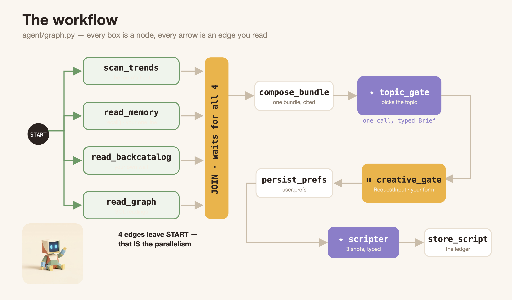

Five knowledge points. The code ships complete — you read it, run it, and
watch it work:

| knowledge point | chapters | your hands-on |
|---|---|---|
| **long running** — pending is a value, not a thread | ⏳ 📬 | describe your avatar, deliver it by hand |
| **workflow** — line · router · fan-out + a human pause | 🔺 🗺️ 🏁 📺 | run the three shapes, then draw the real edges |
| **state** — the ladder of lifetimes | 💾 | one prefix: `user:` |
| **BigQuery graph** — world state | 🌍 | watch |
| **Memory Bank** — learned state | 🧠 | one line: `memory.recall()` |

This lab is **two parts**, and every chapter belongs to exactly one:

**Part 1 · An agent that waits (⏳ 📬 🔺 🗺️ 🏁 📺).** How a workflow becomes
a long-running agent: one wait resumed once, then a graph orchestrating many
waits and two human questions.

**Part 2 · State that survives (💾 🌍 🧠).** Four storage layers, and
for EACH one the same three questions get answered: *why this layer* ·
*how it connects* · *how the agent uses it*. Layer by layer: session files
(💾) → the BigQuery world graph (🌍) → Memory Bank: connect, write, and
watch the agent use it (🧠).

The app is only ever the frontend to both parts.

One law carries the whole lab: **a long-running agent is defined by where its
state lives, because its process is allowed to die.**

## 🧰 Setup
Duration: 0:08:00

This is the whole app's architecture — look at it before touching anything:


👀 What the picture shows: **Vibe Studio** (left) is the frontend — every
button on it just runs one of your backend commands. **Your backend** is the
middle box: two agents (the workflow and the render desk), the plain-python
drivers, and the `runs/` files where every wait and key lives on disk.
**adk web** (bottom) writes nothing — it reads the same `sessions.db` and
shows you raw events. And the **cloud** column is where durable state ends
up: the agent cites BigQuery and recalls Memory Bank. You will boot each
piece right before its first use.

- **What** — clone, install, and prove the toolchain is green. Nothing gets booted here.
- **Why** — every server in this lab starts right before the first step that needs it, so when a surface opens you know exactly which command owns it.
- **How** — one command block → read the map.

### Who is who

You are building the **backend** of a creator studio. `agent/` is that
backend. **Vibe Studio** (port 4600) is the frontend someone already built
for it — every button just runs one of your backend commands, and the grey
caption under each button names which one. **adk web** (port 8000) is the
inspector: it shows the raw events your backend writes, nothing more.

### Install

👉💻 In the Cloud Shell terminal (call it **tab 1** — every 👉💻 in this lab
means tab 1 unless it says otherwise). One block, and the last line proves
everything works:

```console
git clone https://github.com/cuppibla/vibe-studio-lab
cd vibe-studio-lab
uv sync
source .venv/bin/activate
cp .env.example .env
python scripts/preflight.py
```

*You should see* every line tick (Vibe Studio reports `not running yet` —
correct: the app chapter 🗺️ boots it), ending in `PREFLIGHT GREEN`.

### Read more (optional)

<aside class="positive">
<b>The repo, one breath.</b> <code>agent/</code> is the backend you'll read
and lightly edit · <code>vibestudio/</code> is an 8-line adk web entry ·
<code>shape1_line/ shape2_router/ shape3_fanout/</code> are the three
sandbox workflows of chapter 🔺 · <code>app/</code> is Vibe Studio (given) ·
<code>world/</code> is the render farm + platform (given) ·
<code>bqgraph/</code> is the graph chapter 🌍 · <code>checks/</code> holds
the verification gates.
</aside>

<aside class="positive">
<b>Gates: how you verify a chapter.</b> <code>python -m checks.check
&lt;name&gt;</code> runs ~10 labeled assertions against the REAL artifacts
(sessions, state, the wall, BigQuery, the bank) — never a source grep. Green
means the chapter's idea physically happened. Each chapter's Read more names
its gate, they are all optional, and <code>cloudshell edit
~/vibe-studio-lab/checks/check.py</code> lets you read any of them — reviewing the gate you
just passed is a fine way to review the chapter.
</aside>

## ⏳ Make your avatar — and watch the agent wait
Duration: 0:06:00


👀 What the picture shows: your text reaches the desk, the desk calls its
ONE tool — and the wrapper does two things in the same instant: the job
leaves for the studio (green), and a receipt comes straight back (orange).
The agent says WAITING and the turn is OVER. No blocking, no thread — the
only trace is a row in `sessions.db`. You are about to live this exact
picture, and the job leaving is a real image model drawing your face.


- **What** — ask a raw agent for YOUR creator avatar, watch it stop without finishing while a real image model works elsewhere, then kill the server and prove the wait survived.
- **Why** — the lab's load-bearing idea: *pending is a value in the session log, not a thread in memory.* Slow work is worth waiting for — you are about to wait for something you actually want.
- **How** — read the agent → boot adk web → describe your avatar → watch WAITING → kill and restart.

### Who you are about to talk to

👉💻 In **tab 1**, open `agent.py` in the Cloud Shell Editor by running:

```console
cloudshell edit ~/vibe-studio-lab/vibestudio/agent.py
```

👉📖 In `vibestudio/agent.py` — read only, nothing to change — the whole
file is two meaningful lines:

```python
from agent.desk import render_desk

root_agent = render_desk
```

- `root_agent = render_desk` — adk web looks for a folder with an
  `agent.py` exporting `root_agent`; that is the entire discovery
  convention, and the folder name (`vibestudio`) becomes the app name.
- `render_desk` itself lives in `agent/desk.py` — open that one too.

👉💻 In **tab 1**, open `desk.py` in the Cloud Shell Editor by running:

```console
cloudshell edit ~/vibe-studio-lab/agent/desk.py
```

👉📖 In `desk.py` — read only, nothing to change — look at the tool list.
This line is the chapter's vocabulary word:

```python
    tools=[LongRunningFunctionTool(render_submit)],
```

**`LongRunningFunctionTool`** is the vocabulary word of this chapter: it
wraps a plain function and tells ADK "this tool returns a RECEIPT
immediately; the real result comes later." The desk wraps two of them —
`avatar_submit` (the portrait studio, which you are about to use) and
`render_submit` (the shot farm, which the workflow uses later). That one
wrapper is what makes the wait you are about to see possible. This desk is not a practice dummy: **in the publish chapter (🏁)
it is the exact agent that renders your video's three shots.** Here you meet it alone, to
see one wait clearly.

### What you are about to do, in order

1. read the 8-line agent you are about to talk to (editor, **tab 1**)
2. start `adk web` in a **second** terminal tab — and leave that tab alone
3. open it in the browser and type one line: `Make my avatar: a cute cat`
4. watch it stop at **WAITING** — and read why
5. kill the dev UI and start it again — the wait is still there

Everything you need is spelled out below; the explanations come after each
action, not before.

### Start adk web (the dev UI)

👉💻 Open a **second terminal tab (tab 2)** and start ADK's dev UI:

```console
cd ~/vibe-studio-lab
source .venv/bin/activate
adk web . --port 8000 --allow_origins "*" --reload_agents --session_service_uri "sqlite+aiosqlite:///$PWD/runs/sessions.db"
```

👉🔬 Click **Web Preview → Change port → 8000**, then click **Select an
app** at the top left and pick **`vibestudio`**:


👀 Every folder holding an `agent.py` that exports `root_agent` shows up in
that list — that is the whole discovery convention. `vibestudio` is this
studio's desk; the three `shape*` apps are tiny workflows you will run in
chapter 🔺.

### Type the slow request

👉🔬 In the chat box, ask for **your own avatar** — the face your channel
will wear for the rest of this lab. **Two or three words are enough**: name
a creature, not a style.

Copy any one of these, or write your own after the colon:

```
Make my avatar: a cute cat
```

```
Make my avatar: a red panda
```

```
Make my avatar: a grumpy owl
```

```
Make my avatar: a small red robot in a hoodie
```

The part after `Make my avatar:` is **yours** — that is the only text the
studio takes from you.

👀 Why so short? Because the studio owns the look, not you. The tool builds
the real prompt in three layers, and only the first one contains your
words:

| layer | who writes it | what it does |
|---|---|---|
| **ANCHOR** | you | *"The character is: a cute cat"* |
| **STYLE-LOCK** | the studio | low-poly facets · the cream/terracotta/sage palette · soft studio light |
| **CONSTRAINTS** | the studio | head-and-shoulders, centered, square, plain cream background, no text |

Everyone in the room types something different and everyone gets the same
house style — that is what a style-lock is for. (You will read the code in
the next chapter.)

*You should see* one tool call, the word **WAITING** — and then nothing. No
spinner, no progress bar. The turn is over:

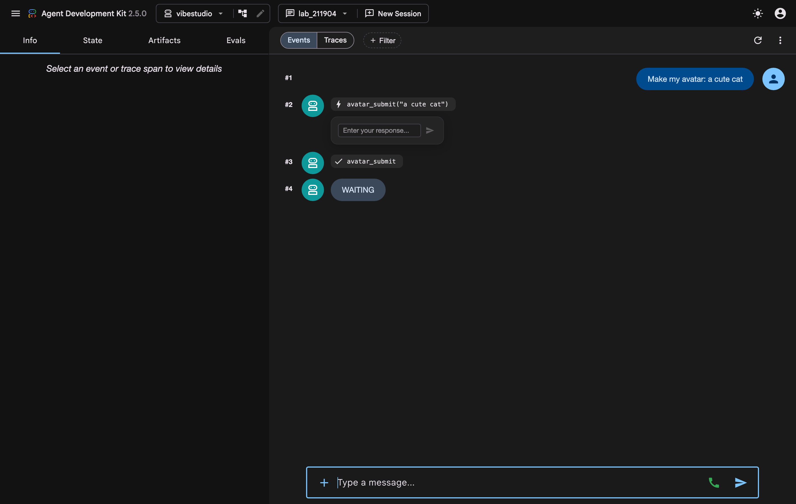

👀 Click the `avatar_submit` call: its response is literally
`{"status": "pending", "job_id": "por_…", …}`. `pending` is not an error and
not a promise object — it is a **value inside a normal response**, sitting
in the session log.

And this is the part worth pausing on: **a real job is running right now, in
a process the agent does not own.** `avatar_submit` started a detached
worker that is calling an image model — 20 to 30 seconds of genuine work —
and then returned instantly. The agent has nothing left to do; the
invocation ended honestly; your portrait is being drawn anyway.

👀 One more thing to notice for later: under that call sits a small box,
**"Enter your response…"**. Leave it alone for now — the next chapter is
you typing into it.

👉🔬 Ask the obvious thing — type exactly this:

```
is it done yet?
```

*You should see* **WAITING** again. Talking to the agent does not finish the
render — text never resumes a wait.

### Kill it

👉💻 In **tab 2** (the terminal running adk web), press **Ctrl+C** — the
entire dev UI dies. Now start it again — same block as before (pressing ↑
then Enter retypes the last line for you):

```console
cd ~/vibe-studio-lab
source .venv/bin/activate
adk web . --port 8000 --allow_origins "*" --reload_agents --session_service_uri "sqlite+aiosqlite:///$PWD/runs/sessions.db"
```

👉🔬 Reload the Preview, pick **`vibestudio`** again, then reopen your
session from the **NEW SESSION ▾** picker. Everything is still there: the call, the pending receipt, your
unanswered question. **The wait is a row in `runs/sessions.db`. It does not
need any process to exist.**

*What you learned:* pending is a value in the session log, not a thread in
memory — the process may die, the wait survives.

### Read more (optional)

<aside class="positive">
<b>How anything finds an open wait.</b> The event that carries a
long-running call also carries <code>long_running_tool_ids</code>. Scan a
session's events, collect those ids, keep the LATEST response per id — the
ones still saying <code>pending</code> are the open waits. That scan is
~15 lines in <code>agent/drive.py pending()</code>, and it is how chapter
the delivery helper, the publish chapter's worker, and the Studio UI all
find work to do.
</aside>

<aside class="negative">
<b>Why "is it done yet?" changes nothing.</b> Your text arrives as a NEW
user turn — the model can chat back, but the pending <code>function_call</code>
is a separate open item that only a <code>function_response</code> with its
id can close. Prose and results ride different rails.
</aside>

<aside class="positive">
<b>Optional check — run it only if you want proof.</b> In tab 1: <code>python -m checks.check one</code>. It asserts that your typed session really carries a long-running call (the second half goes green after the delivery chapter 📬). Nothing later depends on running this.
</aside>

## 📬 Deliver your avatar
Duration: 0:05:00


👀 What the picture shows: five moments, one row. ① you ask · ② the
pending receipt lands in `sessions.db` (the shelf) · ③ the turn ends with
nothing running · ④ you kill the server — the row does not care · ⑤ any
process delivers the result with the SAME call id, and the conversation
continues. Moments ①–④ already happened in the last chapter; this chapter
is moment ⑤.

### What you are about to do, in order

Everything in steps 1-4 happens **in the browser**, in the dev UI you
already have open — you will not touch a terminal until step 5:

1. type `{"status": "done"}` into the response box under the pending call
2. watch the desk wake up and say **AVATAR READY**
3. type one more line in the chat: `Give my avatar a tiny party hat`
4. deliver that one the same way — **AVATAR READY** again
5. now open the avatars folder in the editor and compare the two pictures
6. **then** read the two pieces of code that made it work (state management)

### 1 · You be the process

👀 The farm finished your shot long ago — but nothing tells the agent. ADK
never polls your farm; no callback is registered anywhere. Someone must
**deliver the result back into the session**, addressed by that call's id.
Right now, that someone is you — by hand, in the dev UI.

👉🔬 Under the pending `avatar_submit` call sits a small input,
**"Enter your response…"** — ADK's built-in way to answer a long-running
call. Type exactly this and press the send arrow:

```
{"status": "done"}
```

That is the entire message. You are not carrying the picture — the studio
already wrote it to disk and recorded it. All the session needs is *"that
call is finished"*, addressed to the right id.

*You should see* the desk wake up and reply **AVATAR READY**:

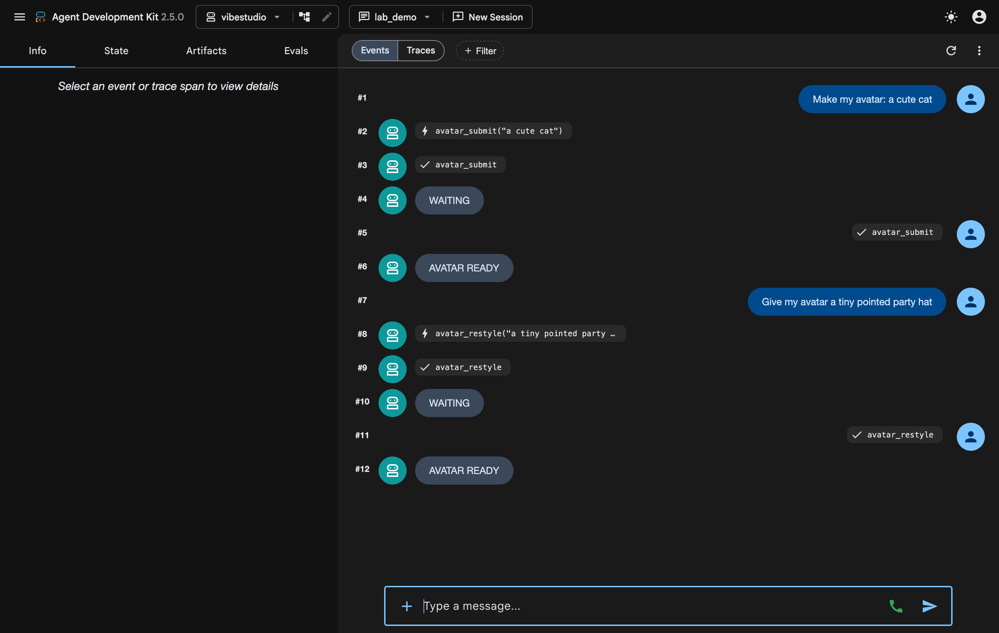

👀 Read the two new rows. **#5** is a *user* turn that contains no text at
all — only a `function_response` carrying the SAME call id. **#6** is the
desk, awake again, answering with the finished map. Nothing restarted;
nothing was waiting in memory. You typed a value into a row, and a
conversation that ended minutes ago picked up mid-sentence.

### 2 · Turn 2 — change it without describing it again

👉🔬 Back in the chat box, ask for one change. Again: short. `Give my avatar
a tiny party hat` · `add round glasses` · `put it in a circular frame`:

```
Give my avatar a tiny party hat
```

*You should see* the same shape as before — a call, a pending receipt,
WAITING. Deliver it the same way when the studio is done (`{"status":
"done"}` in the response box), and the desk says **AVATAR READY** again.

👀 You just did the whole thing. **Now the code that made it work** — and
it is state management, not what people expect. Turn 2 never re-described
the cat. The obvious way to keep a character consistent
is a chat session that remembers — but the worker that drew turn 1 *exited
minutes ago*, and its memory went with it.

What survived is a PNG on disk and a row in `runs/portraits.json` saying
which job it came from. Here is the code that uses them —
`world/portrait.py`, inside `_generate()`:

```python
    parent = _load()["jobs"].get(job.get("parent") or "", {})
    parent_png = (config.ROOT / "app" / parent.get("url", "").lstrip("/")
                  if parent.get("url", "").startswith(WEB) else None)
    if parent_png and parent_png.exists():
        # TURN 2 - the previous image IS the context; no re-describing the character
        contents = [gt.Part.from_bytes(data=parent_png.read_bytes(),
                                       mime_type="image/png"),
                    change_prompt(job["description"])]
    else:
        contents = portrait_prompt(job["description"])
```

Read the branch: no parent → build the layered prompt from scratch. Has a
parent → **load that file from disk** and send the bytes back to the model
with the change. The ledger row is the only thing that knows they are
related.

**In long-running work, the state that matters is the state you can pick up
after everything has died.** In-process memory is not that; files, sessions
and ledgers are.

### 3 · Now look at what you waited for

Both portraits are on disk now. One trip to the editor and you can see them.

<aside class="negative">
<b>Use tab 1 — not the tab running adk web.</b> Tab 2 is busy with the dev
UI; pressing Ctrl+C there would close the session you have been typing into.
Open a terminal that is idle (tab 1, the one you installed in) for the
command below.
</aside>

👉💻 In **tab 1**, open the folder the studio writes into — the Cloud Shell
Editor previews images, so click the two newest PNGs:

```console
cloudshell edit ~/vibe-studio-lab/app/static/avatars
```

*Our run typed "a cute cat", then asked for a hat:*

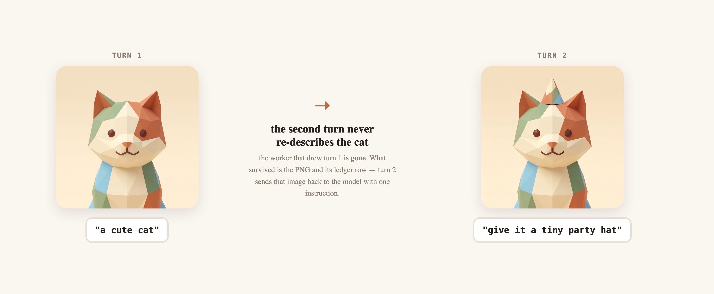

👀 That file did not exist when you pressed Enter. A model drew it while the
agent was doing nothing at all — and the only thing connecting the two is a
call id. **This is the whole point of long-running work: the valuable part
takes time, so the conversation must be able to survive it.**

<aside class="positive">
<b>What about the video shots later?</b> Chapter 🏁 renders three shots
through the same mechanism, but that farm is <b>prebaked</b>
(<code>world/broker.py</code> answers on a fixed clock) — three real renders
would cost you half an hour. Your avatar is the real thing in this lab: a
genuine model call, genuinely slow, genuinely yours.
</aside>

### 4 · How that state was managed — two pieces of code

👀 The ledger is the *studio's* record. The **agent** keeps its own, and ADK
gives you a specific place to write it: a **callback**. `agent/desk.py` ends
with this, and it runs after every turn the desk takes:

```python
def remember_avatar(callback_context) -> None:
    from world import portrait
    latest = portrait.latest()
    if not latest:
        return
    state, url, who = callback_context.state, latest["url"], portrait.anchor(latest)
    if state.get("user:avatar") != url or state.get("user:avatar_anchor") != who:
        state["user:avatar"] = url          # user: = this user, every session
        state["user:avatar_anchor"] = who   # the words that started it, from the ledger
```

Three things to take from it:

- **`callback_context.state` is writable.** Assign to it and ADK turns the
  change into a *state delta* on the event log — no save call, no database
  code. (This desk uses `after_agent_callback`; there are
  before/after hooks for the agent, the model and every tool.)
- **The `user:` prefix picks the lifetime.** These keys belong to the user,
  not to this conversation — chapter 💾 is entirely about that one word.
- **It is idempotent.** It compares before writing, so a hundred turns
  produce one delta.

👉🔬 See it: click the **State** tab on the left of the dev UI (browse only,
nothing to type):

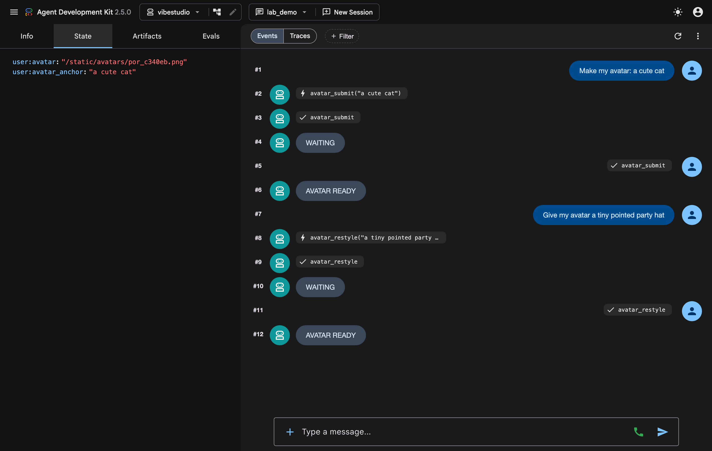

One last thing to notice before you move on: **you will never type that
JSON again.** From here the app's buttons, the repair agent and the deadline
all send the same message for you — same shape, same call id, no human in
the loop unless you want one.

*What you learned:* resume = one `function_response` with the same call id —
and it does not care who sends it. Two long-running turns produced one
consistent character, and neither of them needed a process to stay alive:
the style came from a locked prompt, the continuity came from a file. You
will see that face wearing the app in the next chapter, and on the room's
platform at the end.

### Read more (optional)

**The three lines behind the send button.** Everything above resumed through
one function — `answer()` in `agent/drive.py`
(`cloudshell edit ~/vibe-studio-lab/agent/drive.py`):

<!-- code: RESUME -->
```python
    part = gtypes.Part(function_response=gtypes.FunctionResponse(
        id=call_id, name=name, response=response))
    return await _drive(node, session_id, [part], user_id)
```

A `Part` carrying a **`FunctionResponse`** with the **same `id`**, driven
into the session as a new message. That is the whole delivery path: the dev
UI does it when you press send, and every driver in this lab calls this
function. Ten lines above it live two names worth keeping —
`Runner(app_name=…, session_service=svc(), auto_create_session=True)` (the
Runner drives) and `svc() = DatabaseSessionService(db_url=…)` (the
SessionService remembers).

<aside class="positive">
<b>The same delivery, as a script.</b> You typed the result; a real system
polls for it. <code>agent/deliver.py</code> is that script in 40 lines:
FIND the newest session holding a pending call → WAIT until the studio (or
the farm) says done → SEND via <code>drive.answer(...)</code>. Try it on a
second avatar: type another <code>Make my avatar: …</code> in adk web, leave
the response box alone, then in <b>tab 1</b> run:

<pre><code>cd ~/vibe-studio-lab
source .venv/bin/activate
python -m agent.deliver</code></pre>

Our real run printed
<code>── result delivered (same id) → the run continued ──</code> and the
session moved on by itself. Read it with
<code>cloudshell edit ~/vibe-studio-lab/agent/deliver.py</code> — the only
ADK in the whole file is the three lines you already know.
</aside>

<aside class="positive">
<b>Is a delivery script normal? Yes — it always exists.</b> Every
long-running system has this process under some name: the queue
<b>worker</b>, the <b>webhook handler</b>, the nightly <b>reconciler</b>.
ADK deliberately ships only the primitives — pending calls in a session,
<code>function_response</code> to resume — because the process that connects
them to YOUR world (your farm, your review queue, your clock) is always
application code. In production, this file is a Cloud Run job or a webhook
target.
</aside>

<aside class="negative">
<b>Why the workflow never holds machine waits.</b> A resumed graph
<b>re-runs its nodes</b> — an external submit inside a node would submit
(and pay) twice. That's why machines wait in a plain session (the desk) and
graphs pause only for people: re-asking a person is safe; re-charging a
render is not. Chapter 🏁 shows the two working together.
</aside>

<aside class="positive">
<b>Optional check — run it only if you want proof.</b> In tab 1: <code>python -m checks.check one</code>. It asserts the wait existed AND every call was answered by id — both wait chapters, physically proven in sessions.db. Nothing later depends on running this.
</aside>

## 🔺 Three shapes you can run
Duration: 0:09:00

- **What** — run the three shapes every workflow is made of, one at a time, in the dev UI you already have open.
- **Why** — the graph you build next is a line, a router and a fan-out, nothing else; and its nodes hand work to each other through ONE shared state.
- **How** — same adk web tab, switch the app dropdown three times: ① line → ② router → ③ fan-out.

### Why a workflow at all?

👀 So far one agent did one slow thing. **Making a video is not one thing.**
Before a single frame exists, the channel has to: read what is trending ·
recall what it learned · look at its own back catalogue · query the audience
graph · agree with YOU on a topic · take your creative choices · turn all of
that into a 3-shot script · render those shots · wait for your approval ·
publish.

You could write that as one enormous prompt and hope. A **workflow** says
it out loud instead: each step is a node, the order is edges, and the parts
that do not depend on each other run at the same time. Three things you get
that a mega-prompt cannot give you:

| | |
|---|---|
| **Parallelism you can see** | four research nodes leave START together; nobody wrote a thread |
| **Pauses that are legal** | a node can stop and wait for a person without holding a process open |
| **A shape you can debug** | when lap 7 goes wrong you know *which node*, because the run is a path, not a paragraph |

That is three shapes' worth of vocabulary — and you get to run each one
before building the big graph out of them.

### Where you run them

👉🌐 Go back to the **browser tab with adk web** — port 8000, still running
in **tab 2** since chapter ⏳, so there is nothing to restart. If you closed
that terminal tab, start it again:

```console
cd ~/vibe-studio-lab
source .venv/bin/activate
adk web . --port 8000 --allow_origins "*" --reload_agents --session_service_uri "sqlite+aiosqlite:///$PWD/runs/sessions.db"
```

👉🌐 (If you had to restart: **Web Preview → Change port → 8000**.) At the
**top left** is the app dropdown that says `vibestudio`. It has three more
apps in it:

| pick this app | shape | the file, if you want to read it |
|---|---|---|
| `shape1_line` | ① a line | `shape1_line/agent.py` |
| `shape2_router` | ② a router | `shape2_router/agent.py` |
| `shape3_fanout` | ③ a fan-out and a join | `shape3_fanout/agent.py` |

Each is a real workflow under 30 lines — no cloud, nothing to set up.
Switching apps does not touch your avatar session; it is still there when
you switch back.

### ① A line

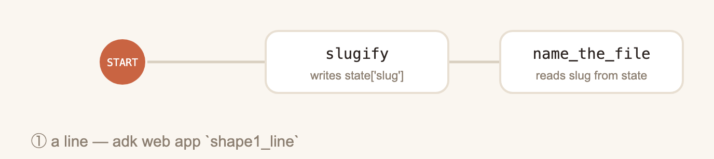

Steps in the order you wrote them. This app is one file —
`shape1_line/agent.py`.

👉💻 Open it in **tab 1**, your work terminal — **not tab 2**, which is busy
running adk web (this command is a normal one-liner; it just opens the
editor):

```console
cloudshell edit ~/vibe-studio-lab/shape1_line/agent.py
```

Both of its nodes fit on one screen:

```python
def slugify(node_input: str):
    """Node 1 - writes ONE key into the run's shared state."""
    slug = "-".join(re.findall(r"[a-z0-9]+", node_input.lower()))[:40]
    yield Event(state={"slug": slug or "untitled"})
    yield Event(output={"title": node_input})


def name_the_file(node_input, slug: str = "untitled"):
    """Node 2 - nobody passed `slug` in. ADK looked it up in state."""
    return Event(output={"file": f"{slug}.mp4", "read_from_state": slug})


root_agent = Workflow(
    name="shape1_line", description="a line: slugify -> name_the_file",
    edges=[(START, slugify, name_the_file)])
```

👉🌐 In adk web: switch the app dropdown to **`shape1_line`**, then type
this in the chat box and press Enter:

```
Robot does the dishes
```

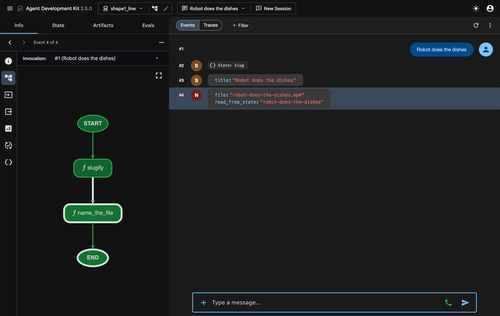

👀 Two panes, two lessons:

- **Left: adk web drew your graph.** Nobody drew that picture — the dev UI reads the same `Workflow` object you just read, so START → `slugify` → `name_the_file` → END *is* the code.
- **Right: the run, event by event.** `#2 State: slug` is node 1 writing to state. `#4` is node 2's answer, and its `read_from_state` field says where the value came from — because nobody passed it in.

👉🌐 Click the **State** tab (left pane, next to Info):

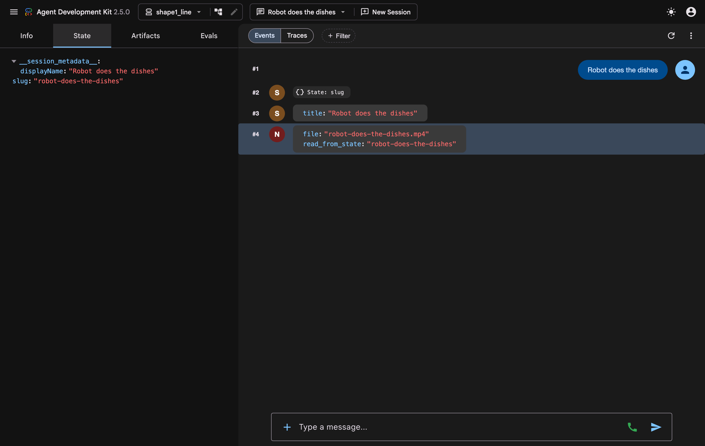

👀 That is state in a workflow: **one dict per run, shared by every node.**
Node 1 wrote `slug`; node 2 declared a parameter with the same name and ADK
filled it in. Nodes do not call each other and do not have to pass
everything down the line — they leave things in state and pick things up
from state.

### ② A router

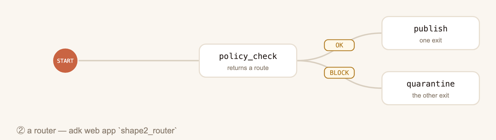

One node, two exits — and this is the file you will edit in a minute, so
open it now.

👉💻 In **tab 1** again (never tab 2 — that terminal is running adk web; if
you stopped it by accident, start it again with the block at the top of this
chapter):

```console
cloudshell edit ~/vibe-studio-lab/shape2_router/agent.py
```

```python
BLACKLIST = ["competitor", "hateful", "gore"]

# TODO: YOUR TURN - nothing to do yet; the codelab says when. Then: delete the
# "# " on the next line, save, and send a title containing that word. (No
# restart needed - adk web was started with --reload_agents.)
# BLACKLIST += ["cliffhanger"]


def policy_check(node_input: str):
    """One node, one decision: `route` names the edge to take next."""
    hits = [w for w in BLACKLIST if w in node_input.lower()]
    return Event(output={"title": node_input}, state={"policy_hits": hits},
                 route="BLOCK" if hits else "OK")


policy_wf = Workflow(
    name="shape2_router", description="check -> publish | quarantine",
    edges=[(START, policy_check),
           (policy_check, {"OK": publish, "BLOCK": quarantine})])
```

👀 **Nothing to do about that `TODO: YOUR TURN` yet** — it is the last step
of this section, and the line under it stays commented for now. First run
the router exactly as it ships.

👉🌐 Switch the dropdown to **`shape2_router`** and send:

```
Robot does the dishes
```

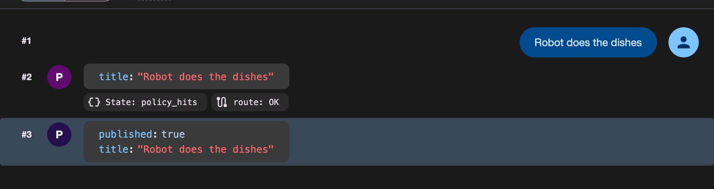

👀 `route: OK` on the event chip, then `published: true`. Now the same app,
the same code, one different word.

👉🌐 Send a second message:

```
Robot roasts a competitor
```

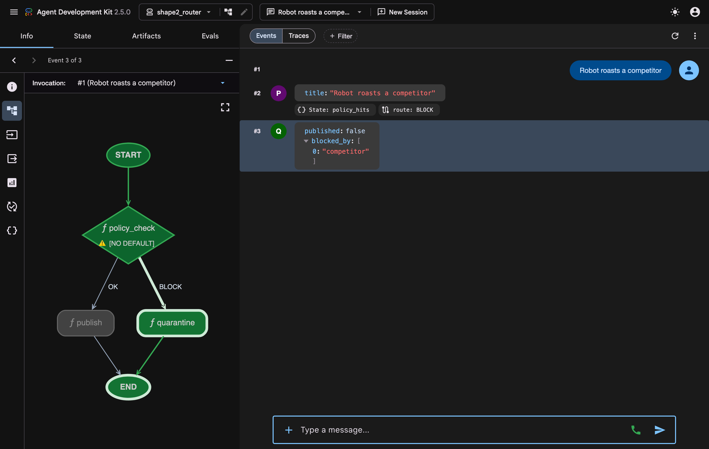

👀 Two paths out of one graph — and the picture keeps up:

- `policy_check` is drawn as a **diamond** and its edges carry their labels. The path this run took is bright; `publish` is greyed out because it never ran.
- The event chip reads `route: BLOCK`. The node returned a word; the edge dict turned that word into a destination.
- `blocked_by: ["competitor"]` came out of **state** — the check wrote `policy_hits` on its way past, and `quarantine` declared it as a parameter, exactly like `slug` in shape ①.

**That is the point of a router:** whether something ships is an *edge* you
can read, not a sentence in a prompt asking a model to be careful.

**Your turn — one line, one keystroke.**

👉✏️ In the editor tab you opened above, find the line marked
`TODO: YOUR TURN` and **delete the `# ` in front of** `BLACKLIST +=
["cliffhanger"]`. Save with Ctrl+S. (Swap in any word you like.)

👉🌐 Back in adk web, send:

```
Robot ends on a cliffhanger
```

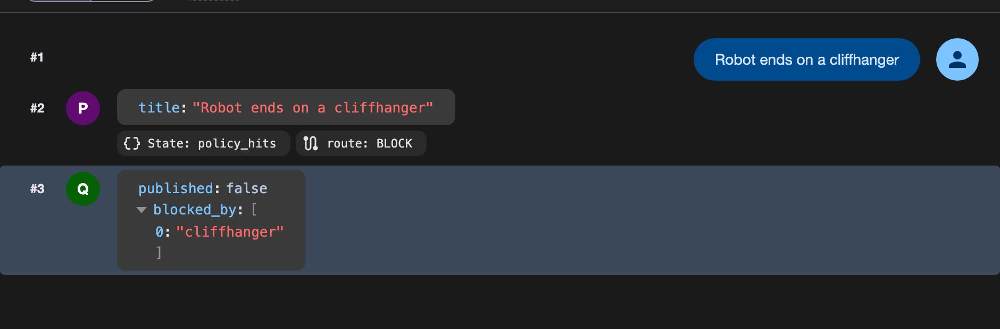

*You should see* `route: BLOCK` — for a word **you** chose. Nothing was
restarted: `adk web` runs with `--reload_agents`, so it re-read your file by
itself. You just changed what this channel refuses to publish, and the graph
is the thing that enforces it.

### ③ A fan-out and a join

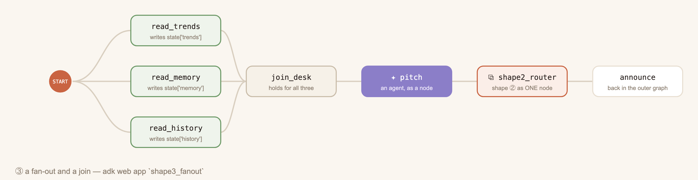

Three readers leave START together and a join holds until all three land —
plus the two things every real graph has. Read-only, this one.

👉💻 In **tab 1**:

```console
cloudshell edit ~/vibe-studio-lab/shape3_fanout/agent.py
```

```python
join_desk = JoinNode(name="join_desk")

# an AGENT is just a node - and {curly keys} are read from the same state
pitch = Agent(
    name="pitch", model=config.MODEL,
    instruction=("Title ONE <=20s video about: {topic}\n"
                 "trends: {trends}\nmemory: {memory}\nhistory: {history}\n"
                 "Reply with the title only, at most 60 characters."))

root_agent = Workflow(
    name="shape3_fanout", description="3 readers -> join -> agent -> router workflow",
    edges=[(START, read_trends, join_desk),
           (START, read_memory, join_desk),
           (START, read_history, join_desk),
           (join_desk, pitch, policy_wf, announce)])
```

👉🌐 Switch the dropdown to **`shape3_fanout`** and send **tonight's
topic** — the thing you would film. For example:

```
laundry night
```

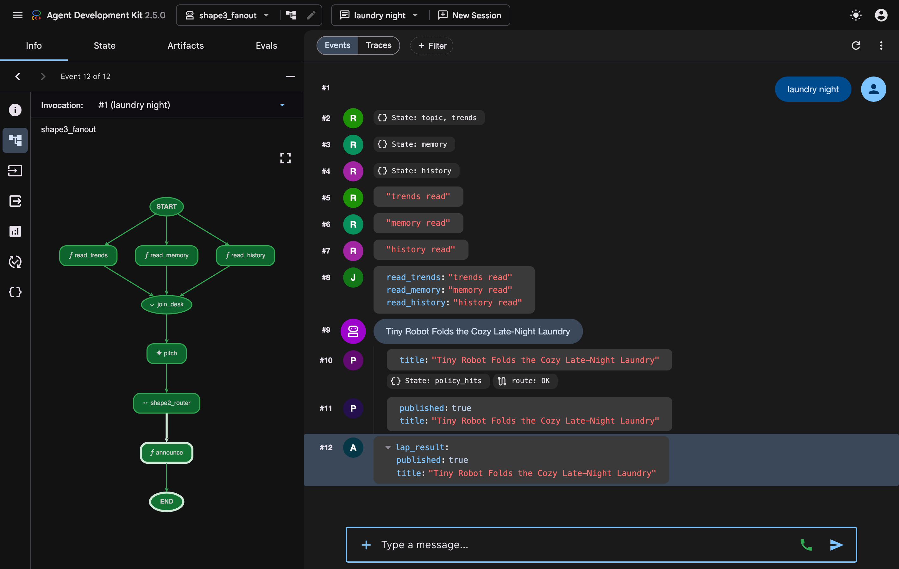

👀 Read the event column top to bottom — it is this whole chapter in one
list:

1. `#2 #3 #4` — three `State:` writes, one per reader. They left START together; nobody wrote a thread.
2. `#8` — the **join** payload: one dict holding all three readers' outputs, handed over once the last one landed.
3. `#9` — a **model** wrote a title. `pitch` is an `Agent` sitting in the graph like any other node, and its prompt read `{topic} {trends} {memory} {history}` straight out of the same state the readers wrote.
4. `#10 #11` — `route: OK`, then `published: true`. Those two events belong to **`shape2_router`**: the whole of shape ② is running as **one node** inside this graph.
5. `#12` — back in the outer graph, `announce` reports what came out.

👀 Your topic is the run's input: `read_trends` drops it into state as
`topic`, and three nodes later the agent reads `{topic}` when it writes the
title. One word in; a routed, published title out.

*What you learned:* a line, a router, a fan-out with a join — nodes talking
through one shared state, an agent used as a node, and a workflow used as a
node.

### Where these three come back

Everything after this chapter is the same three shapes at full size — the
next chapter builds the real graph out of them:

| what you just ran | where it comes back |
|---|---|
| ③ three readers → `join_desk` | four research nodes → `join_research` — the edges you draw yourself in 🗺️ |
| `✦ pitch`, an agent as a node | `topic_gate` and `scripter`, the two model nodes in `agent/graph.py` |
| state written by one node, read by the next | `constraints`, `brief`, `choices` — same trick, feeding the scripter's prompt in 🗺️ |
| ① a line | the tail of the real graph: join → compose → topic → the form → prefs → scripter → store |
| ② a router | `agent/post.py`, deciding whether your video actually ships — you watch it fire in 🏁 |
| a workflow as a node | and why `post` stays a *separate* workflow instead (🏁, Read more) |

One more shape joins them in the next chapter, and it is not in this list: a
node that **stops and waits for a person**.

### Read more (optional)

<aside class="positive">
<b>⚠️ NO DEFAULT on the diamond.</b> adk web flags a router that has no
fallback edge: if <code>policy_check</code> ever returned a word that is
neither <code>OK</code> nor <code>BLOCK</code>, the run would have nowhere
to go. One more dict entry fixes it —
<code>{"OK": publish, "BLOCK": quarantine, DEFAULT_ROUTE: quarantine}</code>
(import <code>DEFAULT_ROUTE</code> from <code>google.adk.workflow</code>).
</aside>

<aside class="positive">
<b>Where a node's arguments come from.</b> A function node binds its
parameters from the run's state by default — that is
<code>parameter_binding='state'</code>, and it is why <code>slug</code> and
<code>policy_hits</code> arrived without anyone passing them. The parameter
named <code>node_input</code> is the exception: it always holds what the
previous node returned. Wrap a node as
<code>node(fn, parameter_binding='node_input')</code> and every parameter is
read out of that dict instead.
</aside>

<aside class="positive">
<b>These three apps are yours to break.</b> They are ordinary folders in the
repo, nothing else imports them, and no gate checks them. Add a node, change
an edge, re-run. The pictures above are generated from those same objects by
<code>scripts/shape_maps.py</code> — change the graph and the picture
changes.
</aside>

## 🗺️ Draw the real graph and run a lap
Duration: 0:08:00

- **What** — draw the real workflow's edges yourself, boot the frontend, and watch your backend run the whole graph while a live map shows where it is.
- **Why** — the three shapes you just ran, at full size; and a "form" turns out to be nothing but a schema riding an interrupt.
- **How** — read the graph → draw the edges → boot Vibe Studio → start a lap → watch the map.


👀 The same three shapes, full size: a fan-out into `join_research`, then a
single line through the two model nodes (`topic_gate` picks the topic,
`scripter` writes the shots), with one human pause (`creative_gate`) on the
way to the stored script. Every arrow is an edge you are about to draw.

**Where does the video get made?** Right at the end, and never inside the
graph: the script comes out of `scripter`, and then the *desk* from chapter
⏳ takes the three shots as long-running submits (chapter 🏁). The graph
pauses for people; it never waits for the world.

### Draw the shape yourself

The graph's nodes all exist. Its **edges do not** — that one list is your
first edit of the lab.

👉💻 In **tab 1**, open `graph.py` in the Cloud Shell Editor by running:

```console
cloudshell edit ~/vibe-studio-lab/agent/graph.py
```

👉✏️ In `graph.py`, find the line marked `TODO: EDGES`, **delete** it and
**uncomment** the six lines below it (select them, Ctrl+/). The edge list
becomes:

<!-- code: EDGES -->
```python
        (START, scan_trends, join_research),
        (START, read_memory, join_research),
        (START, read_backcatalog, join_research),
        (START, read_graph, join_research),
        (join_research, compose_bundle, topic_gate, creative_gate,
         persist_prefs, scripter, store_script),
```

You just wrote the parallelism. Four edges leaving `START` — no thread
pool, no `gather`, no async anything: a drawing. The last tuple is the
single-file line from the join through the human pause to the stored
script.

👉 In `creative_gate`, the following code suspends the graph for a
person:

<!-- code: CREATIVE_GATE -->
```python
    yield RequestInput(
        message="Creative brief - pick the subject, character, and style.",
        response_schema=CREATIVE_SCHEMA,
        payload={"topic": node_input.topic, "angle": node_input.angle,
                 "defaults": prefs})
```

A node that yields **`RequestInput`** suspends the graph — and the
**`response_schema`** is exactly what the frontend will render as a form.
Forms are not UI magic; they are schemas riding an interrupt.

### Boot the frontend

The three sandbox shapes ran in the inspector: no frontend, no people. This
graph has both — so it needs the app. **Nothing gets stopped:** adk web
stays up on port 8000, and Vibe Studio is a *different* server on 4600.

👉💻 Open a **third terminal tab (tab 3)** — leave tabs 1 and 2 alone — and
start the ONE app server. This is the boot command behind every 👉🌐 step
from here on:

```console
cd ~/vibe-studio-lab
source .venv/bin/activate
uvicorn app.main:app --port 4600
```

| tab | what runs there | what it is |
|---|---|---|
| **tab 1** | nothing, on purpose | your work terminal — every 👉💻 command and `cloudshell edit` |
| **tab 2** | `adk web` :8000 | the inspector — raw events, the State tab, the shape apps |
| **tab 3** | `uvicorn` :4600 | Vibe Studio — the product: buttons, the form, the live map |

👉🌐 Click **Web Preview → Change port → 4600**. Nothing to type yet — but
look at the **top-right corner** before you look at anything else:

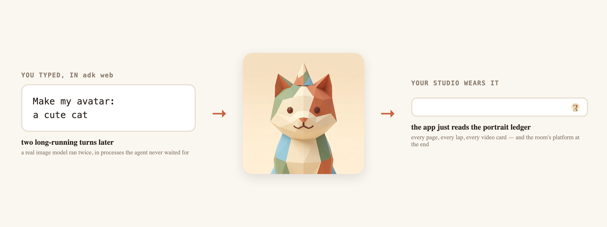

👀 That is the portrait you waited for in the last chapter, and no code
copied it there: the app simply reads the studio's ledger
(`app/main.py` → `my_avatar()` → `world/portrait.latest()`). One long-running
job, delivered by call id, and your channel has an identity that outlives
every process in this lab.

Now the app itself, still asleep:


### Start a lap

👉🌐 On the Now card, type exactly this as your hint, then press
**Start a lap ▸**. **Watch the map that appears above the card** — that is
the workflow you just read, live, with your avatar standing on whichever
node the run is at:

```
a tiny robot doing chores
```

*You should see* the four research nodes light up together, then
`join_research` and `compose_bundle`, and — within ~20 seconds — your face
parked on `creative_gate` with a form underneath it. No pitch, no
conversation first:


👀 Two things about that map, because both are the point of this chapter:

- **It is not a drawing.** The nodes and edges are dumped from the live
  `Workflow` object — `wf.graph.edges`, where every edge carries
  `from_node.name` and `to_node.name`. The layout table only says *where* to
  put a node; if the graph ever gains a node the layout forgot, it still
  renders, listed underneath. The map can be ugly; it cannot lie.
  (`cloudshell edit ~/vibe-studio-lab/app/flowmap.py`)
- **It is not a progress bar.** A node turns solid when the node that owns
  it actually wrote its part of the run — the app reads `runs/state.json`,
  nothing is on a timer. And two nodes can turn **amber with a YOU badge**:
  those are the ones that stop and wait for a human. Your avatar stands on
  whichever node the run is at, so "where am I in this graph" is answered
  before you read a word.

👀 What just happened: your four research nodes ran in parallel, the join
fired, and the topic node **decided without you** — a workflow node defaults
to `single_turn`: one call, no chat. You wrote nothing, and the whole graph
ran. But it never asked.

👉🌐 Fill the form — subject, character, style — and press **Resume ▸**.
The footer names what that click really is: one `function_response`, the
same hinge as your avatar. The graph picks up where it suspended.

*What you learned:* you drew a shape, and the shape ran — four nodes at
once, a join, one pause that waited for a human, and a script at the end.

### Read more (optional)

<aside class="positive">
<b>Why the topic node never asked you anything.</b> An <code>LlmAgent</code>
has a <code>mode</code>, and there are three:
<code>chat</code> (a normal conversational agent),
<code>single_turn</code> (one call, no conversation) and
<code>task</code> (it converses until it calls its built-in
<code>finish_task</code>). The default flips with context: a plain agent is
<code>chat</code>; <b>an agent used as a workflow node is
<code>single_turn</code></b> — which is why <code>topic_gate</code> decided
in one call. Set <code>mode="task"</code> on that node and it would pitch,
listen and revise before releasing a typed Brief. This lab keeps the one
structured pause (the form) so the shape stays readable; the conversational
variety is the same hinge underneath.
</aside>

<aside class="positive">
<b>JoinNode.</b> The four research branches converge on a
<code>JoinNode</code> — the graph holds until all four have reported, then
<code>compose_bundle</code> runs once with everything. That join is
built-in and structural; the join you'll <i>own</i> (business "all done")
comes in the publish chapter 🏁.
</aside>

<aside class="positive">
<b>The form is really a schema.</b> <code>CREATIVE_SCHEMA</code> lists three
fields; Studio renders them as inputs and a dropdown. Change the schema and
the form changes — there is no form code anywhere in the frontend.
</aside>

## 🏁 Approve, finish, and publish
Duration: 0:06:00

- **What** — collect everything this lap is still waiting on — three machine renders and one answer from you — then publish through the router you met in 🔺.
- **Why** — this is where the lab's two halves meet. ⏳ 📬 taught you that a wait is a *value*, delivered by id. 🔺 🗺️ taught you that a run is a *shape*. Neither of them knows when a lap is **finished** — that part is yours, and it is two lines.
- **How** — read the join → Render → Approve → press Finish → watch it publish → read the router that allowed it.

👀 Where you are: the graph stopped at the form and handed you a script.
Since then the **desk** has been holding three machine waits (the ⏳
mechanism, three at once) and the app has been holding one question for
**you**. ADK will deliver all four answers by id. It will never tell you
they add up to "done".

### The join (read, don't write)

👉💻 In **tab 1**, open `joinlogic.py` in the Cloud Shell Editor by
running:

```console
cloudshell edit ~/vibe-studio-lab/agent/joinlogic.py
```

👉📖 In `joinlogic.py` — read only, nothing to change — find
`try_finish()`. These two lines define "all done":

<!-- code: JOIN_CONDITION -->
```python
    still = drive.run(drive.pending(desk_sid(st)))
    human_ok = any(a["kind"] == "thumb" for a in st["lineage"]["approvals"])
```

*No render still pending* AND *the human approved the thumbnail*. Three
machine results and one human answer land in any order; ADK only delivers
them by id — **counting is yours**, and this is all counting takes.

### Render, approve, finish

👉🌐 You are on the **Script ready** card (yours will show your own title):

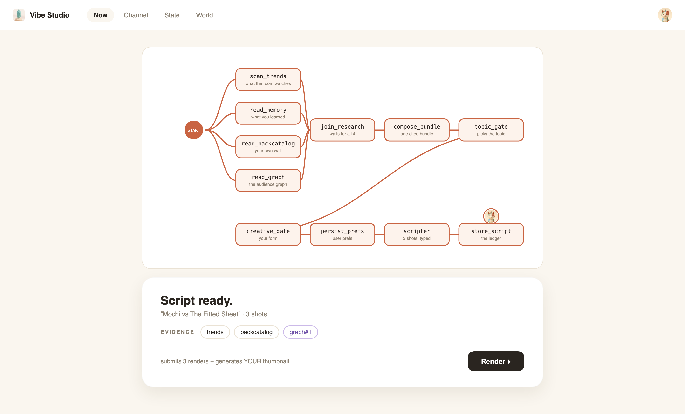

Press **Render ▸**. Three renders submit in one turn, and a real thumbnail
is generated from your form choices (~20 seconds).

👉🌐 The card flips to **Ship this thumbnail?** — that picture came from your
subject + character + style. Press **Approve**:


👉🌐 The card now shows **Rendering 0/3** with a **Finish ▸** button — the
grey caption under it says exactly what the button runs:

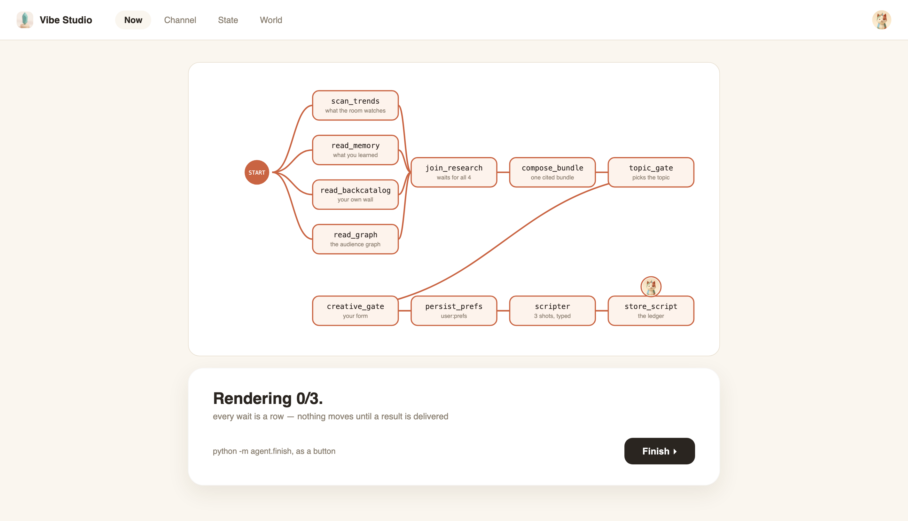

👀 Before pressing it, see what that button actually executes — the core
loop of `agent/finish.py`, the file the caption names:

```python
    while time.time() - t0 < config.DEADLINE_S + 25:
        jobs = {j["id"]: j for j in broker.poll()}
        for cid, name, resp in drive.run(drive.pending(sid)):
            ...
            if job["status"] == "done":
                joinlogic.handle_done(cid, name, resp, job)
            elif job["status"] == "failed":
                joinlogic.handle_failed(cid, name, resp, job)
        ...
        if joinlogic.try_finish() is not None:
            break
```

Poll the farm → deliver each finished result by call id (`handle_done` runs
the delivery chapter's three lines) → send failures to the repair agent →
and after every round, ask `try_finish()` — the two lines you just read —
whether the run is complete. In production this loop is a queue worker, a
webhook handler, a nightly reconciler.

👉🌐 Press **Finish ▸**. When the card flips to **On the wall.**, the lap is
published:


👉🌐 Open the **Channel** tab and press **play** on your newest card:


👀 That is a genuine file: 1280×720 H.264, six seconds, written to
`app/static/renders/final_<run>.mp4` by post-production and served by this
same app. It was cut from the thumbnail your brief generated — the render
farm's own clips stay prebaked (see the 📬 chapter's note), so this is the
one artifact in the lab that is really encoded, and it is the one your
audience "watches".

### The router from chapter 🔺, firing for real

👀 Everything after the join ran through shape ② from the shapes chapter,
full size — the **router** in `agent/post.py`:


`editor` cut the shots together, `policy_check` returned a route (**OK**, so
`eval_gate` ran; **BLOCK** would have sent it to `quarantine` instead), and
`eval_gate` returned **PASS**, which is the only edge that reaches
`publisher`. Two of those four branches never ship anything — and that is
the point of a deterministic router: *the decision to cause a side effect is
an edge you can read, not a sentence you hope the model meant.*

👉🔬 Want the receipts? The routes it took are recorded in the run's
lineage — `runs/state.json` → `lineage.gates` holds the policy result and
the eval checks it passed, which is exactly what the gate below asserts.

*What you learned:* the two kinds of wait met here — three machine results
delivered by id, one human answer through the same hinge — and **"all done"
was two lines you could read**, because ADK counts nothing for you. Then a
**router** decided that this particular video was allowed to ship, and the
publish was one idempotent POST. That is Part 1 whole: *a long-running agent
is a shape that pauses, plus the small amount of your own code that says
when the pausing is over.*

### Read more (optional)

<aside class="positive">
<b>Why <code>post</code> is a second workflow and not a node inside the
first.</b> In shape ③ you nested one workflow inside another, which is the
right move when the inner shape is pure compute. This one is not: a resumed
graph <b>re-runs its nodes</b>, and <code>publisher</code> causes a side
effect. So the lap's graph ends at the script, the world (renders, your
approval) happens outside it, and <code>wf_post</code> runs once, after —
its own <code>Runner</code>, its own session id
(<code>&lt;run_id&gt;_post</code>). Nest for shape; separate for side
effects.
</aside>

<aside class="positive">
<b>The medic and the deadline, explained.</b> One render fails QC — the
worker hands the failed prompt to a one-shot repair agent
(<code>prompt_medic</code>), which rewrites it; the retake is submitted
<i>inside the wait</i>, no restart. One render never finishes — at
<code>STUDIO_DEADLINE_S</code> the worker stops waiting and delivers a
prebaked stand-in instead. Failures repaired mid-wait, stragglers bounded by
a clock: that is what "waiting well" means in production.
</aside>

<aside class="positive">
<b>Publish is idempotent, and the gate proves it by doing it.</b> The
publish POST carries an <code>Idempotency-Key</code>; replaying the same
request returns the ORIGINAL video id instead of creating a duplicate. The
<code>lap</code> gate literally re-sends the POST and asserts the same id
comes back.
</aside>

Want to watch the full story as text instead of pressing the button? On
any LATER lap (🌍 or 🧠): after pressing **Render ▸** and **Approve**,
do NOT press **Finish ▸**. Go to **tab 1** (your work terminal) and type:

```console
cd ~/vibe-studio-lab
source .venv/bin/activate
python -m agent.finish
```

Exactly what the button runs — but in the terminal it narrates every
delivery as it happens:

```
── result delivered: job_0 ──
── qc FAIL: job_1 (overexposed frames in the opening seconds) -> prompt_medic ──
  medic: Specified soft, evenly balanced diffused lighting …
── deadline: job_2 replaced by prebaked stand-in ──
── result delivered: job_3 ──
── join complete (renders N/N + human) -> post-production ──
PUBLISHED: {'published': True, 'video_id': 'v_…', 'url': '/watch/v_…'}
```

Dev-UI deep dive — the whole lap as raw events (browse only, nothing to
type): port 8000 Preview → add `&userId=creator` to the URL and reload (adk
web files YOUR chats under user `user`; the lap's sessions belong to
`creator`) → **NEW SESSION ▾** → newest `run_…_wf` session. Top to bottom:
the typed Brief the topic node returned in one call, the
`adk_request_input` carrying your form's schema, your answers coming back as
a `function_response`, `user:prefs` and `choices` landing in state, and the
script.


Then the newest `run_…_desk` session: three `render_submit` calls in one
turn, results delivered out of order, the medic's retake, the final map.


<aside class="negative">
<b>Two gotchas, both deliberate.</b> ① adk web files NEW chats under user
<code>user</code>, while the lap's sessions live under <code>creator</code>
— that's why browsing them needs <code>&userId=creator</code> in the URL.
② The renders you just watched never lived in the graph: a resumed graph
re-runs its nodes, and an external submit inside a node would submit twice.
People-pauses are safe to re-ask; world side effects are not.
</aside>

<aside class="positive">
<b>Optional check — run it only if you want proof.</b> In tab 1: <code>python -m checks.check lap</code>. It asserts four things at once: the graph ran with real evidence · both human pauses were answered by id · every render result was delivered · publish passed gates and is idempotent (it re-sends the POST and expects the SAME video back). Nothing later depends on running this.
</aside>

## 📺 Publish to the shared platform — workshop only
Duration: 0:04:00

<aside class="negative">
<b>WORKSHOP ONLY — self-paced readers: skip this whole chapter.</b> It
needs a platform URL that only a live workshop (or your own deployment)
provides. Nothing later depends on it — jump straight to the next chapter 💾.
</aside>

- **What** — put your published video on the ROOM's shared VibeTube, next to everyone else's.
- **Why** — the local Wall is your analytics engine; the room's VibeTube is a real hosted streaming platform. Same lesson, different host: publish is a POST to a contract.
- **How** — three lines in .env → one command → open the room.

### Point at the room

Your instructor announces two values, like a meeting code.

👉💻 In **tab 1**, open `.env` in the Cloud Shell Editor by running:

```console
cloudshell edit ~/vibe-studio-lab/.env
```

👉✏️ In `.env`, fill the platform block — the third line is how the room
credits you:

```
VIBETUBE_URL=https://<the-platform-url-your-instructor-gives>
VIBETUBE_EVENT=sandbox
VIBETUBE_NAME=Your Name
```

👀 `sandbox` is real: every deployment ships a practice room whose upload
window never closes — fine any day. On workshop day, your instructor's room
code replaces it.

### Premiere

👉💻 In tab 1 — it packages your thumbnail into a real 6-second H.264 (one
ffmpeg command) and POSTs it with your title and name; one multipart
request, no SDK:

```console
cd ~/vibe-studio-lab
source .venv/bin/activate
python -m agent.premiere
```

*Our real run:*

```
── packaging the premiere cut (ffmpeg, ~5s) ──
── POST http://…/api/events/sandbox/videos ──
── the room can see you now ──
  watch it with everyone else: http://…/e/sandbox?v=v_863d6cfa
```

👉🌐 Open that watch link in a new browser tab (just browse):


👀 Success = the terminal line `the room can see you now` AND your card in
the grid — with **your avatar on it**. Look at the card's byline: the
portrait you generated in chapter ⏳ travelled with the upload
(`premiere.py` attaches it as `avatarFile`), so the room sees the face you
made, next to everyone else's. A `403` means the room's upload window is
closed — your instructor owns those times.

*What you learned:* a platform is a contract — changing hosts changes
nothing about the act.

### Read more (optional)

<aside class="positive">
<b>premiere.py, opened.</b> <code>cloudshell edit ~/vibe-studio-lab/agent/premiere.py</code> —
two functions, no new machinery: <code>package()</code> turns your generated
thumbnail into a real 6-second H.264 with ONE ffmpeg command (swap in real
Veo shots and this is exactly where the real cut gets stitched), and
<code>main()</code> is one <code>httpx.post</code> — multipart form, your
title, description, display name, the video, the thumbnail. No SDK, no
session: a platform is just a contract.
</aside>

<aside class="negative">
<b>If the platform says no.</b> <code>403</code> = the room's upload window
is closed (the instructor owns those times) · <code>413</code> = over the
limits (50 MB video, 5 MB images) · <code>404</code> = wrong room code.
Every error carries a human-readable <code>detail</code>. Re-running the
same lap's premiere REPLACES your entry (same <code>projectId</code>), so
you can retry safely.
</aside>

## 💾 Durable state — session files and the user: prefix
Duration: 0:07:00


👀 What the picture shows: the left column is ONE lap, top to bottom; the
right column is the five storage layers. Solid arrows are writes — events
and your prefs into `sessions.db`, the ledger into `state.json`, rows into
BigQuery, notes into Memory Bank. Dashed arrows are reads, and they all
feed the NEXT lap: the prefilled form, the graph readings, the recalled
notes. And during the wait itself? Nothing runs — and nothing is lost.

Part 2 begins. This chapter's single lesson, up front: **ADK session state
persists in the SessionService** — here that is `DatabaseSessionService`,
i.e. the file `runs/sessions.db` — **and one key prefix (`user:`) widens a
value's lifetime from one session to all of a user's sessions.** Everything
below just makes you SEE that. Same three questions as every layer:

- **The layer** — session files: `runs/sessions.db` and `runs/state.json`, the two files on disk that hold every wait, every event, every key.
- **Why this layer** — the process is allowed to die; whatever must outlive it needs an address outside the process.
- **How it connects** — nothing to connect: ADK's SessionService writes here automatically (you passed its sqlite URI to adk web in the first chapter ⏳).
- **How the agent uses it** — every resume reads it; and after your one-prefix edit, the next lap's form arrives pre-filled from `user:prefs`.

### The ladder

👀 Top to bottom — shorter lives above, longer below. Read the third
column twice: durable state is not an abstraction, it is a THING with an
address —

| lives for | who writes it | where it physically is |
|---|---|---|
| one turn | the model | nowhere — RAM of one call, gone at turn end |
| one process + | ADK, automatically | **one sqlite file**: `runs/sessions.db` — events, `session.state`, `user:` keys, every pending call |
| one run | your driver | **one JSON file**: `runs/state.json` — open it with any editor |
| the world | the platform | **a BigQuery dataset** (`vibestudio`) in YOUR cloud project |
| the channel | `learn`, distilled | **a managed resource**: `projects/…/reasoningEngines/<id>` (Memory Bank) |

👉🌐 Studio's **State** tab is this table, live (just browse):


### The kill test

👀 One law, one keystroke: the process may die; the state does not. Reading
that ten times is worth less than killing something once.

👉💻 Go to **tab 3** — the terminal running Vibe Studio — and press
**Ctrl+C**. The server is gone; the browser tab goes blank on its next
refresh.

👉💻 That terminal is free now, so use it to look at what outlived the
server. This folder **is** your durable state:

```console
ls runs
```

*Our real run:*

```
broker.json        graph_run.log     portraits.json   sessions.db
delivered.json     memorybank.json   radar.json       state.json
graph_report.json  premiere_….mp4    ui_busy.json     wall.db
```

👉💻 Start the app again, same tab, same venv (press ↑ twice, or retype):

```console
uvicorn app.main:app --port 4600
```

👉🌐 Reload the browser and open the **State** tab: every row is exactly as
you left it — the open call, your prefs, the wall. Nothing was written "on
the way out", because nothing was ever only in memory.

👀 That's it. Your avatar is in there too — `runs/portraits.json` is the
ledger that let turn 2 find turn 1's picture after its process had died.
The wait from the ⏳ chapter is a row inside `sessions.db`. The
lap's brief and script are keys inside `state.json`. The wall's watch rows
are in `wall.db`. `memorybank.json` holds one line — the ADDRESS of the
cloud resource where notes live. Kill any process you like; these files
don't care. The only two rungs NOT in this folder are the cloud ones:
the BigQuery dataset (🌍) and the Memory Bank resource itself
(🧠) — they survive even `rm -rf` of this whole VM.

### Where ADK state actually lives (read, don't write)

👀 Three sentences, and you already met every piece: a node **writes** by
yielding `Event(state={…})` — the delta rides the event log, which is why it
replays and survives. Anything in the session **reads** `session.state` —
both State tabs are just reading it. And the **SessionService stores** it —
the delivery chapter's `DatabaseSessionService`, the same sqlite URI you
passed to adk web. The production swap is one line: `VertexAiSessionService`, and the same
events, waits, and state live in managed Agent Engine sessions — your agent
code does not change.

### One prefix up (your second edit)

👉💻 In **tab 1**, open `graph.py` in the Cloud Shell Editor by
running:

```console
cloudshell edit ~/vibe-studio-lab/agent/graph.py
```

👉✏️ In `graph.py`, locate `persist_prefs`, **delete** the line marked
`TODO: PREFS` and **uncomment** the line below it, so the write becomes:

```
    yield Event(state={"user:prefs": node_input, "choices": node_input})
```

The only change that matters is the prefix **`user:`** — keys wearing it are
scoped to the user across ALL sessions. Same database, one word, one
lifetime longer. (`temp:` goes the other way: never persisted.)

### Watch it come back

👉🌐 All buttons this time, no terminal, nothing to type. On the **Now**
tab: press **Start next lap ▸**, wait ~20 s while the research fans out —
and the creative form arrives **pre-filled with last lap's choices**:


👉🌐 Finish the lap: press **Resume ▸** (keep or edit the pre-filled
answers), then **Render ▸**, then **Approve**, then **Finish ▸**.

👉🔬 See the same thing in the raw store — browse only, no commands, no
typing, five clicks:

1. **Web Preview → Change port → 8000** (adk web is still running in
   tab 2 — if you closed the preview tab, this reopens it).
2. Click the browser's address bar, go to the very END of the URL, add
   `&userId=creator`, press Enter. (Your own chats live under user `user`;
   the app's laps live under user `creator` — this switches the view.)
3. Click the **NEW SESSION ▾** picker at the top.
4. The session list opens — these are the app's laps. Click the newest
   `run_…_wf` session (largest number):


5. Click the **State** tab on the left panel — `user:prefs` sits right next
   to the plain keys:


*What you learned:* ADK session state persists in the SessionService (the
file `runs/sessions.db` — that is what `DatabaseSessionService` means), and
the `user:` prefix widened your choices' lifetime from one session to every
session this user owns.

<aside class="positive">
<b>So where IS durable state? Five answers, memorize them.</b> ① The turn:
nowhere — it dies with the model call. ② Sessions, state, waits: the file
<code>runs/sessions.db</code>. ③ The run's ledger: the file
<code>runs/state.json</code>. ④ The world's rows: the
<code>vibestudio</code> dataset in your BigQuery project. ⑤ The channel's
lessons: the Memory Bank resource
<code>projects/…/reasoningEngines/&lt;id&gt;</code>. Two files, two cloud
residents, one nothing — that is the entire answer.
</aside>

### Read more (optional)

<aside class="positive">
<b>How a write actually travels.</b> A node yields
<code>Event(state={"user:prefs": …})</code> → the delta is committed to the
event log in <code>sessions.db</code> → the SessionService folds it into
<code>session.state</code> → any later session for the same user sees the
<code>user:</code> keys. Nothing writes "directly" to state; everything
rides an event, which is why it replays and survives.
</aside>

<aside class="positive">
<b>The production swap, spelled out.</b> <code>svc()</code> is one line:
<code>DatabaseSessionService(db_url=…)</code>. Replace it with ADK's
<code>VertexAiSessionService</code> (and point adk web's
<code>--session_service_uri</code> at your Agent Engine) and the SAME
events, deltas, and pending calls live in managed cloud sessions — the
rungs are pluggable stores, not different programs. Your agent code does
not change by one character.
</aside>

<aside class="negative">
<b>The other two prefixes.</b> <code>temp:</code> keys are never persisted
at all — scratch space that dies with the invocation. <code>app:</code>
keys are shared across ALL users of the app. Wrong prefix = wrong lifetime;
the gate below catches the classic mistake (a <code>temp:</code> key that
leaked into the store).
</aside>

<aside class="positive">
<b>Optional check — run it only if you want proof.</b> In tab 1: <code>python -m checks.check state</code>. It asserts that `user:prefs` is readable from a brand-new session, matches what you typed, and no `temp:` key ever leaked into the store. Nothing later depends on running this.
</aside>

## 🌍 Durable state — the world graph (BigQuery)
Duration: 0:06:00


👀 What the picture shows: the four cards are plain BigQuery tables that
already exist; the three arrows are the edges the DDL declares over them —
creators publish videos, videos are about topics, viewers watch videos.
The orange `watched` edge is the one that matters: the retention numbers
(`watched_ms`, `drop_ms`) live ON the edge itself. And the channel's
questions are paths across this picture — one hop for "where do I lose
people", three hops for "what else do my finishers finish".

- **The layer** — the world's rows: a BigQuery dataset (`vibestudio`) in YOUR cloud project.
- **Why this layer** — the audience's watch data is bigger than any process and shared with every tool; it outlives even this VM.
- **How it connects** — one button in the app's **World** tab (it runs `scripts/graph.sh`): create the dataset, load the vendor pack, declare the graph, push YOUR rows in.
- **How the agent uses it** — the `read_graph` research node queries it every lap; at the end of this chapter you watch the app cite it.

### Why BigQuery, and do you even need a graph

👀 **Why BigQuery for world state?** The audience's watch rows are the
platform's data, not your agent's: bigger than any process, shared with
every other tool, alive after `state.json` is deleted. That is
warehouse-shaped data — the wall's sqlite is this lab's stand-in for it.

👀 **Do you need a graph database?** No — and notice that you are not
getting one. `taste_graph` is a *declaration over tables you already have*:
nothing is copied, nothing new is deployed. Two questions decide whether
declaring it earns its keep:

| ask this | in this lab |
|---|---|
| **How many hops is the question?** | "where do I lose people" is one hop, so it stays plain SQL — the report literally tags it `engine: sql`. "what else do my finishers finish" is three hops (me → video ← viewer → video → topic): that is where one `MATCH` beats a pyramid of joins. |
| **Does the relationship itself carry data?** | `watched_ms` and `drop_ms` belong to neither the viewer nor the video — they belong to the *watch*. Retention lives on the edge. |

Many-to-many on its own does **not** justify a graph; a join table handles
that fine. Multi-hop questions over many-to-many edges do.

### The edge that carries the data (read, don't write)

👉💻 In **tab 1**, open `load.py` in the Cloud Shell Editor by running:

```console
cloudshell edit ~/vibe-studio-lab/bqgraph/load.py
```

👉📖 In `load.py` — read only, nothing to change — find `GRAPH_DDL`. The
four tables are declared as nodes; then comes the edge that carries the
watch data, and it is three clauses long:

<!-- code: EDGE_TABLE -->
```sql
    `{d}.watched` AS watched
      KEY (viewer_id, video_id)
      SOURCE KEY (viewer_id) REFERENCES viewers (id)
      DESTINATION KEY (video_id) REFERENCES videos (id)
```

| the clause | what it says |
|---|---|
| `KEY` | which columns identify one row of this edge |
| `SOURCE KEY … REFERENCES` | where the arrow starts — a viewer |
| `DESTINATION KEY … REFERENCES` | where it lands — a video |

That is the whole vocabulary. The `watched` table already existed; three
clauses turned it into an arrow. Its other columns (`watched_ms`,
`drop_ms`, `completed`) come along automatically — that is how retention
ends up living on the relationship. `published` and `about`, right above it,
are the same three clauses.

### Build it — one button

👉🌐 In Vibe Studio, open the **World** tab (top left, next to State):


👉🌐 Press **Build + read the graph ▸**. The grey caption names what the
button runs — `bash scripts/graph.sh` — and that script is three verbs in
order: **CONNECT + LOAD** (dataset + vendor pack + the DDL you just read) ·
**STORE** (your own rows enter the world) · **READ** (the questions).

Its output streams into the page while it works, ~40 seconds:


👀 Nothing here is animated for show: a dot goes solid when the script
actually printed that banner, exactly like the workflow map. The app never
touches BigQuery itself — it runs the same command you could run in tab 1
and tails the log.

When the third dot lands, the readings are underneath it:


👀 Those are YOUR videos and YOUR panel's real rows — and the
`engine` chip on each reading is the honest part: `graph#1` ran as **sql**
(one hop needs no graph), `graph#2` and `graph#3` ran as **gql** (two and
three hops). Remember that median drop just before the 5-second mark: the
Memory Bank chapter 🧠 turns it into a rule.

### See it drawn

👉🌐 Open the BigQuery console (just browse): your project → dataset
`vibestudio` → **Tables** shows all six with row counts — then
**Graphs → taste_graph**:


### Watch the agent use it — right now

👉🌐 Nothing to configure — the `read_graph` research node was already wired
to this dataset. Prove it in the app, click by click (the hint box may stay
empty; you type nothing):

1. Open Vibe Studio (Web Preview → 4600) → the **Now** tab.
2. Press **Start next lap ▸** and wait ~20 s while the four research nodes
   run — watch them light up on the map.
3. The form appears, already pre-filled from `user:prefs` (the 💾 chapter's
   edit at work) — press **Resume ▸**:


4. The **Script ready** card appears. Read its **EVIDENCE** row — a
   `graph#1` chip, highlighted:


   Your agent just cited, by name, a reading from the graph you built two
   minutes ago. You never asked it anything: the research step queries the
   graph on every lap, automatically.
5. Finish the lap: press **Render ▸**, wait for the thumbnail card, press
   **Approve**, then press **Finish ▸** — the Memory Bank chapter 🧠 wants
   this lap's audience data anyway.

*What you learned:* a graph is a declared lens over tables you already
have; readings carry names — and you watched your agent cite one without
being asked.

### Read more (optional)

<aside class="positive">
<b>The same thing from the terminal.</b> The button is only a wrapper. In
tab 1: <code>bash scripts/graph.sh</code> prints the same three banners, and
the three verbs are three files you can run one at a time —
<code>python -m bqgraph.load</code> · <code>bqgraph.export</code> ·
<code>bqgraph.report</code>. <code>report</code> also writes
<code>runs/graph_report.json</code>, which is what the World tab renders.
</aside>

<aside class="positive">
<b>What the DDL leaves out on purpose.</b> An edge can also carry
<code>LABEL x PROPERTIES (a, b, c)</code>. Both are optional and this lab
omits both: with no <code>PROPERTIES</code> list every column of the table
is a property (that is why <code>w.completed</code> works in the queries),
and with no <code>LABEL</code> the alias is the label. Three clauses is the
smallest true version.
</aside>

<aside class="positive">
<b>The client is two lines, and the auth ladder in one breath.</b>
<code>_bq()</code> in <code>bqgraph/queries.py</code> is just
<code>bigquery.Client()</code> — no key file, no connection string. Cloud
Shell → ADC is already there (what you're using). Laptop → one command,
<code>gcloud auth application-default login</code>. CI → workload identity.
Nowhere in this lab does a service-account key file appear — that rung is
deliberately skipped.
</aside>

<aside class="positive">
<b>GQL and its SQL twin.</b> Every path question in
<code>bqgraph/queries.py</code> exists twice: a GQL <code>MATCH</code> and a
same-shape SQL join. The <code>engine:</code> tag in the report tells you
which one ran — and reading the two side by side IS the argument for the
graph: the MATCH looks like the question; the join pyramid looks like work.
</aside>

<aside class="positive">
<b>A privacy floor, built in.</b> The queries only surface cohorts of at
least <code>K_ANON</code> viewers (2 in this tiny world; a real platform
uses ~10+), and no query ever returns viewer ids. Aggregates about YOU,
never rows about THEM.
</aside>

<aside class="negative">
<b>The TODO guard.</b> In the shipped starter every edge is already in
place. If an edge is ever carved out (authoring mode), stage 1/3 refuses
loudly with <code>NotImplementedError: TODO: EDGE_TABLE</code> rather than
creating a graph with missing edges — a graph with no watch data would let
every later chapter silently lie.
</aside>

<aside class="positive">
<b>Optional check — run it only if you want proof.</b> In tab 1: <code>python -m checks.check graph</code>. It asserts that taste_graph exists in your project, your rows joined in, and a path query about YOU returns real rows. Nothing later depends on running this.
</aside>

## 🧠 Durable state — Memory Bank: connect, write, read
Duration: 0:10:00


👀 What the picture shows: the bank sits in the middle with its scope and
its three topics. The left lane is the WRITE — raw readings get distilled
into sentences (never transcripts, never ids), and one `generate` call
files them; consolidation curates (CREATED / UPDATED). The right lane is
the READ — a question, not a key, retrieves the note by similarity, inside
the `read_memory` research node, before any decision is made. Write after
the audience; read at the start of every lap.

- **The layer** — the channel's lessons: a managed **Memory Bank**, hosted on an Agent Engine resource in your project.
- **Why this layer** — lessons must outlive runs, sessions, and this machine — and consolidation (merging new lessons into old ones) is a service, not a file.
- **How it connects** — one command creates the resource; `runs/memorybank.json` caches its address.
- **How the agent uses it** — you write notes with one call, then wire ONE line — and watch the next pitch change because of it.

### Connect: create the bank

👉💻 In **tab 1**, open `memory.py` in the Cloud Shell Editor by running:

```console
cloudshell edit ~/vibe-studio-lab/agent/memory.py
```

👉📖 In `memory.py` — read only, nothing to change — two spots, one idea
each:

- `_bank_config()` — the bank's configuration. The nesting is the concept:
  `AgentEngineConfig → context_spec → memory_bank_config → memory_topics`.
  An Agent Engine becomes a Memory Bank host by carrying this block, and
  **`memory_topics`** define what a note may be about.
- `engine_name(create=True)` — one `agent_engines.create(config=…)` call;
  the resource name it returns is cached to `runs/memorybank.json`.
  **That file is the connection** — every write and read below addresses
  that one name.

<aside class="positive">
<b>Topics: this lab's three, and Google's four.</b> This lab defines three
<b>custom topics</b> — <code>CHANNEL_LESSONS</code> ·
<code>CHANNEL_CONSTRAINTS</code> · <code>AUDIENCE</code>, each with a
one-line description the consolidator reads — mirroring exactly the
<code>[TOPIC]</code> prefixes the learner writes. For common cases Google
ships <b>managed topics</b>: <code>USER_PREFERENCES</code>,
<code>USER_PERSONAL_INFO</code>, <code>KEY_CONVERSATION_DETAILS</code>,
<code>EXPLICIT_INSTRUCTIONS</code>.
</aside>

👉💻 Create it (tab 1 · ~30 s · one-time):

```console
cd ~/vibe-studio-lab
source .venv/bin/activate
python -m agent.bank
```

*You should see:*

```
no Memory Bank yet - creating an Agent Engine to host it (~30s, one-time)…
── created ──
  projects/680476413759/locations/us-central1/reasoningEngines/3403957707466604544
scope for every note: app_name=vibestudio · user_id=creator
memory topics (custom): CHANNEL_LESSONS · CHANNEL_CONSTRAINTS · AUDIENCE
the bank holds 0 note(s)
```

👉🌐 See it in the Cloud console (just browse): **Agent Platform → Memory
Bank** — your engine in the list, with its memory count:


### Write: distill readings into notes

👀 Two kinds of knowing, and why the graph alone is not enough:

| | BigQuery graph (🌍) | Memory Bank (this chapter) |
|---|---|---|
| holds | the world's raw rows | distilled sentences |
| you get it by | asking a question you know | similarity — the question finds the note |
| lands in | a report you read | the agent's context, mid-decision |

👉💻 In **tab 1**, open `learn.py` in the Cloud Shell Editor by running:

```console
cloudshell edit ~/vibe-studio-lab/agent/learn.py
```

👉📖 In `learn.py` — read only, nothing to change — find `distill()`. The
code is deliberately plain: the drop-at-5s *reading* becomes a
conclusion-first *rule*; the neighbor overlap becomes one audience sentence.
Notice what never enters a note: no video ids, no row counts, no job ids.
👉 In `write_facts()` (same file as before, `agent/memory.py`), the
following call is the entire write path:

<!-- code: GENERATE -->
```python
    op = _cli().agent_engines.memories.generate(
        name=name,
        direct_memories_source=vt.GenerateMemoriesRequestDirectMemoriesSource(
            direct_memories=[{"fact": f} for f in facts]),
        scope=SCOPE, config={"wait_for_completion": True})
```

Three vocabulary words: **`direct_memories_source`** (distilled facts, never
transcripts) · **`scope`** (this app + this user) · **`wait_for_completion`**
(block until **consolidation** finishes, so the response carries per-memory
action flags). `name` is the resource you just created.

👉🌐 Now write the notes — one button, click by click (you type nothing):

1. Open the **Now** tab. The lap you finished in the graph chapter 🌍 is
   still on screen — and the left button is the one you want:


2. Press **Learn from the audience ▸** (the grey caption under it says
   exactly what it runs: `python -m agent.learn, as a button`). It is NOT a
   deploy — it is the after-audience job you would cron nightly, and its
   `main()` is three moves you have already read:

```python
    from bqgraph import export as bq_export
    bq_export.main()          # re-align rows (the graph chapter's stage 2/3)

    facts = distill()         # readings -> notes (the code above)
    ...
    flags = memory.write_facts(facts)   # the generate call you just read
```

3. Wait ~30 seconds, then open the **State** tab: the Memory Bank row —
   the bottom rung of the ladder — now holds the distilled notes:


### Read: one line, and the agent uses it

👀 The bank is now full — but if you started a lap right now, the EVIDENCE
row would show `graph#N` chips and **no `memory#`**, exactly like the graph
chapter's lap. `read_memory` still says `facts = []`: notes are being written and
never read, so nothing the agent decides can change. This edit is the whole
point of Part 2:

👉💻 In **tab 1**, open `graph.py` in the Cloud Shell Editor one last
time by running:

```console
cloudshell edit ~/vibe-studio-lab/agent/graph.py
```

👉✏️ In `graph.py`, locate `read_memory`, **delete** the `facts = []` line
marked `TODO: RECALL` and **uncomment** the line below it:

```
        facts = memory.recall()
```

👉🌐 Watch the agent use the bank, click by click (you type nothing):

1. **Now** tab → press **Start next lap ▸** and wait ~20 s.
2. Press **Resume ▸** on the pre-filled form, then read the **Script ready**
   card. *Our real run's script* opened on the outcome at second zero —
   because the recalled `CHANNEL_CONSTRAINTS` note says conclusion-first.
   Nothing asked you for that; the graph read it.
3. Read that card's EVIDENCE row:


👉🔬 See the recall happen in the raw events — browse only, no commands, no
typing, five clicks:

1. **Web Preview → Change port → 8000**.
2. If the URL no longer ends with `&userId=creator`, add it back at the very
   end and press Enter.
3. Click the **NEW SESSION ▾** picker.
4. Click the newest `run_…_wf` session — this is the lap you just ran.
5. Scroll the event list to the very TOP. Read events #1–#4:


Event **#3** — the small `State: constraints` chip — is `read_memory`
writing the recalled note into state, BETWEEN two other research nodes and
BEFORE any decision was made. Memory read on the way to a decision, not in
a demo.

👉🌐 Finish the lap: press **Resume ▸**, then **Render ▸**, then **Approve**,
then **Finish ▸**.

*What you learned:* connect is a resource name, write is one `generate`
call, read is one `recall()` line — and only the read made durable state
change the agent's behavior.

### Read more (optional)

<aside class="positive">
<b>The write path, by hand — and the flags the button hides.</b> The button
runs <code>python -m agent.learn</code>; type it yourself in tab 1 on any
later lap and it narrates: the row alignment, the three distilled notes,
then <b>consolidation flags</b> — <code>CREATED memory#…</code> for a
genuinely new note, <code>UPDATED</code> when the service merges a new
lesson into an old one instead of piling up duplicates. You write facts;
the service curates them.
</aside>

<aside class="positive">
<b>The read path, by hand.</b> In tab 1:
<code>python -m agent.learn --recall "what should my videos do in the first
seconds?"</code> returns the constraint and the lesson — that is
<code>memories.retrieve</code>, similarity search against the scope. You
asked a QUESTION, not a key. (<code>memories.list</code> is the unranked
ledger Studio's governance view uses — search is for agents, the ledger is
for you.)
</aside>

<aside class="positive">
<b>Three names, one resource.</b> The console says <b>Agent Platform</b>,
the SDK namespace is <code>agent_engines</code>, the resource path says
<code>reasoningEngines</code> — one product renamed twice. Deploying your
AGENT to that platform is a different command (<code>adk deploy
agent_engine</code>) and a different lab; this resource only hosts memory
here.
</aside>

<aside class="positive">
<b>The ADK-native wiring, for production.</b> ADK wraps this same resource
as <code>VertexAiMemoryBankService(project, location, agent_engine_id)</code>
— hand it to the <b>Runner</b> as <code>memory_service</code> (the third
slot beside the <code>session_service</code> from the delivery chapter), or to
<code>adk web</code> via <code>--memory_service_uri</code>. Raw SDK calls in
this lab so you can see the wire; the wrapper in production.
</aside>

<aside class="positive">
<b>Correct it like an operator.</b>
<code>python -m agent.learn --forget &lt;id&gt;</code> deletes a wrong
lesson; <code>--inject "[CHANNEL_CONSTRAINTS] …"</code> hand-writes one. A
memory you can list, delete, and inject is a memory you can govern.
</aside>

<aside class="positive">
<b>Optional check — run it only if you want proof.</b> In tab 1:
<code>python -m checks.check channel</code>. It asserts the notes exist and
are clean (no ids or row counts leaked in), this lap CITED a memory that
really exists, obeyed the conclusion-first rule, and arrived pre-filled
from user:prefs. Nothing later depends on running this.
</aside>

## 🎉 Congratulations
Duration: 0:02:00

You built and ran a **long-running workflow agent with durable state** —
with three one-line edits. The point was never typing: it was seeing
exactly where every pause and every byte lives. Here is the whole lab in
one table:

| chapter | the idea to keep |
|---|---|
| 🧰 Setup | frontend · backend · inspector — every server boots right before its first use |
| ⏳ Make your avatar | pending is a **value** in the session log, not a thread in memory — and a locked prompt keeps every result on-style |
| 📬 Deliver your avatar | resume = one `function_response` with the **same call id**; multi-turn continuity comes from **files, not memory** |
| 🔺 Three shapes | every graph is a **line**, a **router** and a **fan-out+join** — nodes talk through one **shared state**, an agent is a node, and a workflow is a node |
| 🗺️ Run the workflow | parallelism is *drawn*, not threaded; a form is a **schema riding an interrupt** |
| 🏁 Finish and publish | where both waits land: "all done" is **your two lines** (ADK counts nothing for you), what ships is a **labelled edge**, and publish is one idempotent POST |
| 📺 Shared platform | a platform is a **contract** — changing hosts changes nothing about the act |
| 💾 Session files | lifetime = **where you store it**; the `user:` prefix moves a key one rung up |
| 🌍 The world graph | a graph is a **declared lens** over tables; readings carry names so briefs can cite them |
| 🧠 Memory Bank | write **distilled notes**, read by **similarity** — writes without reads are a diary |

And the one law that carried everything: **a long-running agent is defined
by where its state lives, because its process is allowed to die.**

### Read more (optional)

Where to go next — each is one seam in code you already read: real **Veo**
inside `render_submit` · results by **webhook** (the same `answer()` call,
over HTTP) · a **measures graph** beside `taste_graph` ·
**VertexAiSessionService** + **VertexAiMemoryBankService** for the cloud
rungs.
