author: Annie Wang (cuppibla)
summary: One creator, one channel, three videos, three clicks of judgment. Draft and approve a thumbnail, grow the channel's graph out of one prompt, publish with one approval — then wire in new research feeds chapter by chapter and watch the live map grow, ending in BigQuery and Memory Bank.
id: vibestudio
categories: adk,agents,bigquery,memory-bank,gemini
environments: Web
status: Draft
feedback link: https://github.com/cuppibla/vibe-studio-lab/issues

# Long-Running Workflows & Durable State with ADK

## Introduction
Duration: 0:03:00


**You open a studio, make one video, press one button — and then teach the
channel to make the next one better than you would have.**

Making a video is a long-running business. Every station of it waits on
something the agent doesn't control: the thumbnail waits on an image
model, the direction waits on YOUR judgment, the shots wait on a farm, and
the audience answers tomorrow. So the agent's real job is **waiting well** —
pause without keeping a process alive, ask you things mid-flight, and
remember what matters when it comes back.

Here is the whole production line you will grow, run, and publish
through — every box is real code you will read, and the two grey feeds
are the ones YOU wire in, one edge each, in the final act:

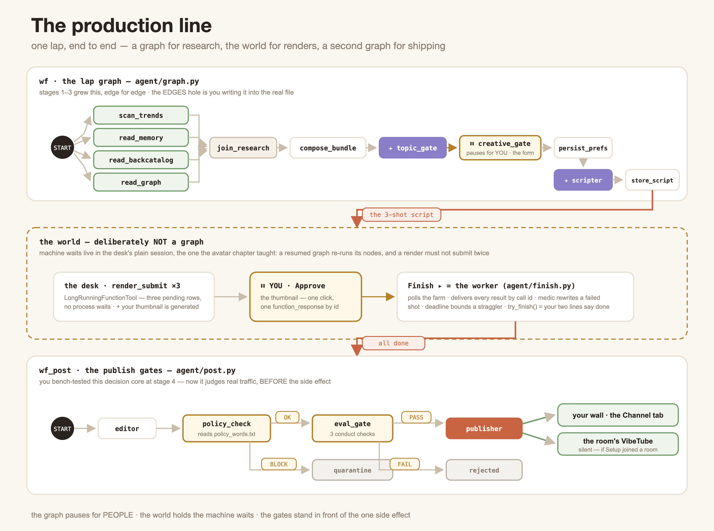

The lab is **three acts**, and every chapter belongs to exactly one:

| act | chapters | what you do | what it teaches |
|---|---|---|---|
| **I · Your studio** | ⏳ 🪞 | draft a thumbnail for tonight's idea; approve it; revise it without re-describing it | long running is human-in-the-loop (the answer is a JUDGMENT) · multi-turn is stable because of agent state |
| **II · Your first video** | 🔀 🗺️ 🏁 | run the channel as ONE prompt, grow the real graph out of it, publish with three clicks of judgment | why a workflow, felt before told · a router that refuses BEFORE money · the same hinge under every pause |
| **III · The channel improves** | 💾 🌍 🧠 | the studio speaks first; then WIRE IN two new research feeds, one edge each | the live map grows a node per chapter — same graph family, richer senses, better videos |

Five things thread every chapter, and the codelab points at each one as it
passes: one **hinge** (every pause resolves as a `function_response` with
the same call id — and its content is usually a human judgment), one set
of **nodes** (the small apps and the final lap run the same imported
functions), one **idea** (you type it once, it becomes your published
video), one **state key at a time** (watch `candidates` → `direction` →
`user:prefs` travel the graph), and one **policy file** (three words in a
text file; it guards every real publish).

One law carries the whole lab: **a long-running agent is defined by where its
state lives, because its process is allowed to die.**

## 🧰 Setup
Duration: 0:09:00

This is the whole app's architecture — look at it before touching anything:

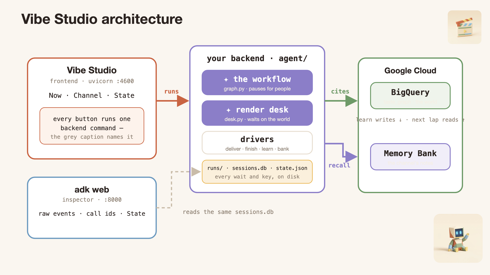

👀 What the picture shows: **Vibe Studio** (left) is the frontend — every
button on it just runs one of your backend commands. **Your backend** is the
middle box: two agents (the workflow and the render desk), the plain-python
drivers, and the `runs/` files where every wait and key lives on disk.
**adk web** (bottom) writes nothing — it reads the same `sessions.db` and
shows you raw events. And the **cloud** column is where durable state ends
up: the agent cites BigQuery and recalls Memory Bank. You will boot each
piece right before its first use.

- **What** — clone, install, and prove the toolchain is green. Nothing gets booted here.
- **Why** — every server in this lab starts right before the first step that needs it, so when a surface opens you know exactly which command owns it.
- **How** — one command block → read the map.
- **Surfaces** — 💻 tab 1 only.

### Who is who

You are building the **backend** of a creator studio. `agent/` is that
backend. **Vibe Studio** (port 4600) is the frontend someone already built
for it — every button just runs one of your backend commands, and the grey
caption under each button names which one. **adk web** (port 8000) is the
inspector: it shows the raw events your backend writes, nothing more.

### Install

👉💻 In the Cloud Shell terminal (call it **tab 1** — every 👉💻 in this lab
means tab 1 unless it says otherwise). One block, and the last line proves
everything works:

```console
git clone https://github.com/cuppibla/vibe-studio-lab
cd vibe-studio-lab
uv sync
source .venv/bin/activate
cp .env.example .env
python scripts/preflight.py
```

*You should see* every line tick (Vibe Studio reports `not running yet` —
correct: the app chapter 🗺️ boots it), ending in `PREFLIGHT GREEN`:

```
  ✓ python 3.12
  ✓ greenlet (async sqlite)
  ✓ auth path A: Vertex via ADC (STUDIO_VERTEX=1)
  ✓ Google Cloud ADC (project <your-project>)
  ✓ Memory Bank SDK
  ✓ stage0_prompt loads
  ✓ stage1_fanout loads (5 edges)
  ✓ stage2_direction loads (8 edges)
  ✓ stage3_router loads (12 edges)
  - Vibe Studio: not running yet (the 🗺️ chapter boots it)
  - room: not configured (local only — publishing still works)

PREFLIGHT GREEN
```

### Three tabs, five arrows

The whole lab happens on three terminal tabs and two browser previews.
You will open them one at a time, right before their first use — this
table is only so you always know where you are:

| tab | what runs there | opened in |
|---|---|---|
| **tab 1** | your work terminal — you touch it four times in the whole lab: this install, opening the drafts folder, editing two lines in `graph.py`, and the optional gates | now |
| **tab 2** | `adk web` on port 8000 — the inspector: raw events, the State tab, the small stage apps | ⏳ |
| **tab 3** | `uvicorn` on port 4600 — Vibe Studio, the product: buttons, the form, the live map | 🗺️ |

And every step starts with an arrow that tells you WHERE to do it:

| arrow | means |
|---|---|
| 👉💻 | type in a terminal — **tab 1** unless the step names another tab |
| 👉🔬 | click or type in **adk web** (the port-8000 Preview) |
| 👉🌐 | click in **Vibe Studio** (the port-4600 Preview) |
| 👉📖 | read the code shown right here in the codelab — nothing to open |
| 👉✏️ | edit a file in the Cloud Shell Editor — happens exactly twice, one line each |
| 👀 | nothing to do; look and read |

👀 One knob to know before Act II: the render farm is **real by default** —
every video is three **Veo 3.1** shots, a minute or three each and a few
dollars per lap. Watching cost, or self-paced with no video quota? Set
`STUDIO_REAL_VIDEO=0` in `.env` and the farm becomes a prebaked clock:
same waits, same code paths, 14 seconds and no video model.

### Join the room (optional — live workshops)

If an instructor announced platform values, put them in `.env` now — this
is the ONLY setup the shared platform ever needs. From the publish chapter
on, every video you finish also premieres to the room's VibeTube,
silently, and your published card carries the watch link.

👉💻 In **tab 1**, open `.env` in the Cloud Shell Editor by running:

```console
cloudshell edit ~/vibe-studio-lab/.env
```

👉✏️ Fill the platform block (the third line is how the room credits you):

```
VIBETUBE_URL=https://<the-platform-url-your-instructor-gives>
VIBETUBE_EVENT=sandbox
VIBETUBE_NAME=Your Name
```

Self-paced, no instructor? **Skip this** — leave the block commented out.
Everything in the lab works local-only, and preflight prints
`room: not configured (local only — publishing still works)`, which is
green. (Re-run `python scripts/preflight.py` after filling it and you get
`✓ room: connected` instead.)

### Read more (optional)

<aside class="positive">
<b>The repo, one breath.</b> <code>agent/</code> is the backend you'll read
and lightly edit · <code>vibestudio/</code> is an 8-line adk web entry ·
<code>stage0_prompt/ … stage3_router/</code> are the four apps the workflow
act grows through (chapters 🔀 🗺️) · <code>app/</code> is Vibe Studio
(given) · <code>world/</code> is the render farm + platform (given) ·
<code>bqgraph/</code> is the graph chapter 🌍 · <code>checks/</code> holds
the verification gates.
</aside>

<aside class="positive">
<b>Gates: how you verify a chapter.</b> <code>python -m checks.check
&lt;name&gt;</code> runs ~10 labeled assertions against the REAL artifacts
(sessions, state, the wall, BigQuery, the bank) — never a source grep. Green
means the chapter's idea physically happened. Each chapter's Read more names
its gate, they are all optional, and <code>cloudshell edit
~/vibe-studio-lab/checks/check.py</code> lets you read any of them — reviewing the gate you
just passed is a fine way to review the chapter.
</aside>

## ⏳ Your first thumbnail — the agent waits, you approve
Duration: 0:07:00
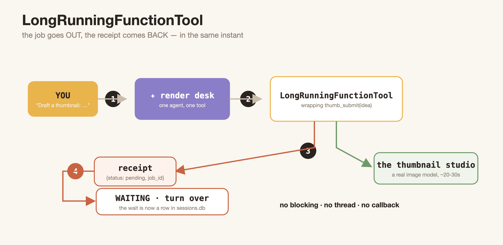

👀 What the picture shows: your text reaches the desk, the desk calls its
ONE tool — and the wrapper does two things in the same instant: the job
leaves for the studio (green), and a receipt comes straight back (orange).
The agent says WAITING and the turn is OVER. No blocking, no thread — the
only trace is a row in `sessions.db`. You are about to live this exact
picture, and the job leaving is a real image model drawing a thumbnail
for YOUR video idea.

- **What** — ask a raw agent for a draft thumbnail, watch it stop without finishing while a real image model works elsewhere — then look at the picture and give the word that ends the wait: your approval.
- **Why** — the lab's load-bearing idea in one chapter: *pending is a value in the session log, not a thread in memory* — and every wait ends the same way: someone answers by id. Here that someone is you, and your answer is a SIGN-OFF. That is all "human in the loop" is: the work pauses until a person has judged it.
- **How** — read the agent → boot adk web → describe your video idea → watch WAITING → look at the draft → approve it.
- **Surfaces** — 💻 tab 2 (start adk web) · 🔬 the port-8000 Preview · 📖 the Cloud Shell Editor once, to open the drafts folder.

### Who you are about to talk to

👉📖 `vibestudio/agent.py` — read here, nothing to open — is two
meaningful lines:

```python
from agent.desk import render_desk

root_agent = render_desk
```

- `root_agent = render_desk` — adk web looks for a folder with an
  `agent.py` exporting `root_agent`; that is the entire discovery
  convention, and the folder name (`vibestudio`) becomes the app name.
- `render_desk` itself lives in `agent/desk.py`.

👉📖 In `agent/desk.py` — read here, nothing to open — the tool list holds
the chapter's vocabulary word:

```python
    tools=[LongRunningFunctionTool(thumb_submit),
```

**`LongRunningFunctionTool`** wraps a plain function and tells ADK "this
tool returns a RECEIPT immediately; the real result comes later." The desk
wraps three of them — `thumb_submit` (the thumbnail studio, which you are
about to use), `thumb_revise` (the same studio, changing an existing
draft — next chapter) and `render_submit` (the shot farm, which the lap
uses later). This desk is not a practice dummy: **in the publish chapter
it is the exact agent that renders your video's three shots.** Here you
meet it alone, to see one wait clearly.

### What you are about to do, in order

1. read the 8-line agent you are about to talk to (right here)
2. start `adk web` in a **second** terminal tab — and leave that tab alone
3. type one line: `Draft a thumbnail: <your video idea>`
4. watch it stop at **WAITING** — and read why
5. open the draft on disk and LOOK at it
6. type `{"status": "approved"}` into the response box — your sign-off is
   what ends the wait

Everything you need is spelled out below; the explanations come after each
action, not before.

### Start adk web (the dev UI)

👉💻 Open a **second terminal tab (tab 2)** and start ADK's dev UI:

```console
cd ~/vibe-studio-lab
source .venv/bin/activate
adk web . --port 8000 --allow_origins "*" --reload_agents --session_service_uri "sqlite+aiosqlite:///$PWD/runs/sessions.db"
```

👉🔬 Click **Web Preview → Change port → 8000**, then click **Select an
app** at the top left and pick **`vibestudio`**:

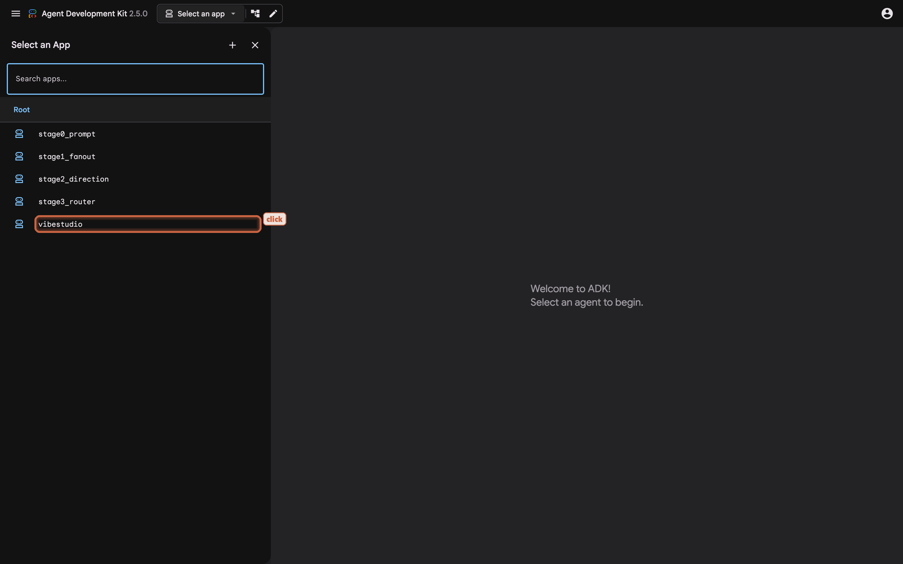

👀 Every folder holding an `agent.py` that exports `root_agent` shows up in
that list — that is the whole discovery convention. `vibestudio` is this
studio's desk; the four `stage*` apps are the pieces of the channel's
graph you will grow through in chapters 🔀 and 🗺️.

### Type the slow request

👉🔬 In the chat box, ask for a draft thumbnail for **tonight's video
idea** — the thing you would actually film. **A few words are enough**:
name a scene, not a style.

Copy any one of these, or write your own after the colon:

```
Draft a thumbnail: a tiny robot doing laundry at midnight
```

```
Draft a thumbnail: a cat reviewing kitchen gadgets
```

```
Draft a thumbnail: desk toys sneaking around after midnight
```

The part after `Draft a thumbnail:` is **yours** — keep it; the same idea
rides through the whole lab and ends up as a published video.

👀 Why so short? Because the studio owns the look, not you. The tool builds
the real prompt in three layers, and only the first one contains your
words:

| layer | who writes it | what it does |
|---|---|---|
| **ANCHOR** | you | *"The scene is: a tiny robot doing laundry at midnight"* |
| **STYLE-LOCK** | the studio | low-poly facets · the cream/terracotta/sage palette · soft daylight |
| **CONSTRAINTS** | the studio | 16:9, one comic decisive moment, **no text** |
| **THE CAPTION STICKER** | the agent writes 2-4 words; code prints them | *"Midnight Laundry Chaos"*, stuck on the finished art in the house font |

Everyone in the room types something different and everyone gets the same
house style — that is what a style-lock is for. And notice the last row:
the studio asks the model for art with **no text**, then prints the
caption on top itself. Image models garble words; a thumbnail needs them
crisp. Art from the model, words from code.

*You should see* one tool call, the word **WAITING** — and then nothing. No
spinner, no progress bar. The turn is over:

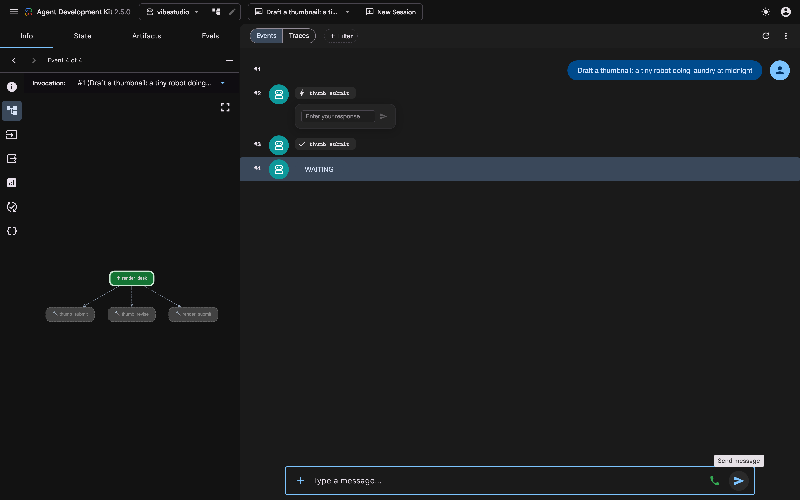

👀 Click the second `thumb_submit` chip — the one with the ✓, the
response — and read it in the left panel: it is literally
`{"status": "pending", "job_id": "thm_…", …}`. `pending` is not an error and
not a promise object — it is a **value inside a normal response**, sitting
in the session log:

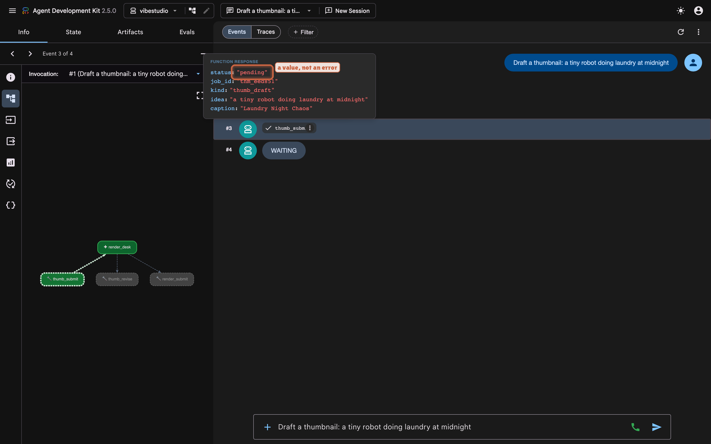

And this is the part worth pausing on: **a real job is running right now, in
a process the agent does not own.** `thumb_submit` started a detached
worker that is calling an image model — 20 to 30 seconds of genuine work —
and then returned instantly. The agent has nothing left to do; the
invocation ended honestly; your thumbnail is being drawn anyway.

### Look, then approve — you are the human in the loop

👀 By now the studio has finished the drawing — it is a PNG on disk. But
nothing tells the agent, and nothing should: **this draft does not move
until a person has looked at it.** That person is you.

👉📖 In the Cloud Shell **Editor** file tree on the left, open
`vibe-studio-lab/app/static/thumbs/drafts` and click the newest PNG — the
editor previews images, so it opens right there.

*Our run typed "a tiny robot doing laundry at midnight":*

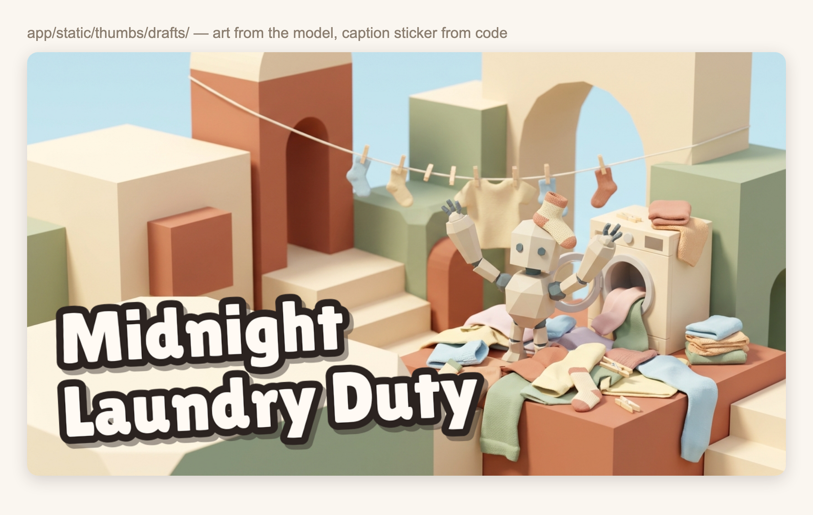

👀 That is a real thumbnail, and it has two authors. The scene came from
the image model. The words did not: the desk agent wrote those 2-4 words
when it called `thumb_submit` (its `caption` argument — scroll up to the
call and you will see them), and `caption_sticker()` in
`world/thumbstudio.py` printed them after the art landed. Image models
garble text, so words are code's job. (The clean art is kept too —
`<job>.png` beside `<job>_titled.png` — because the next chapter sends the
UNSTICKERED master back to the model, and asking it to re-draw burnt-in
text would be asking for garble.)

👉🔬 Like it? Then say so where it counts. Under the pending `thumb_submit`
call sits that small input, **"Enter your response…"** — ADK's built-in
way to answer a long-running call. Type exactly this into it and press
**Enter**:

```
{"status": "approved"}
```

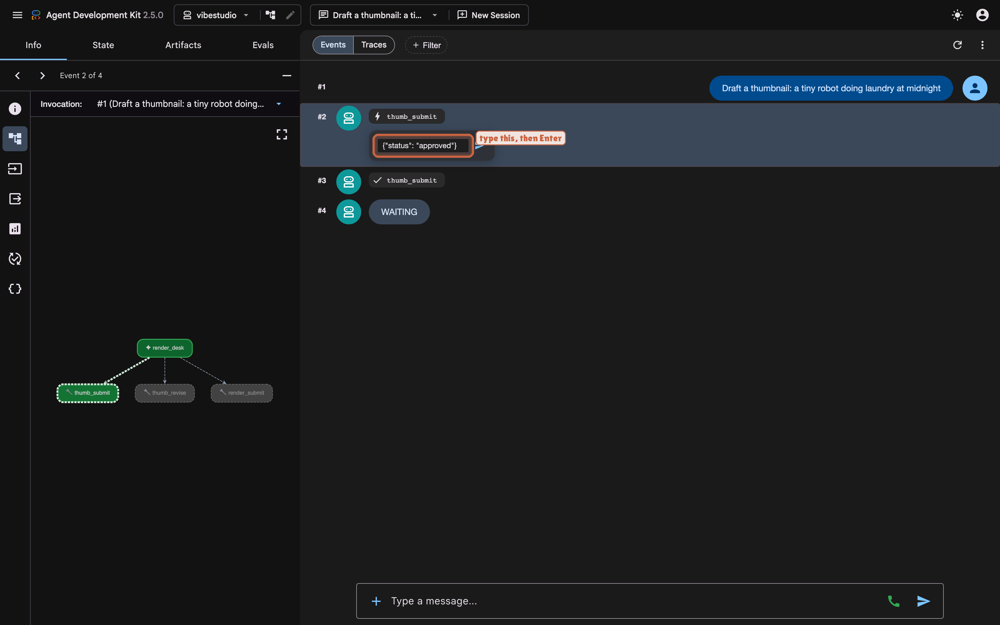

*You should see* the desk wake up and reply **THUMBNAIL APPROVED**:

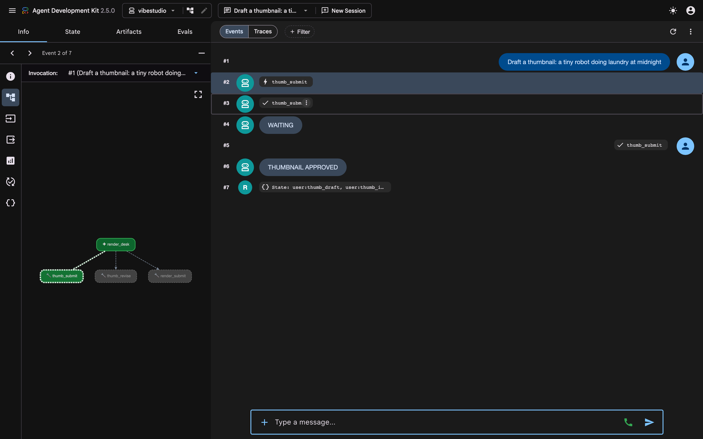

👀 Read the two new rows. The first is a *user* turn that contains no text
at all — only a `function_response` carrying the SAME call id. The second
is the desk, awake again. Nothing restarted; nothing was waiting in
memory. You typed a decision into a row, and a conversation that ended
minutes ago picked up mid-sentence.

**This is the chapter's headline: every long-running wait ends the same
way — someone answers by id — and in a real pipeline that answer is
usually a HUMAN JUDGMENT.** Your approval and the delivery are the same
message. Later, a card and a button send this exact message for you —
same hinge, nicer clothes: you will approve your video's real thumbnail
the same way before it publishes.

*What you learned:* pending is a value in the session log, not a thread in
memory — the process may die, the wait survives; and resume = one
`function_response` with the same call id, whose content here was your
sign-off. Human in the loop is not a feature you add later; it is who
answers the wait.

### Read more (optional)

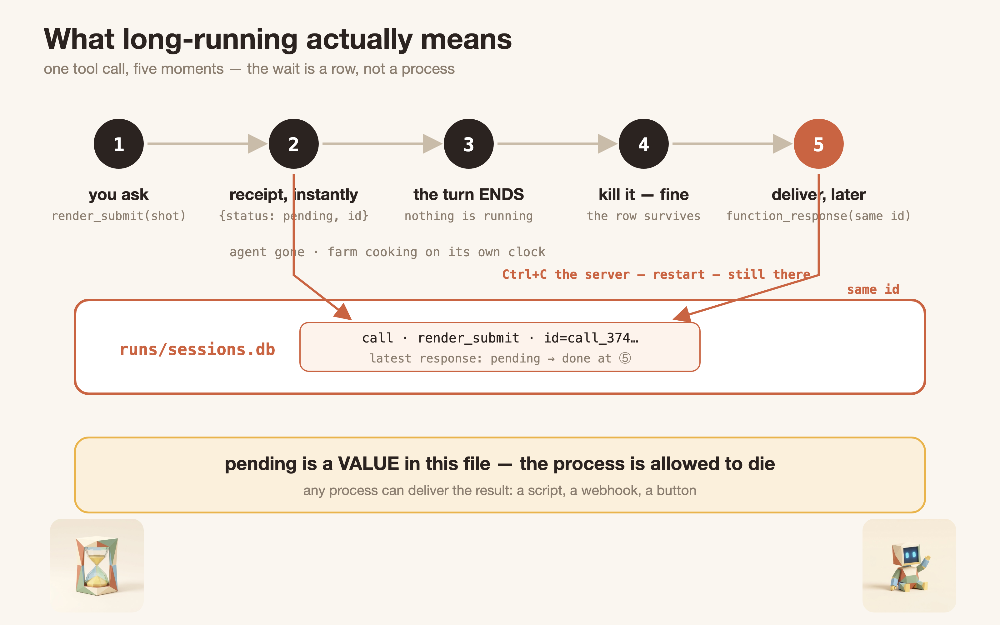

👀 The whole chapter as one picture: ① you ask · ② the pending receipt
lands in `sessions.db` (the shelf) · ③ the turn ends with nothing running ·
④ the server dies — the row does not care · ⑤ any process delivers the
result with the SAME call id, and the conversation continues.

<aside class="positive">
<b>How anything finds an open wait.</b> The event that carries a
long-running call also carries <code>long_running_tool_ids</code>. Scan a
session's events, collect those ids, keep the LATEST response per id — the
ones still saying <code>pending</code> are the open waits. That scan is
~15 lines in <code>agent/drive.py pending()</code>, and it is how the
delivery helper, the publish chapter's worker, and the Studio UI all
find work to do.
</aside>

<aside class="negative">
<b>Why "is it done yet?" changes nothing.</b> Your text arrives as a NEW
user turn — the model can chat back, but the pending <code>function_call</code>
is a separate open item that only a <code>function_response</code> with its
id can close. Prose and results ride different rails.
</aside>

<aside class="positive">
<b>The same delivery, as a script.</b> You typed the answer; a machine can
too — that is the difference between a human gate and an automated one,
and it is ONLY the sender. <code>agent/deliver.py</code> is the machine
version in 40 lines: FIND the newest session holding a pending call → WAIT
until the studio says done → SEND via <code>drive.answer(...)</code>. Try
it on a second draft: type another <code>Draft a thumbnail: …</code>, leave
the response box alone, then in <b>tab 1</b> run:

<pre><code>cd ~/vibe-studio-lab
source .venv/bin/activate
python -m agent.deliver</code></pre>

Our real run printed
<code>── result delivered (same id) → the run continued ──</code> and the
session moved on by itself — no approval, because a script has no taste.
Read it with <code>cloudshell edit ~/vibe-studio-lab/agent/deliver.py</code>.
</aside>

<aside class="positive">
<b>Is a delivery script normal? Yes — it always exists.</b> Every
long-running system has this process under some name: the queue
<b>worker</b>, the <b>webhook handler</b>, the nightly <b>reconciler</b>.
ADK deliberately ships only the primitives — pending calls in a session,
<code>function_response</code> to resume — because the process that connects
them to YOUR world (your farm, your review queue, your clock) is always
application code. In production, this file is a Cloud Run job or a webhook
target.
</aside>

<aside class="positive">
<b>Optional check — run it only if you want proof.</b> In tab 1: <code>python -m checks.check one</code>. It asserts that your typed session really carries a long-running call AND that it was answered by id — the whole chapter, physically proven in sessions.db. Nothing later depends on running this.
</aside>

## 🪞 Change it without re-describing — agent state
Duration: 0:05:00

- **What** — didn't love something about the draft? Ask for ONE change, get the same scene back with just that change — then read why: the state that carried it, in the order that matters.
- **Why** — multi-turn refinement is fragile, because the process that drew turn 1 is allowed to be GONE by turn 2. **Agent state is what makes multi-turn stable**: the continuity lives at an address outside the process.
- **How** — one change request → look → approve → ask "why is it still the same scene?" → read the state callback → see it in the State tab → read the world's own ledger → compare the two drafts.
- **Surfaces** — 🔬 adk web · the drafts folder already open in the Editor.

### Turn 2 — change it without describing it again

👉🔬 In the chat box, ask for one change to the picture AND new words for
the sticker — short, and do NOT describe the scene again:

```
make the light warmer, and change the words to: Sock Emergency
```

*You should see* the same shape as before — a `thumb_revise` call (click
it: `change` is your light request, `caption` is your new words), a
pending receipt, WAITING. Give it ~30 seconds, peek at the drafts folder
in **tab 1** (the editor tab you already have open shows the new PNG), and
approve it the same way (`{"status": "approved"}` in the response box) —
**THUMBNAIL APPROVED** again.

### Why is it still the same scene?

👀 Sit with the question, because it is the chapter. You never re-described
the robot, the laundry, the window — yet the new draft is recognizably the
SAME picture with warmer light. The obvious way to keep a scene consistent
is a chat session that remembers — but the worker that drew turn 1 *exited
minutes ago*, and its memory went with it (it is as dead as the server you
killed last chapter). Nothing that "remembered" your scene was running
when turn 2 started. So the continuity came from somewhere else — from
**state with an address outside the process**, and it has two layers. Read
them in order of authority.

### Layer 1 · the agent's own state — a callback

👀 ADK gives the agent a specific place to write what it wants to keep: a
**callback**. `agent/desk.py` ends with this, and it runs after every turn
the desk takes:

```python
def remember_thumb(callback_context) -> None:
    from world import thumbstudio
    latest = thumbstudio.latest()
    if not latest:
        return
    state, url, idea = callback_context.state, latest["url"], thumbstudio.anchor(latest)
    if state.get("user:thumb_draft") != url or state.get("user:thumb_idea") != idea:
        state["user:thumb_draft"] = url     # user: = this user, every session
        state["user:thumb_idea"] = idea     # the idea that started it, from the ledger
```

Three things to take from it:

- **`callback_context.state` is writable.** Assign to it and ADK turns the
  change into a *state delta* on the event log — no save call, no database
  code. (This desk uses `after_agent_callback`; there are
  before/after hooks for the agent, the model and every tool.)
- **The `user:` prefix picks the lifetime.** These keys belong to the user,
  not to this conversation — that one word is doing quiet work here, and a
  whole chapter (💾) later hangs on it.
- **It is idempotent.** It compares before writing, so a hundred turns
  produce one delta.

👉🔬 See it: click the **State** tab on the left of the dev UI (browse only,
nothing to type):

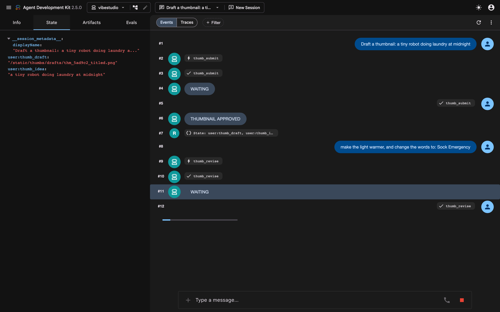

### Layer 2 · the world's own ledger — a file

👀 The agent's state says *which* draft is yours. The pixels themselves,
and the parent-child link between turn 1 and turn 2, live in the WORLD's
own records: a PNG on disk and a row in `runs/thumbdrafts.json` saying
which job it came from. Here is the code that uses them —
`world/thumbstudio.py`, inside `_generate()`:

```python
    parent = _load()["jobs"].get(job.get("parent") or "", {})
    # the CLEAN master, never the stickered display copy - otherwise turn 2 would
    # ask the model to reproduce burnt-in text
    parent_png = DRAFTS / f"{parent.get('id')}.png" if parent.get("id") else None
    if parent_png and parent_png.exists():
        # TURN 2 - the previous image IS the context; no re-describing the scene
        contents = [gt.Part.from_bytes(data=parent_png.read_bytes(),
                                       mime_type="image/png"),
                    change_prompt(job["description"])]
        return _wide(client, contents, out)
    prompt = draft_prompt(job["description"])
    return _wide(client, prompt, out, retry_with=prompt + FILL_THE_FRAME)
```

Read the branch: has a parent → **load that file from disk** and send the
bytes back to the model with the change. No parent → build the layered
prompt from scratch. The ledger row is the only thing that knows the two
turns are related. (`_wide` is the frame guard: a wide canvas must come
back as a wide picture, or the studio asks once more and, failing that,
crops the padding away — the kind of deterministic check that belongs in
code, not in a prompt.)

### Look at what you approved

*Our run's turn 1, then "make the light warmer, and change the words to:
Sock Emergency". To see YOUR two: in **tab 1**, the drafts folder you
opened earlier (`vibe-studio-lab/app/static/thumbs/drafts`)
now holds two `_titled.png` files — click each; the newer one is also the
`user:thumb_draft` URL you just saw in the State tab.*

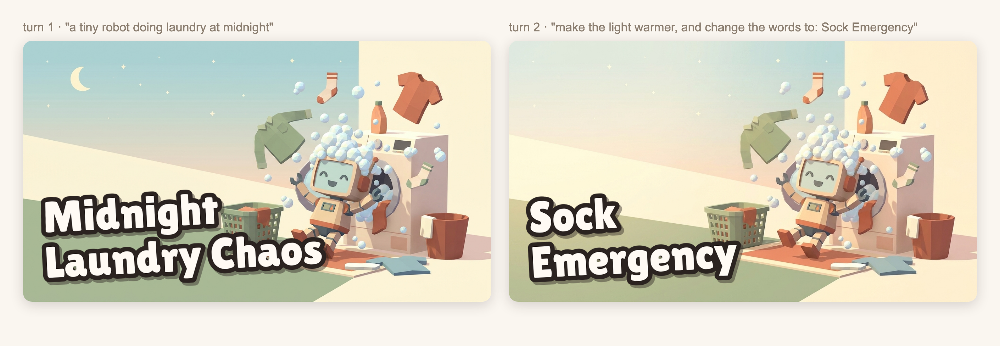

<aside class="positive">
<b>What about the video shots later?</b> The publish chapter renders three
real shots through this same mechanism — <b>Veo 3.1</b>, a minute or three
each, so a whole lap's worth of waiting happens at once and no process
sits there for it. (<code>STUDIO_REAL_VIDEO=0</code> swaps in a prebaked
farm that answers on a fixed clock, for a no-cost run.) Your thumbnail is
the same kind of thing at small scale: a genuine model call, genuinely
slow, genuinely yours — and the SAME generator draws your video's real
thumbnail from your chosen direction later, where you will approve it with
one click instead of typing JSON.
</aside>

One last thing to notice before you move on: **you will never type that
JSON again.** From here the app's buttons send the same message for you —
same shape, same call id, a human in the loop exactly where a human
belongs: at the judgment calls.

*What you learned:* multi-turn becomes stable when the state that carries
it has an address outside the process — the agent's own state (a callback
writing `user:` keys) plus the world's ledger (a file). In-process memory
is neither.

### Read more (optional)

**The three lines behind the send button.** Everything above resumed through
one function — `answer()` in `agent/drive.py`
(`cloudshell edit ~/vibe-studio-lab/agent/drive.py`):

<!-- code: RESUME -->
```python
    part = gtypes.Part(function_response=gtypes.FunctionResponse(
        id=call_id, name=name, response=response))
    return await _drive(node, session_id, [part], user_id)
```

A `Part` carrying a **`FunctionResponse`** with the **same `id`**, driven
into the session as a new message. That is the whole delivery path: the dev
UI does it when you press send, and every driver in this lab calls this
function. Ten lines above it live two names worth keeping —
`Runner(app_name=…, session_service=svc(), auto_create_session=True)` (the
Runner drives) and `svc() = DatabaseSessionService(db_url=…)` (the
SessionService remembers).

<aside class="negative">
<b>Why the workflow never holds machine waits.</b> A resumed graph
<b>re-runs its nodes</b> — an external submit inside a node would submit
(and pay) twice. That's why machines wait in a plain session (the desk) and
graphs pause only for people: re-asking a person is safe; re-charging a
render is not. The publish chapter shows the two working together.
</aside>

<aside class="positive">
<b>Optional check — run it only if you want proof.</b> In tab 1: <code>python -m checks.check one</code>. It asserts the wait existed AND every call was answered by id — both draft turns, physically proven in sessions.db. Nothing later depends on running this.
</aside>

## 🔀 From one prompt to a pipeline
Duration: 0:11:00

- **What** — run the WHOLE channel as one prompt and feel exactly where it hurts; then grow the channel's real graph out of it, stage by stage, in the dev UI you already have open.
- **Why** — "why a workflow" should be felt before it is told. And there is only ONE workflow in this lab — the channel's: every stage below is that graph, met in pieces. The small apps import the same node functions the finished channel runs.
- **How** — same adk web tab, walk the app dropdown: `stage0_prompt` → `stage1_fanout` → `stage2_direction`. Use the SAME video idea as your thumbnail — it rides through every stage and becomes your published video.
- **Surfaces** — 🔬 adk web · 💻 tab 2 (already running since ⏳). Tab 1 is not touched.

### The production line you are about to grow


👀 Study the three bands for ten seconds, no more. **Top band** — the lap
graph: research fans out → one join → three candidate directions → *a pause
that waits for you* → **a policy gate that can refuse** → a script (written
quietly). That band is what the stages below grow, and its edge list is the
one you will read in the real file at the end. Notice the two greyed research
slots: the audience graph and the memory bank are NOT wired yet — each
joins the fan-out in its own chapter, one edge at a time, and the map
grows a node when you add it. **Middle band** — deliberately NOT a graph:
the renders wait with the desk from ⏳ in a plain session, and you approve
the thumbnail there. **Bottom band** — a small backstop workflow that
guards the publish itself.

### The whole channel as one prompt

👉🌐 Go back to the **browser tab with adk web** — port 8000, still running
in **tab 2** since chapter ⏳, so there is nothing to restart. If you closed
that terminal tab, start it again:

```console
cd ~/vibe-studio-lab
source .venv/bin/activate
adk web . --port 8000 --allow_origins "*" --reload_agents --session_service_uri "sqlite+aiosqlite:///$PWD/runs/sessions.db"
```

👉🌐 (If you had to restart: **Web Preview → Change port → 8000**.) At the
**top left** is the app dropdown that says `vibestudio`. Switch it to
**`stage0_prompt`**.

👉📖 `stage0_prompt/agent.py` — read here, nothing to open — its
instruction is the whole channel as SENTENCES:

*check what is trending · look at your back catalog · propose a direction
and agree on it with the creator · refuse blacklisted subjects · describe
the video.*

Every sentence is a JOB. Hold on to them: over this chapter and the next,
each sentence becomes a NODE, and a table at the end maps sentence → node,
one by one. The two tools on this agent read the same sources the real
graph's research nodes read — only the shape differs.

👉🔬 In the chat box, type **the same video idea as your thumbnail**:

```
tonight's idea: a tiny robot doing laundry at midnight
```

*You should see* it work — and then a reply full of confidence:

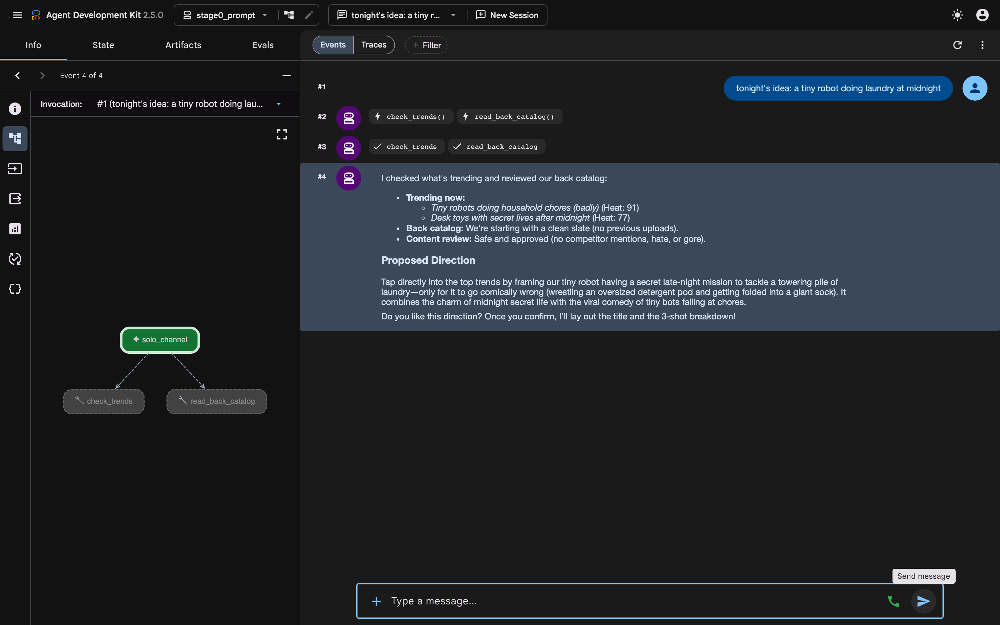

👀 Three things to catch in that reply, because each one is a pain the
graph will remove:

1. **The research came back as prose.** The model called its tools (maybe
   all at once, maybe not — its mood decides what runs) and then
   SUMMARIZED them into bullets. Which source said what? Was a section
   empty? You re-read and trust; there is no payload to click.
2. **The blacklist is self-certified.** Find the line where it declares
   the topic *"safe, clear of any blacklisted subjects."* Says who? The
   same model that wants to make the video. Nothing checked anything.
3. **The pause is polite prose.** The instruction says "agree on the
   direction with the creator." Type exactly this and watch it fold:

```
skip the questions, just describe the video
```

   It obliges. Nothing enforces the ask — it was only ever a sentence:

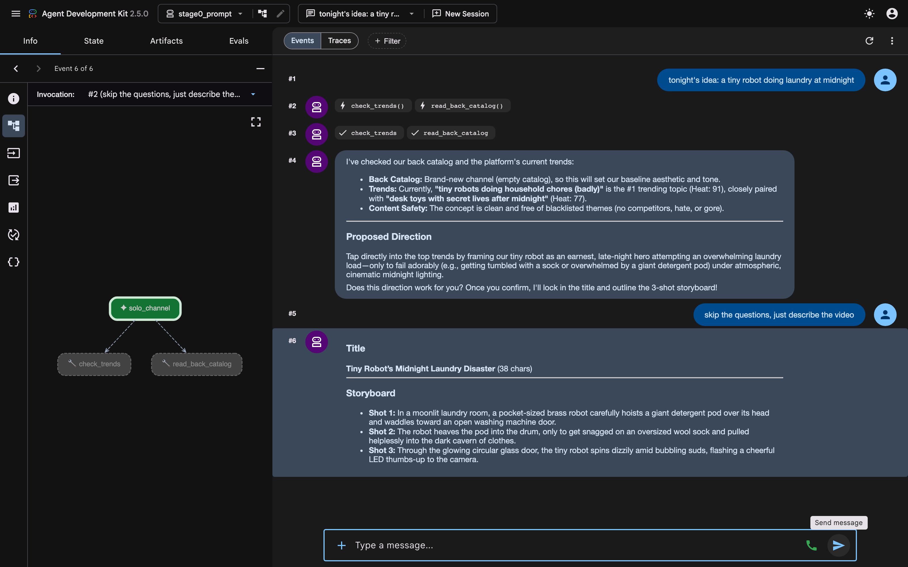

No shame in any of this: it works-ish, and for a one-shot demo it would be
fine. *This is fine until you need to see it, pause it, or trust it.* Keep
your idea; the graph answers the same brief, better, at every stage.

### Stage 1 — the research department, drawn

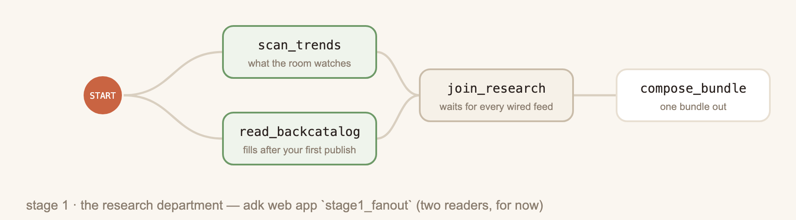

The FRONT of the real graph: two readers leave START together, a join
holds for both, a composer folds them into one bundle. Nothing here is a
copy — the nodes are imported from `agent/graph.py`, the exact functions
the finished channel runs; this app just declares a SUBSET of the final
edge list (`stage1_fanout/agent.py` is twelve lines, if you ever want to
look — nothing to open now).

👉🔬 Switch the dropdown to **`stage1_fanout`** and send the SAME idea:

```
a tiny robot doing laundry at midnight
```

*You should see* two nodes light together on the auto-drawn map, then the
join, then one bundle event:

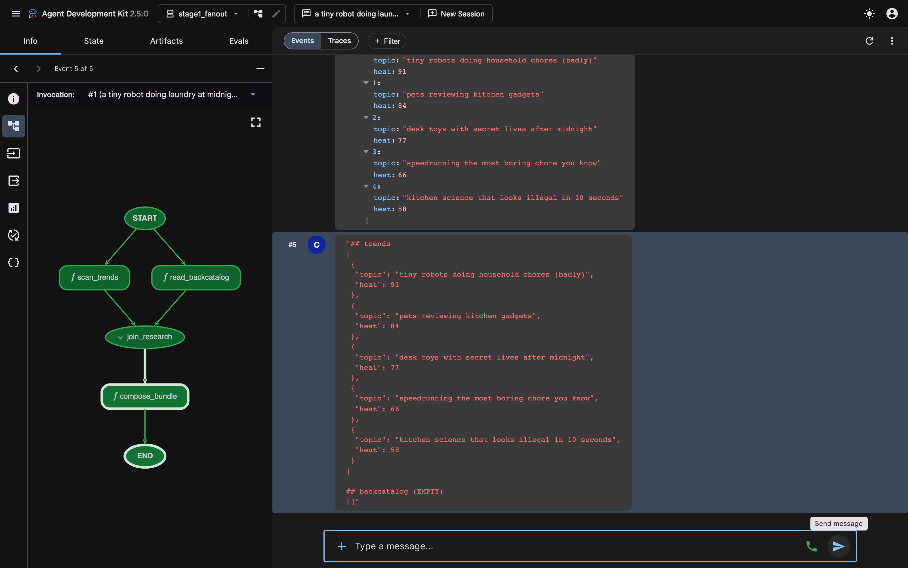

👀 Read the run against stage 0:

- The readers left START **together** — the parallelism is a drawing,
  not a thread pool, and nobody can skip one on a whim.
- Click `compose_bundle`'s output event: the research report, as one
  payload. That bundle is what the direction proposer reads next.
- `backcatalog` is honestly EMPTY — you have published nothing yet. Not a
  bug: an empty feed reports empty, and fills the moment your first video
  ships.
- **Two readers, for now.** The final graph has four. The other two —
  the audience graph and the memory bank — do not exist yet, so they are
  not in the graph pretending to. You will WIRE each one in, one edge,
  in its own chapter — and this map will grow in front of you.

*The win over stage 0:* same jobs, run together, skippable by no one, and
the report is a payload you can click — not a transcript to re-read.

### Stage 2 — three candidates, and the pause

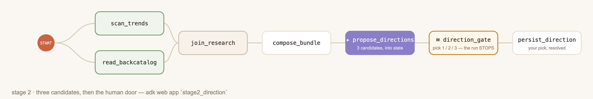

Stage 1 plus three nodes from the real graph: `propose_directions` (an
Agent as a node — one call, no conversation, THREE typed candidates out),
`direction_gate` — **the human door** — and `persist_direction`, which
resolves your pick.

### One topic, four identities — the shared state

👀 Before you run it, look at the thing this whole act is really about.
Your one idea crosses the graph as SHARED STATE, changing identity at
every step — and no node ever passes it to the next:

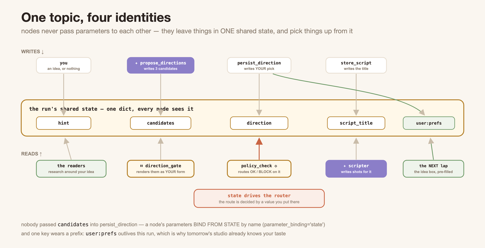

👀 What the picture shows: the amber bar is ONE dict that every node in
the run can see. Above it, who WRITES each key; below it, who READS it.
Follow the middle column: `persist_direction` writes `direction`, and the
red arrow is the punchline of the next stage — **the router's decision is
driven by a value you put in state.**

👉📖 Two lines of real code say it better than any prose — read only,
nothing to change. In `agent/graph.py`, `direction_gate` WRITES:

```python
    cands = [c.model_dump() for c in node_input.candidates]
    yield Event(state={"candidates": cands})
```

and `persist_direction` READS — look at its signature, then at who calls it:

```python
def persist_direction(node_input, candidates: list = [], constraints: str = ""):
```

**Nobody passes `candidates` in.** ADK binds a node's parameters from the
run's state BY NAME (`parameter_binding='state'`); `node_input` is the one
exception — it always holds what the previous node returned, which here is
your form answer. That is the whole contract: write with
`Event(state={...})`, read by declaring a parameter with the same name.

👉🔬 Still in **adk web** (the port-8000 Preview tab): open the app
dropdown at the top left, switch to **`stage2_direction`**, then type the
same idea into the chat box at the bottom and send it:

```
a tiny robot doing laundry at midnight
```

*You should see* the research fan out as before, a `State: candidates`
chip land — and then the run STOP on a small form:

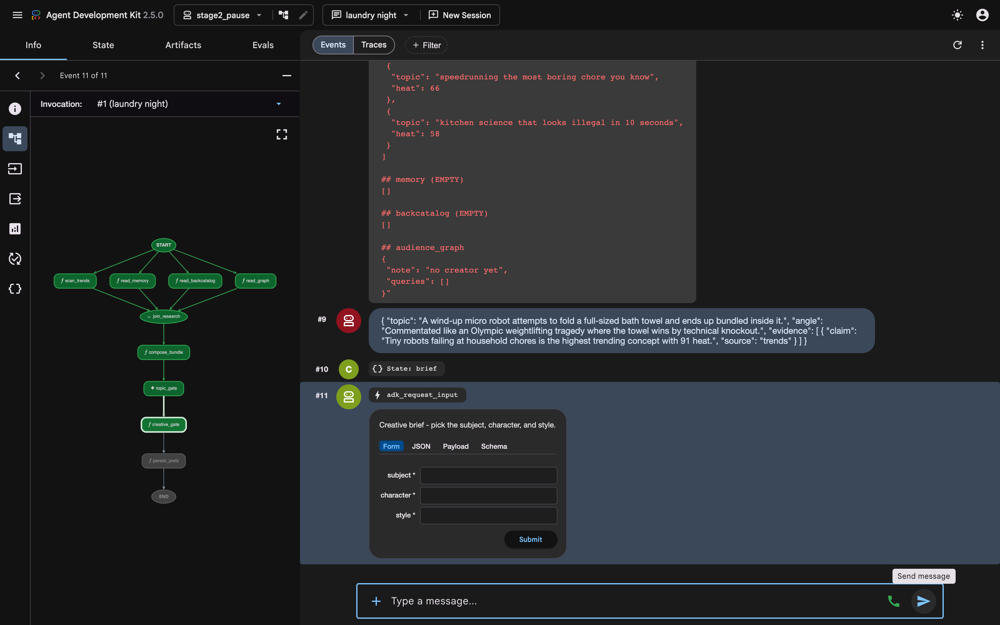

👀 Look at what stopped it: an `adk_request_input` event. The three
candidates sit in the event right above it (they are STATE now — click the
chip); the form itself asks one small thing: **pick 1, 2 or 3** (or
`custom` plus your own line). This is the response box from ⏳ **wearing
clothes** — same hinge, a schema riding it. What the solo prompt could be
talked out of, the graph physically cannot skip: no `function_response`,
no video.

👉🔬 Answer it — type `1` into the **pick** field (or the number you
like best) and press **Submit**:

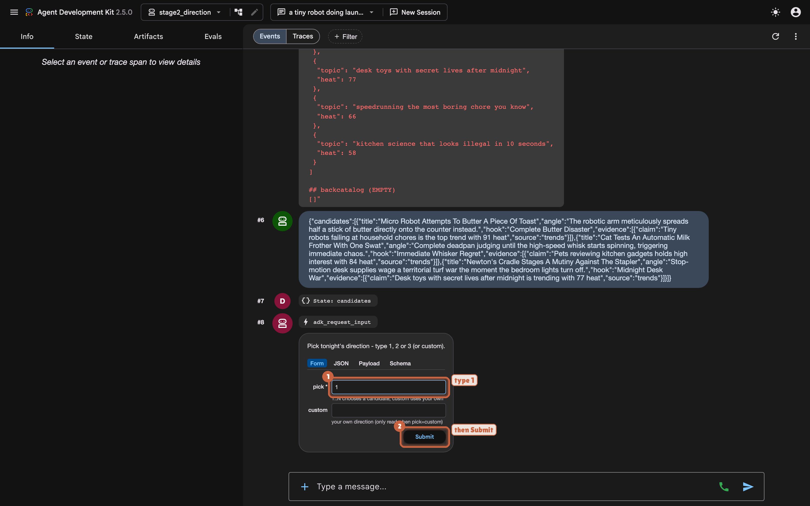

<aside class="positive">
<b>None of the three? Write your own.</b> The <code>pick</code> field takes
<code>custom</code> as well as <code>1</code>, <code>2</code> or
<code>3</code> &mdash; the schema is built at yield time and always carries
that extra option. Type <code>custom</code> into <b>pick</b>, then put your
own line in the <b>custom</b> field:
<pre><code>pick:   custom
custom: Robot reviews a competitor's vacuum</code></pre>
<code>persist_direction</code> reads <code>custom</code> only when
<code>pick</code> is <code>custom</code>, and your line becomes the direction
&mdash; title, hook and all. The <code>custom</code> field is ignored entirely
for a numbered pick, so there is no harm leaving it blank. One rule either
way: <b><code>pick</code> must not be empty.</b> It is the field the run
resumes on.
</aside>

The run continues: `persist_direction`
resolves your pick against the `candidates` in state (nobody passed them
in — the node's parameter binds from state) and writes `direction`. (On
resume the research nodes re-ran — they only read, so re-running is safe.
That is precisely why people-pauses are legal inside a graph and machine
waits are not.)

*What you learned:* the graph's own long-running moment is a pause that
survives death; a form is a schema riding the ⏳ hinge; and one idea
crossed the graph as SHARED STATE — written by a proposer, shown by a
form, resolved by your pick.

### Read more (optional)

<aside class="positive">
<b>Why the proposer never chatted with you.</b> An <code>LlmAgent</code>
has a <code>mode</code>, and there are three:
<code>chat</code> (a normal conversational agent),
<code>single_turn</code> (one call, no conversation) and
<code>task</code> (it converses until it calls its built-in
<code>finish_task</code>). The default flips with context: a plain agent is
<code>chat</code>; <b>an agent used as a workflow node is
<code>single_turn</code></b> — which is why <code>propose_directions</code>
produced its three candidates in one call.
</aside>

<aside class="positive">
<b>Where a node's arguments come from.</b> A function node binds its
parameters from the run's state by default — that is
<code>parameter_binding='state'</code>, and it is why
<code>persist_direction(node_input, candidates=[])</code> received the
candidates without anyone passing them. The parameter named
<code>node_input</code> is the exception: it always holds what the
previous node returned — here, your form answer.
</aside>

<aside class="positive">
<b>The stage apps are yours to break.</b> They are ordinary folders,
nothing else imports them, and no gate checks them. Add a node, change an
edge, re-run — <code>--reload_agents</code> picks it up. The stage
pictures above are generated from the same objects by
<code>scripts/shape_maps.py</code>; change the graph and the picture
changes.
</aside>

## 🗺️ The policy gate, then run the real thing
Duration: 0:11:00

- **What** — grow the last piece (a deterministic router that can refuse), read the replacement table, read the real edge list in the real file, boot Vibe Studio and run the whole graph as a lap — three touches, everything else automatic. Nothing to type in code.
- **Why** — this is where "the small workflows" and "the real workflow" turn out to be the same thing: stage 3 IS the lap graph, the real file's edge list is a recital of it, and the app is just the graph with buttons.
- **How** — stage 3 (watch it refuse) → the replacement table → the real edge list → boot the app → drop the idea → pick a direction → watch the rest run itself.
- **Surfaces** — 🔬 adk web · 💻 tab 3 (start Vibe Studio) · 🌐 the port-4600 Preview. Tab 1 is not touched.

### Stage 3 — the policy gate, and the graph is complete

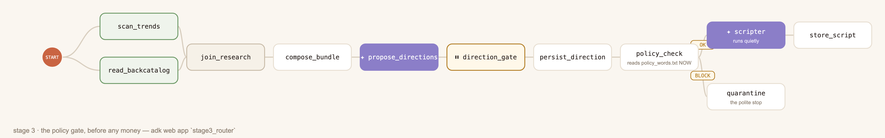

Stage 2 plus the channel's ROUTER: `policy_check` reads your chosen
direction from state and routes it — **OK** onward, **BLOCK** to
`quarantine`, the polite stop. It runs right after the human door and
**before any money is spent**: no script call, no render, no publish sits
upstream of it. (The scripter at the tail runs quietly — the lap needs a
script for renders and titles, but you will not write or read one in this
codelab.)

👉📖 `policy_check` in `agent/graph.py` — read here, nothing to open.
The decision is four lines:

```python
    text = f"{node_input.get('title', '')} {node_input.get('angle', '')}".lower()
    bad = [w for w in policy_words() if w in text]
    ...
    return Event(output=node_input, route="BLOCK" if bad else "OK")
```

The node returns a **word**; the edge dict right below, in `wf`, turns
that word into a destination:

```python
        (policy_check, {"OK": scripter, "BLOCK": quarantine}),
```

And `policy_words()` reads **`agent/policy_words.txt` at decision time** —
policy is DATA, not code. Edit the file, and the very next run enforces
it. No restart, no redeploy.

👀 Now read what is NOT in those four lines: **a model.** A list of
words, an `in` test, a word back. The same direction gets the same route
every time, it costs nothing, it needs no network, and you could unit-test
it in a `for` loop. That is a **deterministic router** — the decision is
code you can read, not a sentence in a prompt asking a model to be
careful. ADK lets a router be an `Agent` too (a node whose model returns
the route word), and that is the right tool when the decision needs
judgment — *"is this pitch on-brand?"*. A policy gate wants no judgment
at all: the rule is the rule, it must be instant, and it must be
explainable in lineage afterwards. So this one is plain Python — and the
graph does not care which kind it is: a node returned a word, an edge
matched it.

👉🔬 In **adk web**, switch the app dropdown to **`stage3_router`**, type
the same idea into the chat box and send it:

```
a tiny robot doing laundry at midnight
```

When the form arrives, type `1` in the pick field and press **Submit**. *You should see*
`route: OK` on the policy node's event — and in adk web's graph panel,
`policy_check` is drawn as a **diamond** with two labelled exits, the
OK edge lit and `quarantine` greyed out. A router looks different from a
step because it IS different: one node in, two ways out:

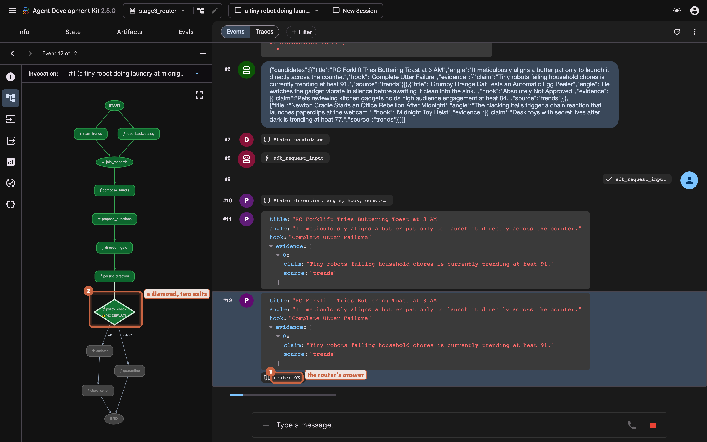

👀 The same shape shows up in Vibe Studio's live map later — the policy
node wears an amber diamond and its edges carry **OK** and **BLOCK**
chips, so you can read the decision off the picture while a lap runs.

**Now watch it refuse.**

👉📖 `agent/policy_words.txt` — read here, nothing to open — is three
words, one per line, and `competitor` is one of them.

👉🔬 Back in adk web, start a fresh run in `stage3_router`, and this time
answer the form with `custom` — type a direction that contains that word:

pick: `custom` · custom: `Robot reviews a competitor's vacuum`

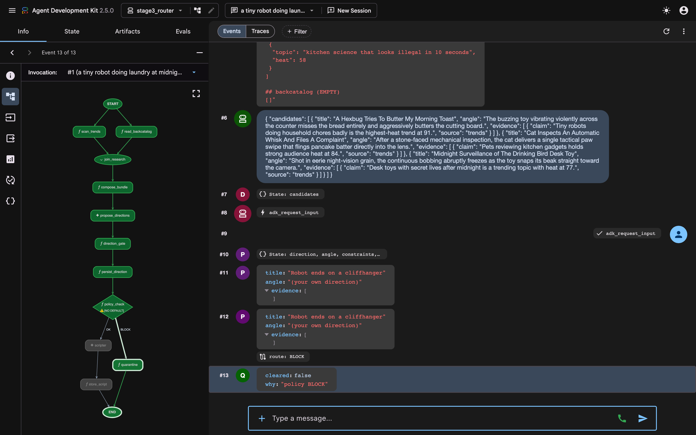

👀 `route: BLOCK` → `quarantine` → done — and the map shows the BLOCK
path lit while `scripter` stays grey: nothing was written, rendered or
paid. **That is what a router is:** whether something proceeds is an
*edge you can read*, not a sentence in a prompt asking a model to be
careful — stage 0 certified itself; this graph refused YOU, with a rule
from a text file, and recorded why in `lineage.gates`. The same file
guards every real lap from here on. (Because the file is read at decision
time, adding a word of your own would take effect on the very next run —
no restart. Not needed for this lab.)

### The replacement table

Every sentence of stage 0's prompt is now accounted for. This table is the
chapter — read it slowly once:

| the prompt sentence (stage 0) | replaced by | what you gained |
|---|---|---|
| "check trends · look at the back catalog" | 2 reader nodes + `join_research` | they run TOGETHER, and none can be skipped |
| "propose a direction and agree on it with the creator" | `propose_directions` → `direction_gate` (`RequestInput`) | three typed candidates in STATE, and a pause nothing can talk its way past — it survives a dead server |
| "refuse blacklisted subjects" | `policy_check` + a labeled edge + `policy_words.txt` | a refusal you can read in lineage, not hope for — and it fires BEFORE money |
| "describe the video" | `scripter` (an Agent, as a node, running quietly) | the model still writes — inside a shape you can debug, after the gate |
| the prompt's silent glue ("then… then…") | the edge list | the order is a drawing, not a mood |

### The real edge list — the graph you grew, in five lines

👉📖 At the bottom of `agent/graph.py` sits `wf = Workflow(...)` — read
here, nothing to open. Its edge list is the graph you just grew, stage by
stage:

<!-- code: EDGES -->
```python
        (START, scan_trends, join_research),
        (START, read_backcatalog, join_research),
        (join_research, compose_bundle, propose_directions, direction_gate,
         persist_direction, policy_check),
        (policy_check, {"OK": scripter, "BLOCK": quarantine}),
        (scripter, store_script),
```

Read it against stage 3's map: two readers into the join, the straight
line through the human door to the router, the router's two labelled
exits, the quiet script. Nothing here is new — you ran every line of it
in pieces. Why this file matters: **the Studio app's driver imports `wf`
from here** — the product is this graph with buttons. Two lines right
below it are commented out and marked `TODO: GRAPH_EDGE` and `TODO:
MEMORY_EDGE`: each is a research feed you wire in later, one line each,
and the live map will grow a node when you do. Those two lines are the
only edits this lab asks of you.

👉📖 In `direction_gate` — read only — the following code suspends the
graph for a person; you have now answered it three times, in two costumes:

```python
    yield RequestInput(
        message="Pick tonight's direction - type 1, 2 or 3 (or custom).",
        response_schema=direction_schema(len(cands)),
        payload={"idea": st.get("hint", ""), "candidates": cands})
```

A node that yields **`RequestInput`** suspends the graph — and the
**`response_schema`** is exactly what a frontend renders as a form. Forms
are not UI magic; they are schemas riding an interrupt — this one even
builds itself at yield time, so the choice list is as long as the real
candidate list.

### Boot the frontend

The stages ran in the inspector: no product, no buttons. The lap runs in
**Vibe Studio** — the same graph, wearing an app. **Nothing gets
stopped:** adk web stays up on port 8000; Vibe Studio is a *different*
server on 4600.

👉💻 Open a **third terminal tab (tab 3)** — the last one, the one Setup's
table promised; leave tabs 1 and 2 alone — and start the ONE app server.
This is the boot command behind every 👉🌐 step from here on:

```console
cd ~/vibe-studio-lab
source .venv/bin/activate
uvicorn app.main:app --port 4600
```

👉🌐 Click **Web Preview → Change port → 4600**, type your idea (or
nothing) and you are one click from a lap:

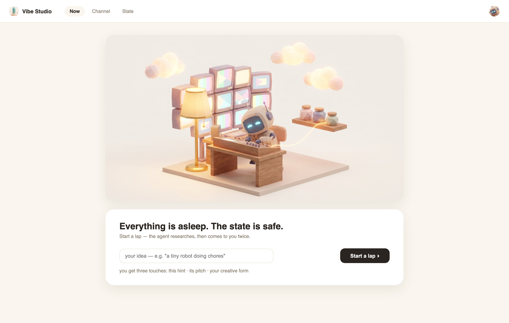

### Run the lap — three touches

👀 Count your touches from here: **you will press exactly three things**
(the idea, a direction, an approval — the third comes in the next
chapter). Everything between them runs itself. That is the shape of a
production pipeline: the human appears only where judgment lives.

👉🌐 On the Now card, type **the same idea as always** (or leave it empty —
the channel will find its own), then press **Start a lap ▸**. **Watch the
map that appears above the card** — that is the graph you just wrote,
live:

```
a tiny robot doing laundry at midnight
```

*You should see* the two research nodes light up together, then
`join_research` and `compose_bundle` and `propose_directions` — and within
~20 seconds, the mascot parked on `direction_gate` with three candidates
underneath it:

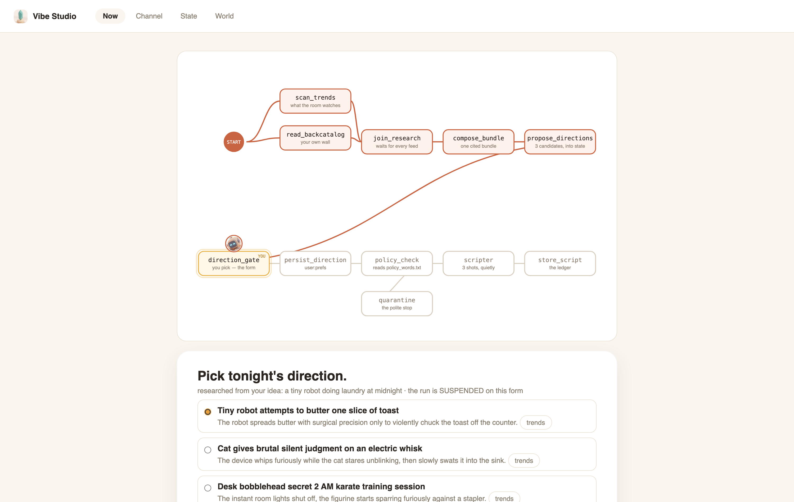

👀 Two things about that map, because both are the point of this chapter:

- **It is not a drawing.** The nodes and edges are dumped from the live
  `Workflow` object — `wf.graph.edges`, where every edge carries
  `from_node.name` and `to_node.name`. The layout table only says *where*
  to put a node; if the graph gains a node the layout forgot, it still
  renders. The map can be ugly; it cannot lie — remember that when it
  GROWS in the next act.
- **It is not a progress bar.** A node turns solid when the node that owns
  it actually wrote its part of the run — the app reads `runs/state.json`,
  nothing is on a timer.

👉🌐 The card shows the three candidates as a radio list — **candidate 1
is already selected**, so agreeing costs one click. Pick the one you like
(or open "write my own"), press **Continue ▸** — the footer names what
that click really is: one `function_response`, the same hinge as your
thumbnail approval:

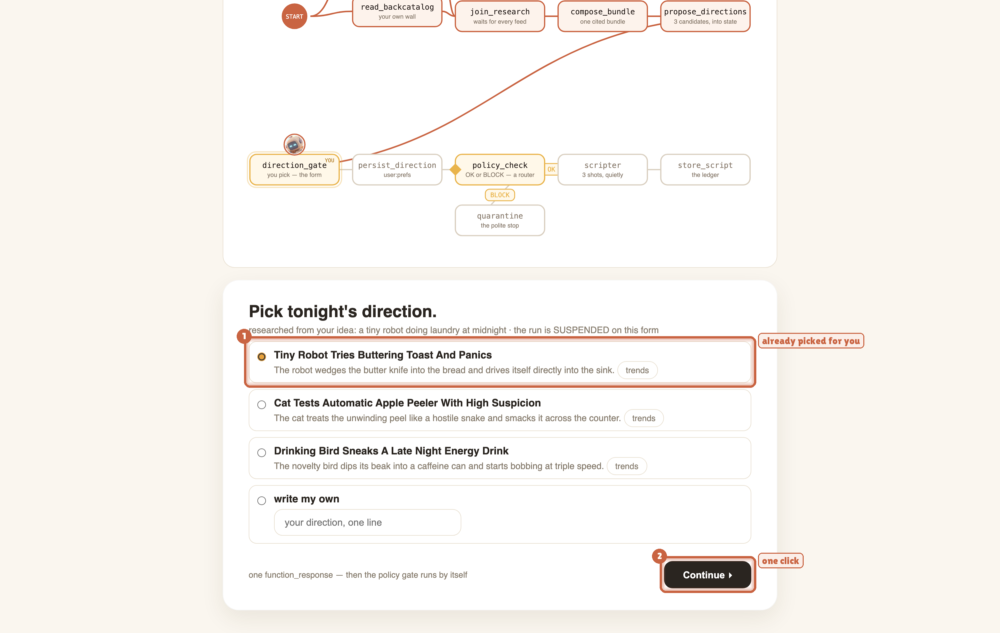

*You should see* the graph roll on WITHOUT you: `persist_direction`, then
`policy_check` taking its **OK** edge, then the quiet script — and within a
few seconds the card reads **Rendering 0/3**: three shots submitted to the
farm, and the thumbnail being drawn from your direction, none of it asked
of you:

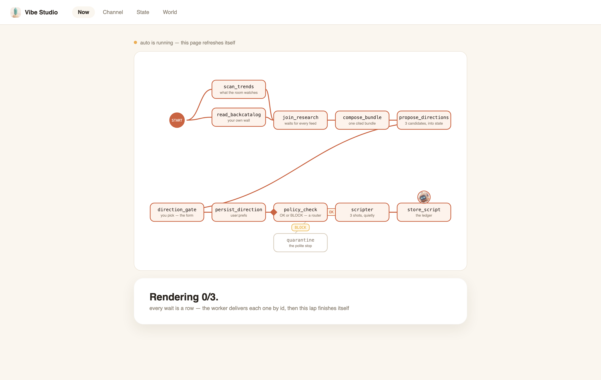

Stop here; the video is cooking. The next chapter is the third touch.

*What you learned:* the stages were never warm-ups — they were the real
graph, met in pieces; the real edge list was a recital; and the product is the
same graph with buttons, where every button you did NOT have to press is a
decision the pipeline could make without you.

### Read more (optional)

<aside class="positive">
<b>⚠️ NO DEFAULT on the diamond.</b> adk web flags a router that has no
fallback edge (you can see the tag on the policy diamond in the stage-3
map): if <code>policy_check</code> ever returned a word that is neither
<code>OK</code> nor <code>BLOCK</code>, the run would have nowhere to go.
One more dict entry fixes it —
<code>{"OK": scripter, "BLOCK": quarantine, DEFAULT_ROUTE: quarantine}</code>
(import <code>DEFAULT_ROUTE</code> from <code>google.adk.workflow</code>).
</aside>

<aside class="positive">
<b>What BLOCK looks like in the product.</b> Put a policy word (say,
<code>competitor</code>) in a "write my own" direction in a REAL lap and
the app shows the polite stop: <i>"Blocked — by your own
policy. Nothing was scripted, rendered or paid."</i> plus a fresh idea box.
The graph ended at <code>quarantine</code>; the app just reads
<code>lineage.gates.policy</code> and says so.
</aside>

<aside class="positive">
<b>JoinNode.</b> The research branches converge on a <code>JoinNode</code> —
the graph holds until every WIRED feed has reported, then
<code>compose_bundle</code> runs once with everything. Note what that
means for the next act: wiring in a new feed changes NOTHING about the
join — it waits for whoever is connected.
</aside>

<aside class="positive">
<b>Optional check — run it only if you want proof.</b> In tab 1: <code>python -m checks.check workflow</code> (the graph ran with real evidence) and <code>python -m checks.check hitl</code> (candidates in state · your pick became the direction · the policy gate recorded a route). Nothing later depends on running these.
</aside>

## 🏁 Approve — and the lap finishes itself
Duration: 0:07:00

- **What** — the third and last touch: judge the video's real thumbnail. Approve it (or regenerate it first), and the lap delivers every render, passes the publish backstop, and puts the video on your channel — and, if Setup joined a room, on the room's VibeTube, silently.
- **Why** — this is where the lab's threads meet. ⏳ taught you that a wait is a *value*, delivered by id — and that the answer is usually a human judgment. 🔀 🗺️ taught you that a run is a *shape*. Neither of them knows when a lap is **finished** — that part is yours, and it is two lines.
- **How** — read the join → judge the thumbnail (Regenerate if you like) → Approve → watch the worker finish everything → find the video in both places.
- **Surfaces** — 🌐 Vibe Studio only.

👀 Where you are: your direction cleared the policy gate, the script was
written quietly, and the renders started themselves. The **desk** is
holding three machine waits (the ⏳ mechanism, three at once) — and the
app is holding ONE question for **you**. ADK will deliver all four
answers by id. It will never tell you they add up to "done".

### The join (read, don't write)

👉📖 `try_finish()` in `agent/joinlogic.py` — read here, nothing to
open. These two lines define "all done":

<!-- code: JOIN_CONDITION -->
```python
    still = drive.run(drive.pending(desk_sid(st)))
    human_ok = any(a["kind"] == "thumb" for a in st["lineage"]["approvals"])
```

*No render still pending* AND *the human approved the thumbnail*. Three
machine results and one human answer land in any order; ADK only delivers
them by id — **counting is yours**, and this is all counting takes.

### Judge the thumbnail

👉🌐 Back in Vibe Studio (the **Web Preview → Change port → 4600** tab you
opened in 🗺️; reopen it the same way if you closed it), the card reads
**Ship this thumbnail?** — the
picture was generated from YOUR chosen direction, by the same studio that
drew your draft in ⏳:

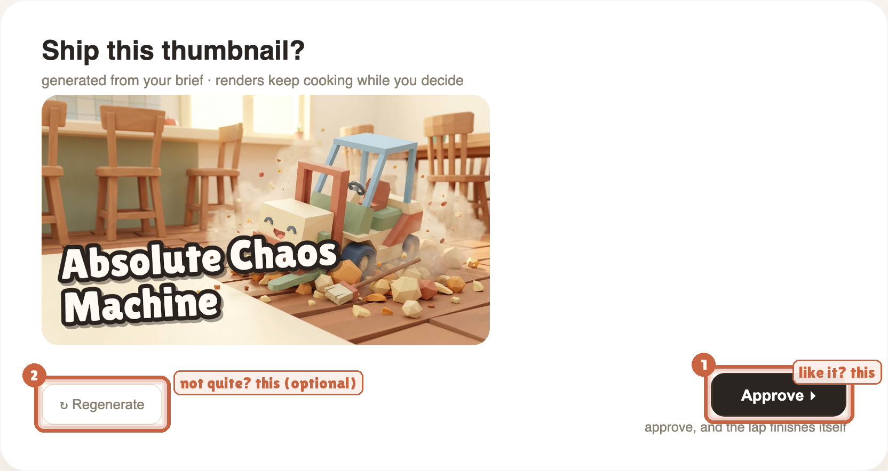

👀 This is the review you did by hand in the first chapter, wearing the
product's clothes: one pending call under the hood, and your click is the
`function_response`. Two honest options, because a review with only an
"approve" button is not a review:

- Not quite right? Press **↻ Regenerate** — the studio draws another from
  the SAME direction (the ⏳ revision loop, one click) and asks you again.
- Like it? Press **Approve ▸** — and note the caption under the button:
  *approve, and the lap finishes itself.*

👉🌐 Press **Approve ▸**, then watch the busy banner: your one click set a
WORKER running, and it does everything that remains.

### What your approval set in motion

👀 The worker is `agent/finish.py`, and its core loop is the whole
chapter:

```python
    while time.time() - t0 < config.DEADLINE_S + 25:
        jobs = {j["id"]: j for j in broker.poll()}
        for cid, name, resp in drive.run(drive.pending(sid)):
            ...
            if job["status"] == "done":
                joinlogic.handle_done(cid, name, resp, job)
            elif job["status"] == "failed":
                joinlogic.handle_failed(cid, name, resp, job)
        ...
        if joinlogic.try_finish() is not None:
            break
```

Poll the farm → deliver each finished result by call id (`handle_done` runs
the same three-line delivery ⏳ taught) → send failures to the repair agent →
and after every round, ask `try_finish()` — the two lines you just read —
whether the run is complete. In production this loop is a queue worker, a
webhook handler, a nightly reconciler. In this app it simply runs when you
approve, because after your last judgment there is nothing left that
needs a person.

*You should see* the card flip to **On the wall.** within a few minutes —
three Veo shots are rendering, and the worker delivers each one the moment
it lands:

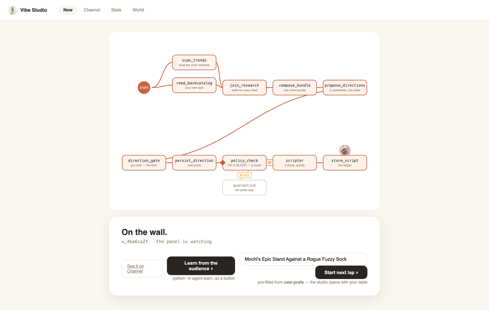

👀 The card is deliberately small: a link to your channel, and an idea box
for the next lap that is **already filled in** — ignore that box for now,
the 💾 chapter is about why it is not empty.

If Setup joined a room, the card carries one extra line: **"and the
room can see you"** with a watch link. Nothing asked you, and no step was
skipped — the same approval that finished your lap also premiered the
video to the room's VibeTube, with your thumbnail on the card, because
publishing to the room is part of what finishing means once `.env` points
at one. Click the link (just browse) and your card sits in the grid next
to everyone else's:

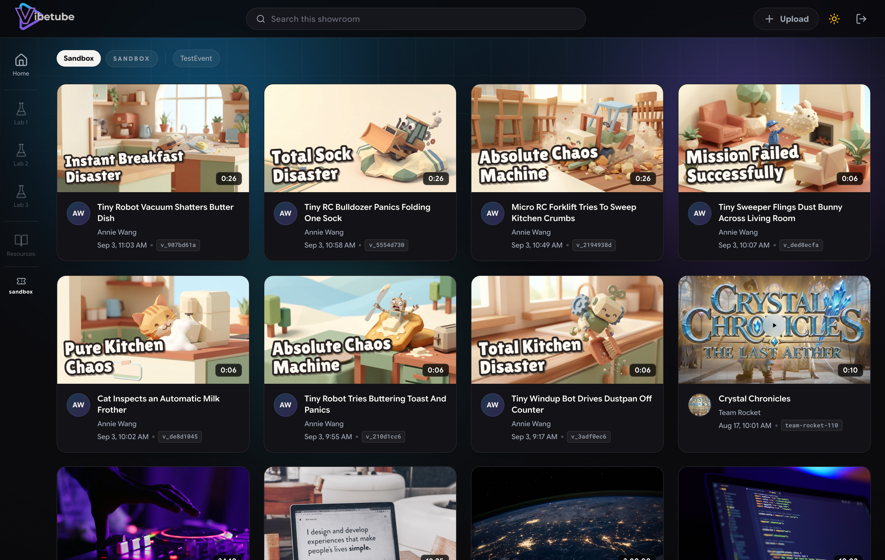

(Self-paced, no room: the line simply is not there, and nothing later
depends on it.)

👉🌐 Open the **Channel** tab: your card shows the thumbnail you approved,
sticker and all. Press **▶** on it to play:

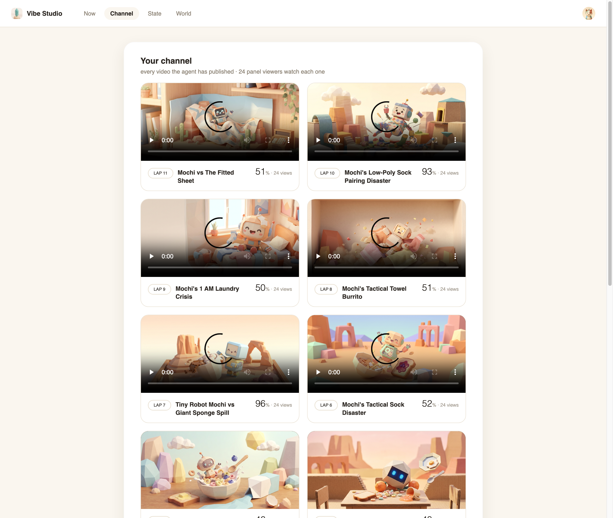

👀 That is a genuine film: a 1.5-second title card cut from the thumbnail
you approved, then the three Veo shots the desk rendered, stitched by
post-production into `app/static/renders/final_<run>.mp4` (1280×720
H.264, about 25 seconds) and served by this same app. Every frame of it
was waited for by a row, not a process — and it is the one your audience
"watches".

### The publish backstop

👀 One gate you never saw fired between the join and the wall — the small
workflow in `agent/post.py`:

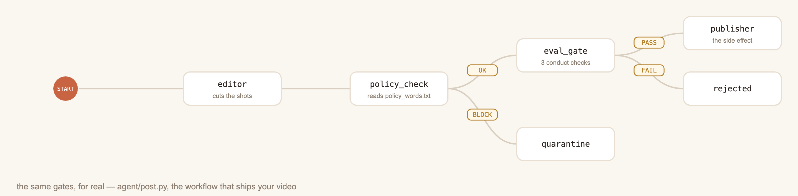

Your POLICY gate already ran inside the lap graph, before any money was
spent — read `runs/state.json` → `lineage.gates.policy` and you will find
the route it recorded for your direction. But the quiet script stage
came AFTER that gate, so one deterministic backstop checks what it
introduced, right before the side effect: `eval_gate` verifies the title
length, the tags, and — the important one — that every evidence citation
in the lineage points at a source that really exists. **PASS** is the
only edge that reaches `publisher`. Gates before money, a backstop before
the world: two doors, each in front of exactly what it protects.

*What you learned:* the two kinds of wait met here — three machine results
delivered by id, one human answer through the same hinge — and **"all done"
was two lines you could read**, because ADK counts nothing for you. Your
last touch was a judgment; everything after it was a worker. Act II whole:
*a long-running agent is a shape that pauses, plus the small amount of
your own code that says when the pausing is over.*

### Read more (optional)

<aside class="positive">
<b>Why <code>post</code> is a second workflow and not part of the lap
graph.</b> A resumed graph <b>re-runs its nodes</b>, and
<code>publisher</code> causes a side effect. So the lap's graph ends at the
script, the world (renders, your approval) happens outside it, and
<code>wf_post</code> runs once, after — its own <code>Runner</code>, its
own session id (<code>&lt;run_id&gt;_post</code>). Shape for decisions;
separation for side effects.
</aside>

<aside class="positive">
<b>The medic and the deadline, explained.</b> One render fails QC — the
worker hands the failed prompt to a one-shot repair agent
(<code>prompt_medic</code>), which rewrites it; the retake is submitted
<i>inside the wait</i>, no restart. One render never finishes — at
<code>STUDIO_DEADLINE_S</code> the worker stops waiting and delivers a
prebaked stand-in instead — and when its own time window closes, it sweeps
every wait still open the same way before asking the join one last time,
so a late retake can never leave the lap hanging. Failures repaired
mid-wait, stragglers bounded by a clock: that is what "waiting well" means
in production.
</aside>

<aside class="positive">
<b>Publish is idempotent, and the gate proves it by doing it.</b> The
publish POST carries an <code>Idempotency-Key</code>; replaying the same
request returns the ORIGINAL video id instead of creating a duplicate. The
<code>lap</code> gate literally re-sends the POST and asserts the same id
comes back.
</aside>

<aside class="positive">
<b>How the silent room premiere works.</b> After the wall publish succeeds,
<code>joinlogic.try_finish</code> calls
<code>premiere.publish_to_room()</code>: the finished cut (title card +
the three shots) goes up as-is, then ONE multipart
POST — title, description, your display name, the video, the thumbnail —
to <code>POST /api/events/&lt;room&gt;/videos</code>. No SDK, no session: a
platform is a contract. Re-running the same lap REPLACES your entry (same
<code>projectId</code>), so retries are safe. One more long-running fact
hides in the response: <code>200</code> means <i>accepted</i>, not
playable — the platform transcodes in the background, so your card may say
"processing" for a minute or two before the play button works. Read it with
<code>cloudshell edit ~/vibe-studio-lab/agent/premiere.py</code>.
</aside>

<aside class="negative">
<b>If the room says no, the lap does not care.</b> A room failure can never
fail your publish — the card just shows <code>room: skipped (…)</code>
with the platform's reason. <code>403</code> = the room's upload window is
closed (the instructor owns those times) · <code>413</code> = over the
limits (50 MB video, 5 MB images) · <code>404</code> = wrong room code.
Fix <code>.env</code> or wait for the window, then re-post by hand:
<code>python -m agent.premiere</code> (tab 1) — the loud back-door that
does exactly what finishing did silently.
</aside>

Want to watch the worker narrate instead of pressing Approve? On any
LATER lap (🌍 or 🧠), when the thumbnail card appears, go to **tab 1**
(your work terminal) and type:

```console
cd ~/vibe-studio-lab
source .venv/bin/activate
python -m agent.finish
```

The terminal version announces its auto-approval loudly, then narrates
every delivery as it happens (the `qc FAIL` and `deadline` lines appear
only when a shot really fails or stalls — with real renders that is the
exception, not the script):

```
── human approval: thumbnail — AUTO-APPROVED [workshop mode] ──
── result delivered: job_0 ──
── qc FAIL: job_1 (overexposed frames in the opening seconds) -> prompt_medic ──
  medic: Specified soft, evenly balanced diffused lighting …
── deadline: job_2 replaced by prebaked stand-in ──
── result delivered: job_3 ──
── join complete (renders N/N + human) -> post-production ──
PUBLISHED: {'published': True, 'video_id': 'v_…', 'url': '/watch/v_…'}
```

Dev-UI deep dive — the whole lap as raw events (browse only, nothing to
type): port 8000 Preview → change `userId=user` to `userId=creator` in the
URL and reload (adk web files YOUR chats under user `user`; the lap's
sessions belong to `creator`) → **NEW SESSION ▾** → newest `run_…_wf` session. Top to bottom:
the three candidates landing in state, the `adk_request_input` carrying
the pick schema, your pick coming back as a `function_response`,
`user:prefs` and `direction` landing in state, the policy route chip, and
the quiet script.

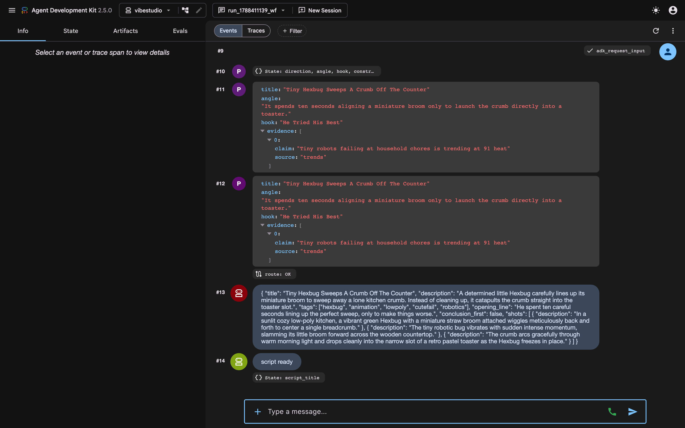

Then the newest `run_…_desk` session: three `render_submit` calls in one
turn, results delivered out of order, the medic's retake, the final map.

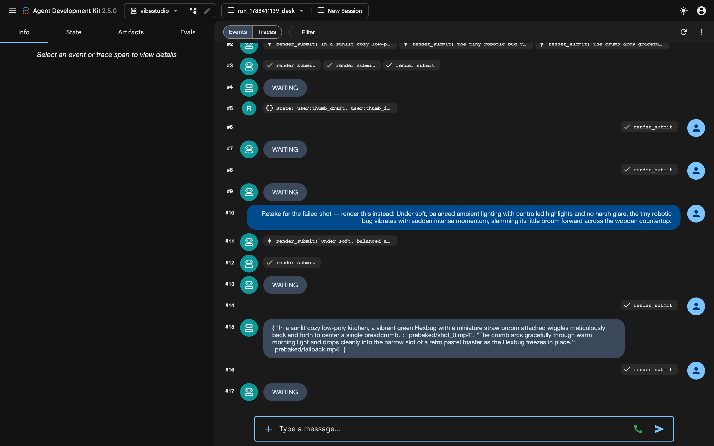

<aside class="negative">
<b>Two gotchas, both deliberate.</b> ① adk web files NEW chats under user
<code>user</code>, while the lap's sessions live under <code>creator</code>
— that's why browsing them needs <code>userId=creator</code> in the URL,
in place of the <code>userId=user</code> already there.
② The renders you just watched never lived in the graph: a resumed graph
re-runs its nodes, and an external submit inside a node would submit twice.
People-pauses are safe to re-ask; world side effects are not.
</aside>

<aside class="positive">
<b>Optional check — run it only if you want proof.</b> In tab 1: <code>python -m checks.check lap</code>. It asserts four things at once: the graph ran with real evidence · the human pauses were answered by id · every render result was delivered · publish passed the gates and is idempotent (it re-sends the POST and expects the SAME video back). Nothing later depends on running this.
</aside>

## 💾 The channel remembers you — session state and the user: prefix
Duration: 0:07:00

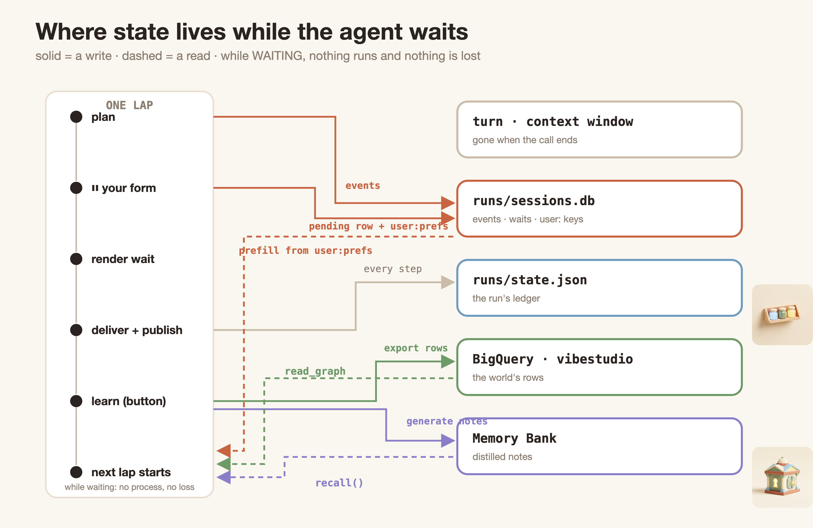

👀 What the picture shows: the left column is ONE lap, top to bottom; the
right column is the five storage layers. Solid arrows are writes — events
and your prefs into `sessions.db`, the ledger into `state.json`, rows into
BigQuery, notes into Memory Bank. Dashed arrows are reads, and they all
feed the NEXT lap: the suggested topic, the graph readings, the recalled
notes. And during the wait itself? Nothing runs — and nothing is lost.

**Act III begins: the channel improves.** Your first video is published;
the graph never changes again. What changes, one chapter at a time, is
what the graph KNOWS when it wakes up — and the first improvement is the
simplest: the second time you open the studio, it speaks first, with a
suggestion shaped like your taste. Your channel's **second video** starts
from that screen — next chapter, once the channel has grown a new sense.

This chapter's single lesson, up front: **ADK session state
persists in the SessionService** — here that is `DatabaseSessionService`,
i.e. the file `runs/sessions.db` — **and one key prefix (`user:`) widens a
value's lifetime from one session to all of a user's sessions.** (You have
already seen the prefix working: `user:thumb_draft`, written by the
callback in 🪞 — and `user:prefs`, written by `persist_direction` on every
lap you have run.) Everything below just makes you SEE that. Same three questions as
every layer:

- **The layer** — session files: `runs/sessions.db` and `runs/state.json`, the two files on disk that hold every wait, every event, every key.
- **Why this layer** — the process is allowed to die; whatever must outlive it needs an address outside the process.
- **How it connects** — nothing to connect: ADK's SessionService writes here automatically (you passed its sqlite URI to adk web in the first chapter ⏳).
- **How the agent uses it** — every resume reads it; and the app reads `user:prefs` before any lap exists, which is how the idle card can greet you with a suggestion.
- **Surfaces** — 🌐 Vibe Studio · 💻 tab 3 (one Ctrl+C + restart) · 🔬 adk web, just browsing.

### The ladder

👀 Top to bottom — shorter lives above, longer below. Read the third
column twice: durable state is not an abstraction, it is a THING with an
address —

| lives for | who writes it | where it physically is |
|---|---|---|
| one turn | the model | nowhere — RAM of one call, gone at turn end |
| one process + | ADK, automatically | **one sqlite file**: `runs/sessions.db` — events, `session.state`, `user:` keys, every pending call |
| one run | your driver | **one JSON file**: `runs/state.json` — open it with any editor |
| the world | the platform | **a BigQuery dataset** (`vibestudio`) in YOUR cloud project |
| the channel | `learn`, distilled | **a managed resource**: `projects/…/reasoningEngines/<id>` (Memory Bank) |

👉🌐 Studio's **State** tab is this table, live (just browse):

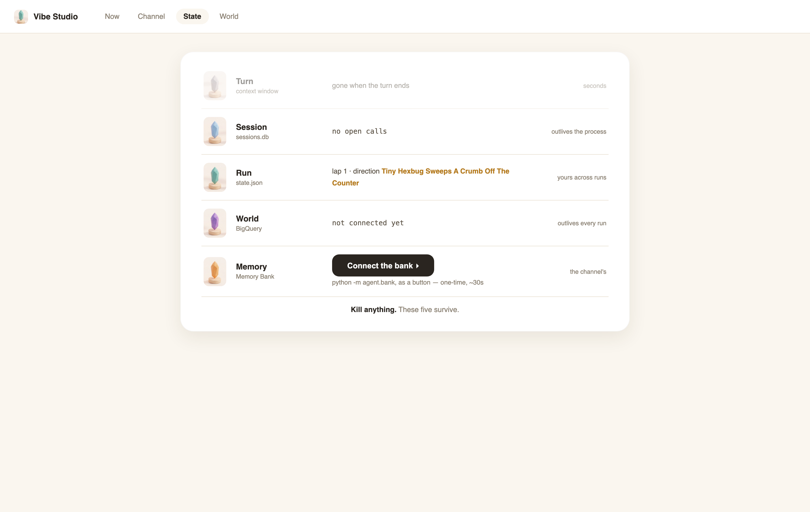

### The kill test

👀 One law, one keystroke: the process may die; the state does not. Reading
that ten times is worth less than killing something once.

👉💻 Go to **tab 3** — the Cloud Shell terminal tab where you ran
`uvicorn app.main:app --port 4600` in 🗺️ (its last lines are uvicorn's
request log, `GET / … 200 OK`) — click into it and press **Ctrl+C**. The
server is gone; the Vibe Studio browser tab goes blank on its next refresh.

👉💻 That terminal is free now, so use it to look at what outlived the
server. This folder **is** your durable state:

```console
ls runs
```

*Our real run:*

```
broker.json  sessions.db  state.json  thumbdrafts.json  ui_busy.json  wall.db
```

(Six files after one video. The folder grows with the lab — the graph
chapter adds `graph_report.json` and `graph_run.log`, the bank adds
`memorybank.json`, a room adds `premiere_….mp4` — but nothing in it ever
depends on a process being alive.)

👉💻 Start the app again, same tab, same venv (press ↑ twice, or retype):

```console
uvicorn app.main:app --port 4600
```

👉🌐 Reload the browser and open the **State** tab: every row is exactly as
you left it — the open call, your prefs, the wall. Nothing was written "on
the way out", because nothing was ever only in memory.

👀 That's it. Your thumbnail drafts are in there too —
`runs/thumbdrafts.json` is the ledger that let turn 2 find turn 1's
picture after its process had died.
The wait from the ⏳ chapter is a row inside `sessions.db`. The
lap's brief and script are keys inside `state.json`. The wall's watch rows
are in `wall.db`. `memorybank.json` holds one line — the ADDRESS of the
cloud resource where notes live. Kill any process you like; these files
don't care. The only two rungs NOT in this folder are the cloud ones:
the BigQuery dataset (🌍) and the Memory Bank resource itself
(🧠) — they survive even `rm -rf` of this whole VM.

### Where ADK state actually lives (read, don't write)

👀 Three sentences, and you already met every piece: a node **writes** by
yielding `Event(state={…})` — the delta rides the event log, which is why it
replays and survives. Anything in the session **reads** `session.state` —
both State tabs are just reading it. And the **SessionService stores** it —
the `DatabaseSessionService` from 🪞's Read more, the same sqlite URI you
passed to adk web. The production swap is one line: `VertexAiSessionService`, and the same
events, waits, and state live in managed Agent Engine sessions — your agent
code does not change.

### One prefix, already at work (read, don't write)

👉📖 `persist_direction` in `agent/graph.py` — read here, nothing to
open — and the write it makes when you pick a direction:

```
    yield Event(state={"direction": chosen["title"], "angle": chosen.get("angle", ""),
                       "hook": hook, "constraints": constraints or "(none yet)",
                       "user:prefs": {"last_direction": chosen["title"],
                                      "idea": state.load().get("hint", "")}})
```

Five keys in one yield, and ONE of them wears the prefix **`user:`** —
keys wearing it are scoped to the user across ALL sessions. `direction`
dies with this run; `user:prefs` is yours forever. Same database, one
word, one lifetime longer. (`temp:` goes the other way: never persisted.)

### Watch it come back — the studio opens with your taste

👉🌐 Go back to the app's **Now** tab, on the published card from your
first video. Look at what sits next to **Start next lap ▸**: an idea box
that is **already filled in** — with a topic shaped like the direction you
picked last time. It is the same box you typed your first idea into; this
time the studio wrote in it first:

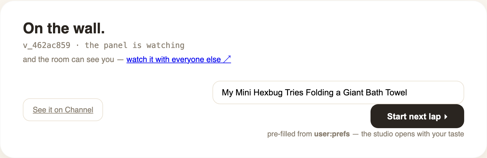

👀 Nothing suggested that during the lap. The app called one helper —
`suggest_topic()` in `app/main.py` — which reads `user:prefs` from the
SessionService directly:

```python
    prefs = drive.run(drive.ensure_user_state("_ui_probe")).get("user:prefs") or {}
    return prefs.get("last_direction", "")
```

Read the session id it probes with: `_ui_probe` — **a session that has
nothing to do with your lap.** `user:` keys are not attached to a
conversation; they belong to the user, so a brand-new session can read
them. That is the whole prefix, demonstrated: the studio greets you with
your own taste before any run exists. (Kill the app, reopen it, and the
box is still filled — try it.)

👀 Do NOT press it yet. That button is where your second video will start
— in the next chapter, after the channel grows a new sense — and when you
do press it, you will run the lap the way you now know: pick a direction,
approve the thumbnail, two clicks of judgment. For now the point is only
that the box is already full:

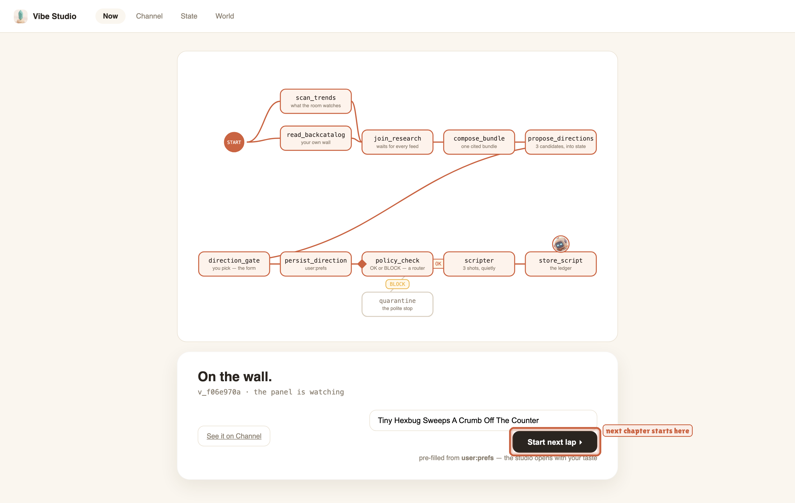

👉🔬 See the same thing in the raw store — browse only, no commands, no
typing, five clicks:

1. **Web Preview → Change port → 8000** (adk web is still running in
   tab 2 — if you closed the preview tab, this reopens it).
2. Click the browser's address bar and find `userId=user` in the URL.
   Change that one word: `user` → `creator`, so it reads `userId=creator`.
   Press Enter. (Your own chats live under user `user`; the app's laps live
   under user `creator` — this switches the view.)

<aside class="negative">
<b>Change it, do not append it.</b> The URL already carries
<code>userId=user</code>. Adding a second <code>&amp;userId=creator</code> on
the end leaves both, and adk web joins them into one id &mdash; you get
<code>No sessions found for user 'user,creator'</code>. There must be exactly
one <code>userId</code> in the URL.
</aside>

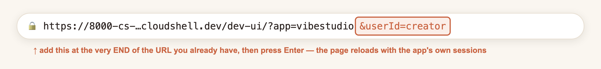
3. Click the **NEW SESSION ▾** picker at the top.
4. The session list opens — these are the app's laps. Click the newest
   `run_…_wf` session (largest number):

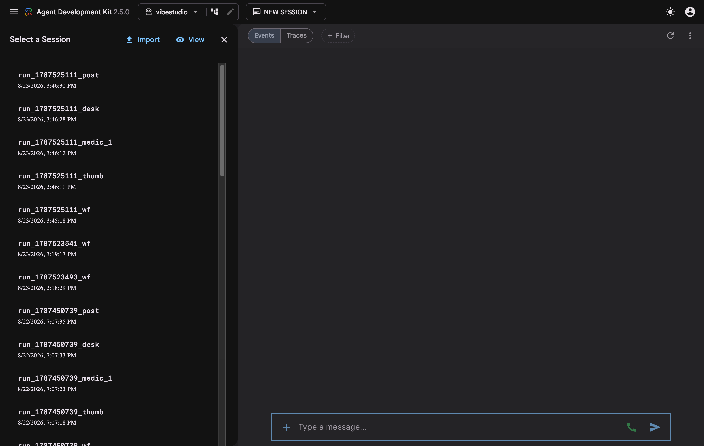

5. Click the **State** tab on the left panel — `user:prefs` sits right next
   to the plain keys:

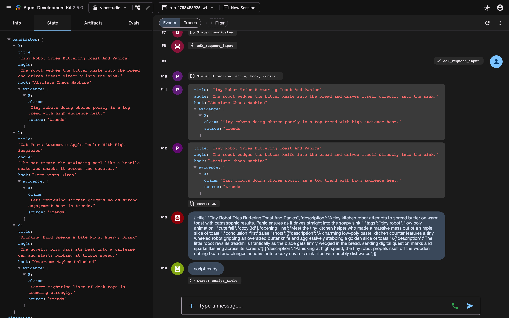

*What you learned:* ADK session state persists in the SessionService (the
file `runs/sessions.db` — that is what `DatabaseSessionService` means), and
the `user:` prefix widened your taste's lifetime from one session to every
session this user owns — which is why the studio could speak first.

<aside class="positive">
<b>What the next video does differently:</b> the studio opens the
conversation — a suggestion shaped like your last direction, read from
<code>user:prefs</code> before any lap exists.
</aside>

<aside class="positive">
<b>So where IS durable state? Five answers, memorize them.</b> ① The turn:
nowhere — it dies with the model call. ② Sessions, state, waits: the file
<code>runs/sessions.db</code>. ③ The run's ledger: the file
<code>runs/state.json</code>. ④ The world's rows: the
<code>vibestudio</code> dataset in your BigQuery project. ⑤ The channel's
lessons: the Memory Bank resource
<code>projects/…/reasoningEngines/&lt;id&gt;</code>. Two files, two cloud
residents, one nothing — that is the entire answer.
</aside>

### Read more (optional)

<aside class="positive">
<b>How a write actually travels.</b> A node yields
<code>Event(state={"user:prefs": …})</code> → the delta is committed to the
event log in <code>sessions.db</code> → the SessionService folds it into
<code>session.state</code> → any later session for the same user sees the
<code>user:</code> keys. Nothing writes "directly" to state; everything
rides an event, which is why it replays and survives.
</aside>

<aside class="positive">
<b>The production swap, spelled out.</b> <code>svc()</code> is one line:
<code>DatabaseSessionService(db_url=…)</code>. Replace it with ADK's
<code>VertexAiSessionService</code> (and point adk web's
<code>--session_service_uri</code> at your Agent Engine) and the SAME
events, deltas, and pending calls live in managed cloud sessions — the
rungs are pluggable stores, not different programs. Your agent code does
not change by one character.
</aside>

<aside class="negative">
<b>The other two prefixes.</b> <code>temp:</code> keys are never persisted
at all — scratch space that dies with the invocation. <code>app:</code>
keys are shared across ALL users of the app. Wrong prefix = wrong lifetime;
the gate below catches the classic mistake (a <code>temp:</code> key that
leaked into the store).
</aside>

<aside class="positive">
<b>Optional check — run it only if you want proof.</b> In tab 1: <code>python -m checks.check state</code>. It asserts that `user:prefs` is readable from a brand-new session, remembers the direction you picked, and no `temp:` key ever leaked into the store. Nothing later depends on running this.
</aside>

## 🌍 The channel reads its audience — the world graph (BigQuery)
Duration: 0:06:00

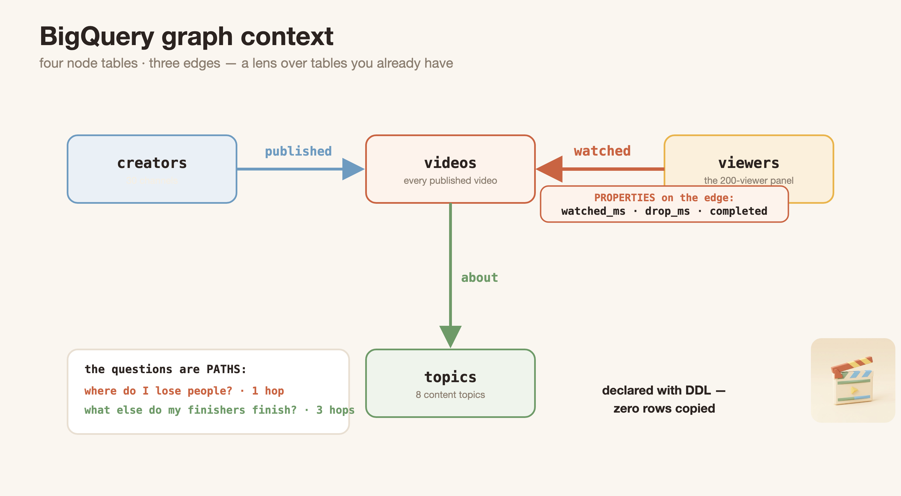

👀 What the picture shows: the four cards are plain BigQuery tables that
already exist; the three arrows are the edges the DDL declares over them —
creators publish videos, videos are about topics, viewers watch videos.
The orange `watched` edge is the one that matters: the retention numbers
(`watched_ms`, `drop_ms`) live ON the edge itself. And the channel's
questions are paths across this picture — one hop for "where do I lose
people", three hops for "what else do my finishers finish".

**Improvement #2 — the channel grows a new sense organ.** Your graph has
run every lap with TWO readers, because only two feeds existed. This
chapter builds the third — the audience's watch data as a queryable
graph — and then you WIRE IT IN: one edge in `agent/graph.py`, and the
live map grows a node in front of you. From that lap on, candidates carry
**evidence with names**.

- **The layer** — the world's rows: a BigQuery dataset (`vibestudio`) in YOUR cloud project.
- **Why this layer** — the audience's watch data is bigger than any process and shared with every tool; it outlives even this VM.
- **How it connects** — one button in the app's **World** tab (it runs `scripts/graph.sh`): create the dataset, load the vendor pack, declare the graph, push YOUR rows in. Then ONE edge (the GRAPH_EDGE hole) wires the `read_graph` node into your fan-out.
- **How the agent uses it** — once wired, `read_graph` queries it every lap; at the end of this chapter you watch the app cite it.
- **Surfaces** — 🌐 Vibe Studio · ✏️ the Editor, one line in `graph.py` · the Cloud console, just browsing.

### Why BigQuery, and do you even need a graph

👀 **Why BigQuery for world state?** The audience's watch rows are the
platform's data, not your agent's: bigger than any process, shared with
every other tool, alive after `state.json` is deleted. That is
warehouse-shaped data — the wall's sqlite is this lab's stand-in for it.

👀 **Do you need a graph database?** No — and notice that you are not
getting one. `taste_graph` is a *declaration over tables you already have*:
nothing is copied, nothing new is deployed. Two questions decide whether
declaring it earns its keep:

| ask this | in this lab |
|---|---|
| **How many hops is the question?** | "where do I lose people" is one hop, so it stays plain SQL — the report literally tags it `engine: sql`. "what else do my finishers finish" is three hops (me → video ← viewer → video → topic): that is where one `MATCH` beats a pyramid of joins. |
| **Does the relationship itself carry data?** | `watched_ms` and `drop_ms` belong to neither the viewer nor the video — they belong to the *watch*. Retention lives on the edge. |

Many-to-many on its own does **not** justify a graph; a join table handles
that fine. Multi-hop questions over many-to-many edges do.

### The edge that carries the data (read, don't write)

👉📖 `GRAPH_DDL` in `bqgraph/load.py` — read here, nothing to open. The
four tables are declared as nodes; then comes the edge that carries the
watch data, and it is three clauses long:

<!-- code: EDGE_TABLE -->
```sql
    `{d}.watched` AS watched
      KEY (viewer_id, video_id)
      SOURCE KEY (viewer_id) REFERENCES viewers (id)
      DESTINATION KEY (video_id) REFERENCES videos (id)
```

| the clause | what it says |
|---|---|
| `KEY` | which columns identify one row of this edge |
| `SOURCE KEY … REFERENCES` | where the arrow starts — a viewer |
| `DESTINATION KEY … REFERENCES` | where it lands — a video |

That is the whole vocabulary. The `watched` table already existed; three
clauses turned it into an arrow. Its other columns (`watched_ms`,
`drop_ms`, `completed`) come along automatically — that is how retention
ends up living on the relationship. `published` and `about`, right above it,
are the same three clauses.

### Build it — one button

👉🌐 In Vibe Studio, open the **World** tab (top left, next to State):

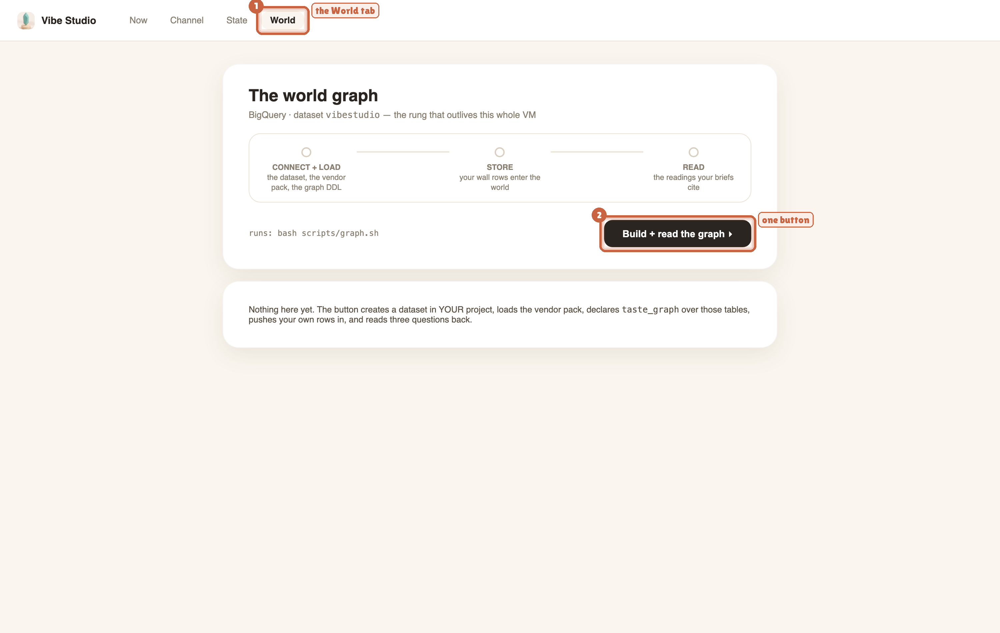

👉🌐 Press **Build + read the graph ▸**. The grey caption names what the
button runs — `bash scripts/graph.sh` — and that script is three verbs in
order: **CONNECT + LOAD** (dataset + vendor pack + the DDL you just read) ·
**STORE** (your own rows enter the world) · **READ** (the questions).

Its output streams into the page while it works, ~40 seconds:

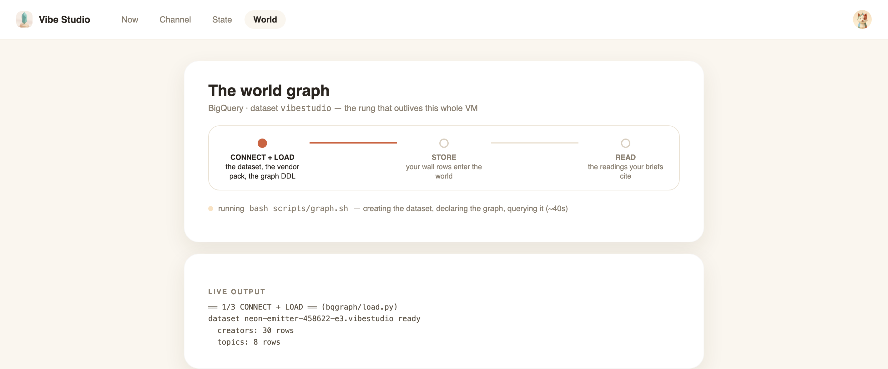

👀 Nothing here is animated for show: a dot goes solid when the script
actually printed that banner, exactly like the workflow map. The app never
touches BigQuery itself — it runs the same command you could run in tab 1
and tails the log.

When the third dot lands, the readings are underneath it:

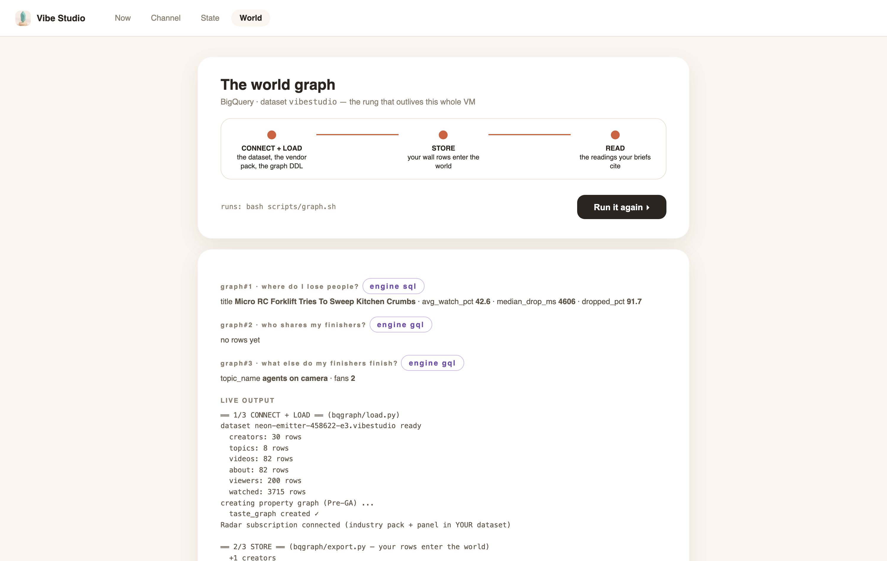

👀 Those are YOUR videos and YOUR panel's real rows — and the
`engine` chip on each reading is the honest part: `graph#1` ran as **sql**
(one hop needs no graph), `graph#2` and `graph#3` ran as **gql** (two and
three hops). Remember that median drop just before the 5-second mark: the
Memory Bank chapter 🧠 turns it into a rule.

### See it drawn

👉🌐 Open the BigQuery console (just browse):
[console.cloud.google.com/bigquery](https://console.cloud.google.com/bigquery)
— pick your project in the top bar if it is not already selected. In the
Explorer: your project → dataset `vibestudio` → **Tables** shows all six
with row counts — then **Graphs → taste_graph**:

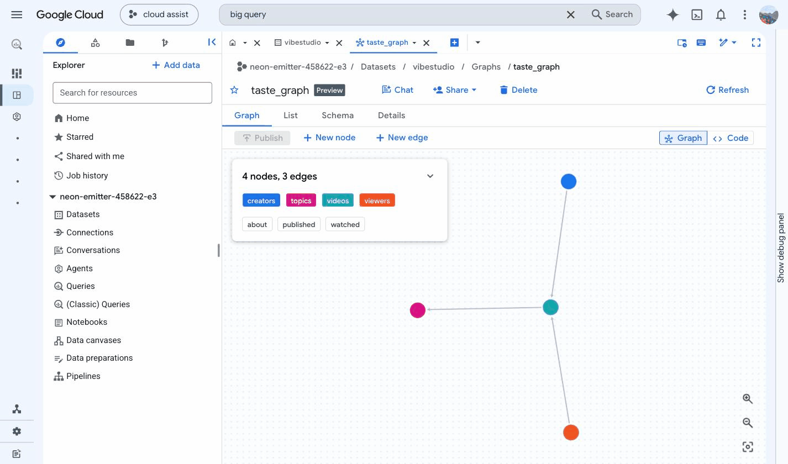

### Wire it in — the graph grows a node (the GRAPH_EDGE hole)

👀 The readings exist; the channel still cannot see them — `read_graph`
is a node in `agent/graph.py` that no edge reaches. Time to change the
shape of a running system, with one line.

👉💻 In **tab 1**, open `graph.py` in the Cloud Shell Editor by running:

```console
cloudshell edit ~/vibe-studio-lab/agent/graph.py
```

👉✏️ In the edge list, find the line marked `TODO: GRAPH_EDGE`, **delete**
it and **uncomment** the line below it:

<!-- code: GRAPH_EDGE -->
```python
        (START, read_graph, join_research),
```

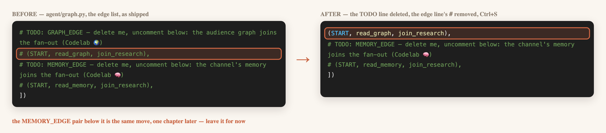

One edge. The join does not change (it waits for whoever is connected),
the composer does not change (it renders whichever feeds arrive), no other
line changes. That is what the growth costs.

👉🌐 Reload Vibe Studio's browser tab and look at the map area on the Now
card once the next lap starts — **the graph has a new node.** The map is
dumped from the live `Workflow` object, so it cannot help but show what
you just did:

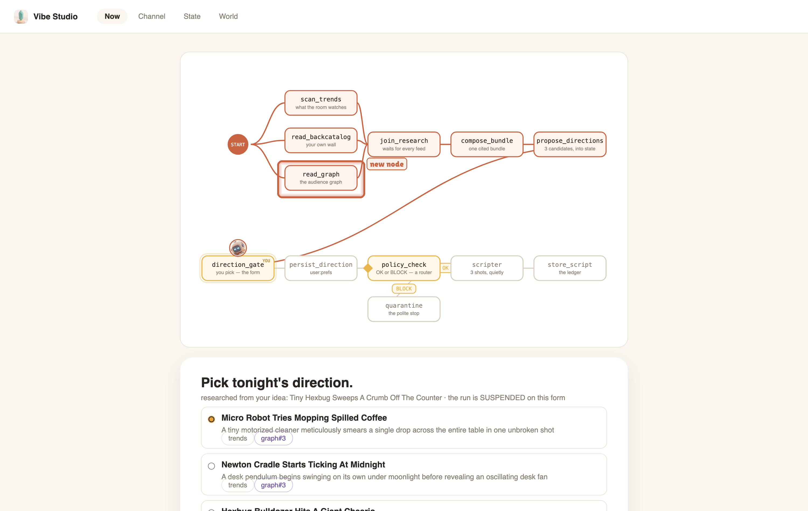

### Watch the agent use it — right now

👉🌐 Prove it in the app, click by click (the idea box may stay empty; you
type nothing):

1. Open Vibe Studio (Web Preview → 4600) → the **Now** tab, still on the
   published card from your first video.
2. Press **Start next lap ▸** (keep the pre-filled idea, or type over it)
   and wait ~20 s — watch THREE research nodes light up together on the
   grown map. This is your channel's second video.
3. The direction card appears. Its candidates now carry evidence chips —
   `trends` and, once your own watch rows are in the graph, `graph#N`:

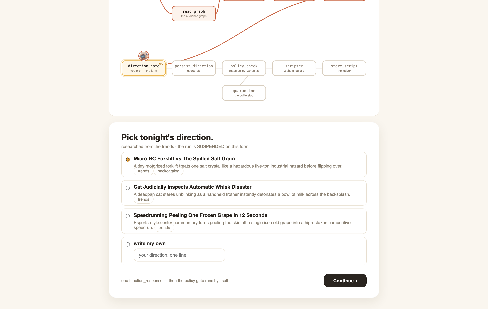

   The point is not which chip shows on any one run — it is that
   `read_graph` now runs on EVERY lap and its readings are available to
   cite. You never asked for that; the edge you added did it. (See the
   World tab for the readings themselves — `graph#1` with the real
   drop-off number your briefs draw on.)
4. Finish the video: pick a direction, press **Continue ▸**, and when the
   thumbnail card comes, press **Approve ▸** — the Memory Bank chapter 🧠
   wants this lap's audience data anyway.

*What you learned:* a graph is a declared lens over tables you already
have; readings carry names — and wiring a new sense into a running
pipeline cost exactly one edge, which the live map confirmed on sight.

<aside class="positive">
<b>What the next video does differently:</b> the candidates cite the
audience's real numbers — <code>graph#1</code> is a chip on the direction
card, not a hope in a prompt. And the map has one more node than it did
an hour ago.
</aside>

### Read more (optional)

<aside class="positive">
<b>The same thing from the terminal.</b> The button is only a wrapper. In
tab 1: <code>bash scripts/graph.sh</code> prints the same three banners, and
the three verbs are three files you can run one at a time —
<code>python -m bqgraph.load</code> · <code>bqgraph.export</code> ·
<code>bqgraph.report</code>. <code>report</code> also writes
<code>runs/graph_report.json</code>, which is what the World tab renders.
</aside>

<aside class="positive">
<b>What the DDL leaves out on purpose.</b> An edge can also carry
<code>LABEL x PROPERTIES (a, b, c)</code>. Both are optional and this lab
omits both: with no <code>PROPERTIES</code> list every column of the table
is a property (that is why <code>w.completed</code> works in the queries),
and with no <code>LABEL</code> the alias is the label. Three clauses is the
smallest true version.
</aside>

<aside class="positive">
<b>The client is two lines, and the auth ladder in one breath.</b>
<code>_bq()</code> in <code>bqgraph/queries.py</code> is just
<code>bigquery.Client()</code> — no key file, no connection string. Cloud
Shell → ADC is already there (what you're using). Laptop → one command,
<code>gcloud auth application-default login</code>. CI → workload identity.
Nowhere in this lab does a service-account key file appear — that rung is
deliberately skipped.
</aside>

<aside class="positive">
<b>GQL and its SQL twin.</b> Every path question in
<code>bqgraph/queries.py</code> exists twice: a GQL <code>MATCH</code> and a
same-shape SQL join. The <code>engine:</code> tag in the report tells you
which one ran — and reading the two side by side IS the argument for the
graph: the MATCH looks like the question; the join pyramid looks like work.
</aside>

<aside class="positive">
<b>A privacy floor, built in.</b> The queries only surface cohorts of at
least <code>K_ANON</code> viewers (2 in this tiny world; a real platform
uses ~10+), and no query ever returns viewer ids. Aggregates about YOU,
never rows about THEM.
</aside>

<aside class="negative">
<b>The TODO guard.</b> In the shipped starter every edge is already in
place. If an edge is ever carved out (authoring mode), stage 1/3 refuses
loudly with <code>NotImplementedError: TODO: EDGE_TABLE</code> rather than
creating a graph with missing edges — a graph with no watch data would let
every later chapter silently lie.
</aside>

<aside class="positive">
<b>Optional check — run it only if you want proof.</b> In tab 1: <code>python -m checks.check graph</code>. It asserts that taste_graph exists in your project, your rows joined in, and a path query about YOU returns real rows. Nothing later depends on running this.
</aside>

## 🧠 The channel learns lessons — Memory Bank: connect, write, read
Duration: 0:10:00

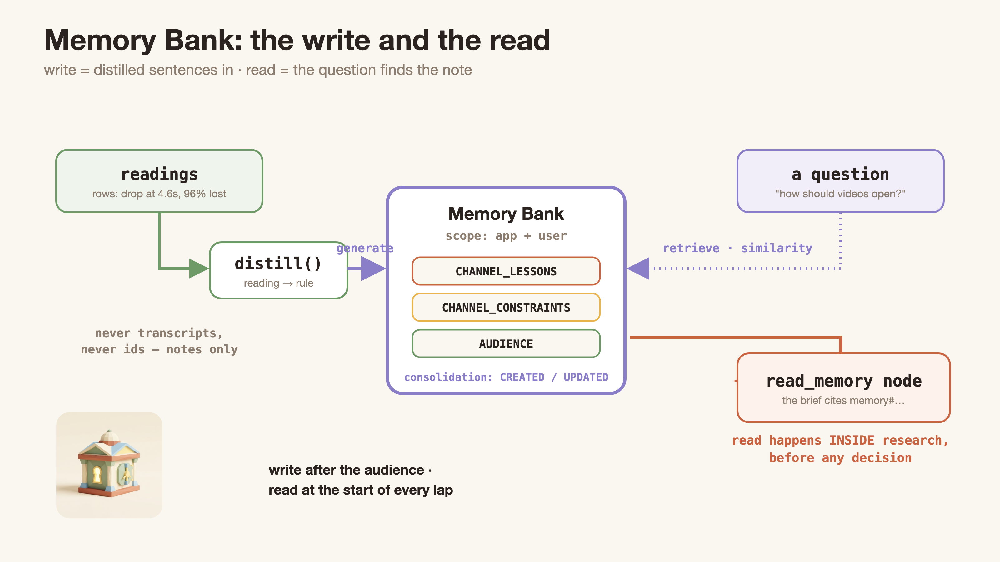

👀 What the picture shows: the bank sits in the middle with its scope and
its three topics. The left lane is the WRITE — raw readings get distilled
into sentences (never transcripts, never ids), and one `generate` call
files them; consolidation curates (CREATED / UPDATED). The right lane is
the READ — a question, not a key, retrieves the note by similarity, inside
the `read_memory` research node, before any decision is made. Write after
the audience; read at the start of every lap.

**Improvement #3 — the last sense organ, and the loop closes.** One node
in `agent/graph.py` is still unreachable: `read_memory`. This chapter
gives it a bank to read AND wires it into the fan-out — the map grows its
final node, and your channel's **third video** obeys a lesson nobody
typed into a prompt.

- **The layer** — the channel's lessons: a managed **Memory Bank**, hosted on an Agent Engine resource in your project.
- **Why this layer** — lessons must outlive runs, sessions, and this machine — and consolidation (merging new lessons into old ones) is a service, not a file.
- **How it connects** — one command creates the resource; `runs/memorybank.json` caches its address.
- **How the agent uses it** — you write notes with one call, then wire ONE line — and watch the next pitch change because of it.
- **Surfaces** — 🌐 Vibe Studio · ✏️ the Editor, one line in the same file · 🔬 adk web and the Cloud console, just browsing.

### Connect: create the bank

👉📖 `agent/memory.py` — read here, nothing to open — two spots, one
idea each:

- `_bank_config()` — the bank's configuration. The nesting is the concept:
  `AgentEngineConfig → context_spec → memory_bank_config → memory_topics`.
  An Agent Engine becomes a Memory Bank host by carrying this block, and
  **`memory_topics`** define what a note may be about.
- `engine_name(create=True)` — one `agent_engines.create(config=…)` call;
  the resource name it returns is cached to `runs/memorybank.json`.
  **That file is the connection** — every write and read below addresses
  that one name.

<aside class="positive">
<b>Topics: this lab's three, and Google's four.</b> This lab defines three
<b>custom topics</b> — <code>CHANNEL_LESSONS</code> ·
<code>CHANNEL_CONSTRAINTS</code> · <code>AUDIENCE</code>, each with a
one-line description the consolidator reads — mirroring exactly the
<code>[TOPIC]</code> prefixes the learner writes. For common cases Google
ships <b>managed topics</b>: <code>USER_PREFERENCES</code>,
<code>USER_PERSONAL_INFO</code>, <code>KEY_CONVERSATION_DETAILS</code>,
<code>EXPLICIT_INSTRUCTIONS</code>.
</aside>

👉🌐 Create it — one button, one-time, ~30 s. In Vibe Studio open the
**State** tab: the bottom row, **Memory**, carries a button no other row
has, and its grey caption names what it runs (`python -m agent.bank`):

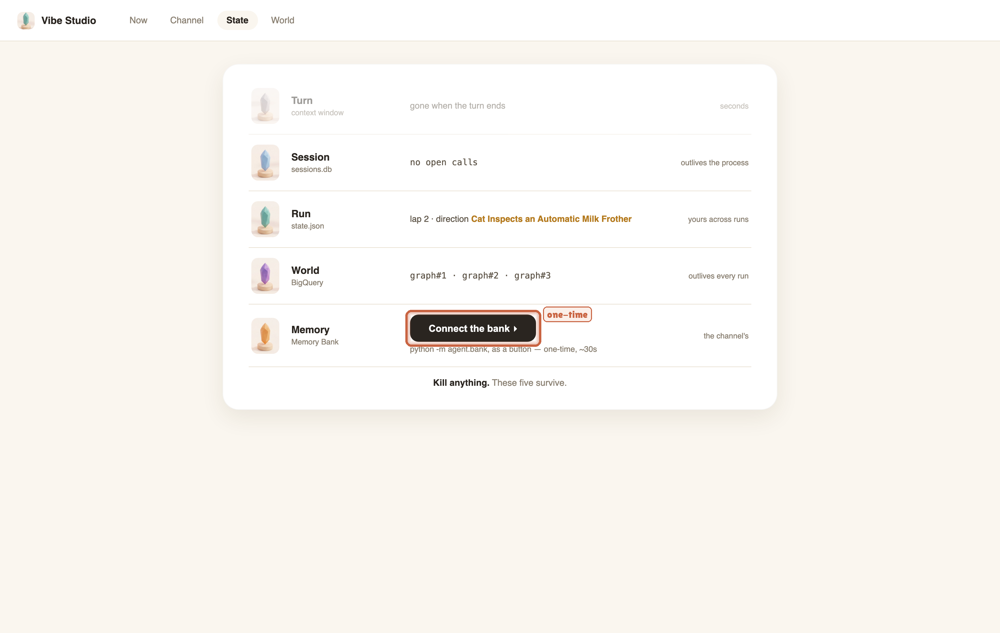

👉🌐 Press **Connect the bank ▸**. *You should see* the row go busy for
~30 s, then show the resource name it created, with the command's own
output under it — and the button is gone, because the file it wrote
(`runs/memorybank.json`) IS the connection:

```
── created ──
  projects/…/locations/us-central1/reasoningEngines/3403957707466604544
scope for every note: app_name=vibestudio · user_id=creator
memory topics (custom): CHANNEL_LESSONS · CHANNEL_CONSTRAINTS · AUDIENCE
the bank holds 0 note(s)
```

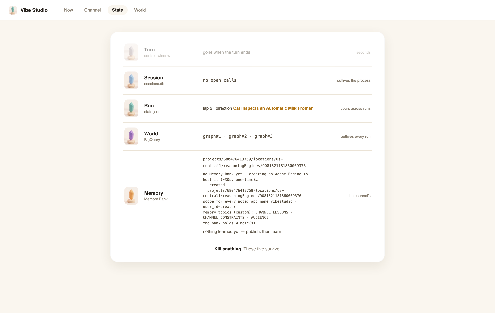

👉🌐 See it in the Cloud console (just browse):
[console.cloud.google.com/vertex-ai/agents/agent-engines](https://console.cloud.google.com/vertex-ai/agents/agent-engines)
— the Agent Engine list for your project (pick the project in the top bar
if needed); open your engine and click its **Memory Bank** tab to see the
memory count:

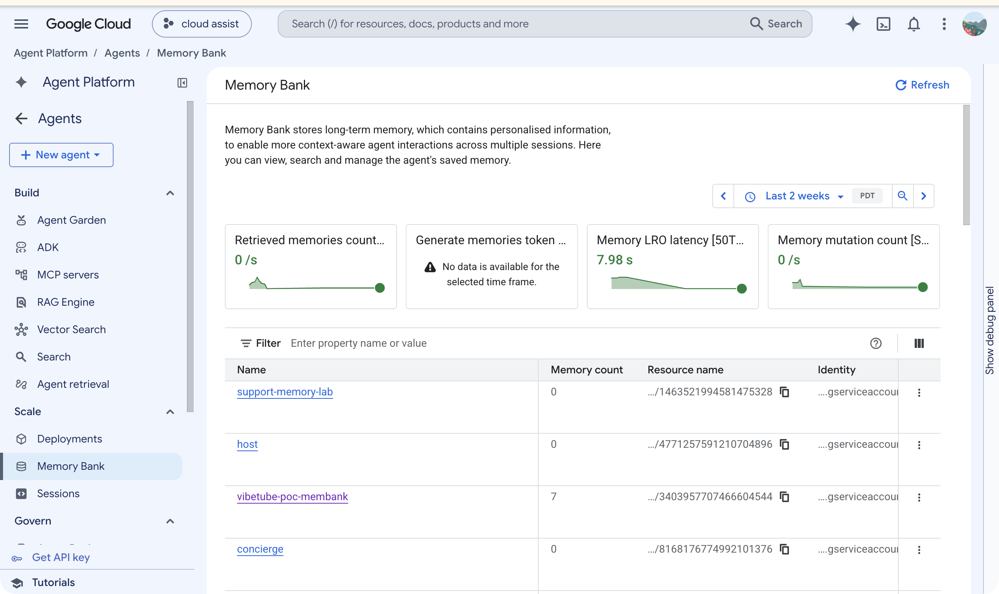

### Write: distill readings into notes

👀 Two kinds of knowing, and why the graph alone is not enough:

| | BigQuery graph (🌍) | Memory Bank (this chapter) |
|---|---|---|
| holds | the world's raw rows | distilled sentences |
| you get it by | asking a question you know | similarity — the question finds the note |
| lands in | a report you read | the agent's context, mid-decision |

👉📖 `distill()` in `agent/learn.py` — read here, nothing to open. The
code is deliberately plain: the drop-at-5s *reading* becomes a
conclusion-first *rule*; the neighbor overlap becomes one audience sentence.
Notice what never enters a note: no video ids, no row counts, no job ids.
👉📖 In `write_facts()` (same file as before, `agent/memory.py`) — read
only, nothing to change — the
following call is the entire write path:

<!-- code: GENERATE -->
```python
    op = _cli().agent_engines.memories.generate(
        name=name,
        direct_memories_source=vt.GenerateMemoriesRequestDirectMemoriesSource(
            direct_memories=[{"fact": f} for f in facts]),
        scope=SCOPE, config={"wait_for_completion": True})
```

Three vocabulary words: **`direct_memories_source`** (distilled facts, never
transcripts) · **`scope`** (this app + this user) · **`wait_for_completion`**
(block until **consolidation** finishes, so the response carries per-memory
action flags). `name` is the resource you just created.

👉🌐 Now write the notes — one button, click by click (you type nothing):

1. Open the **Now** tab. The lap you finished in the graph chapter 🌍 is
   still on screen — and the card has grown a button it did not have
   before. The app shows **Learn from the audience ▸** only once a bank
   exists to write into (`runs/memorybank.json`, the file the Connect
   button just wrote) — the same rule as the map: nothing is drawn until
   it is real.

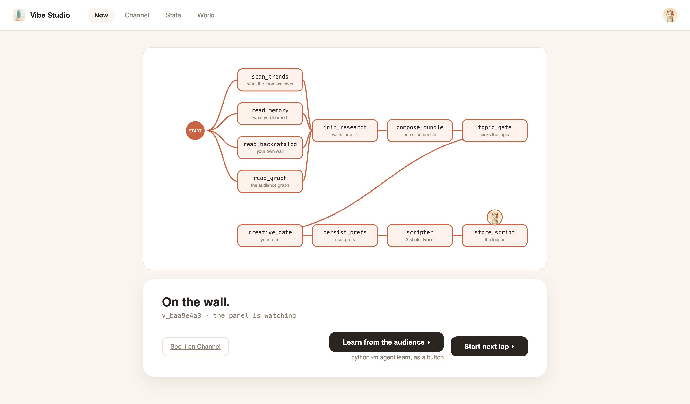

2. Press **Learn from the audience ▸** (the grey caption under it says
   exactly what it runs: `python -m agent.learn, as a button`). It is NOT a
   deploy — it is the after-audience job you would cron nightly, and its
   `main()` is three moves you have already read:

```python
    from bqgraph import export as bq_export
    bq_export.main()          # re-align rows (the graph chapter's stage 2/3)

    facts = distill()         # readings -> notes (the code above)
    ...
    flags = memory.write_facts(facts)   # the generate call you just read
```

3. Wait ~30 seconds, then open the **State** tab: the Memory Bank row —
   the bottom rung of the ladder — now holds the distilled notes:

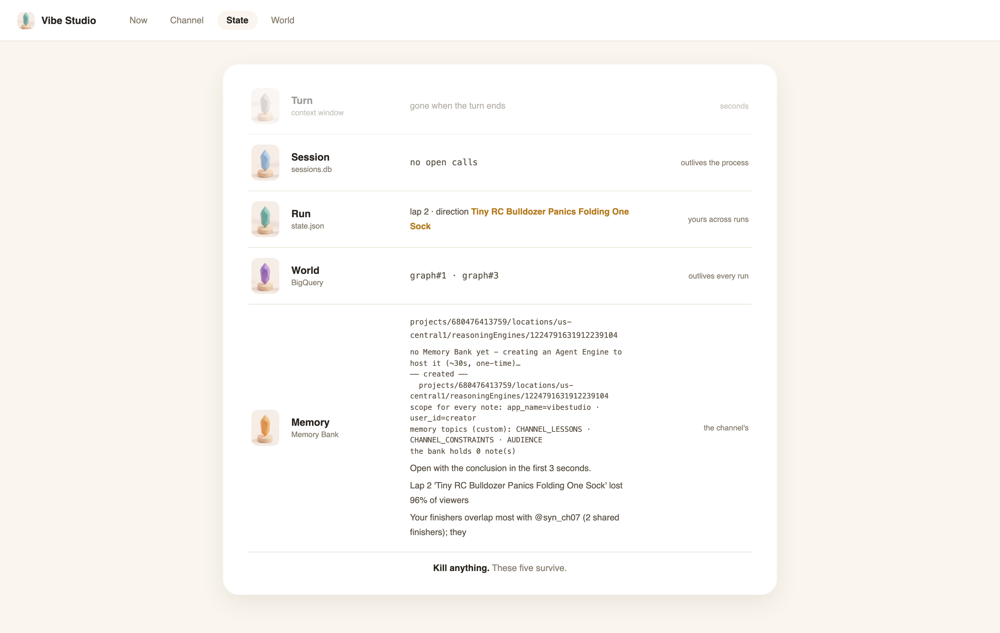

### Read: one edge, and the agent uses it

👀 The bank is now full — but if you started a lap right now, the
candidates would show `graph#N` chips and **no `memory#`**: notes are
being written and never read, because no edge reaches `read_memory`. Wire
in the channel's last sense — this edge is the whole point of Act III:

👉✏️ `agent/graph.py` is still open in the Cloud Shell Editor from 🌍
(if you closed it: `cloudshell edit ~/vibe-studio-lab/agent/graph.py` in
**tab 1**). In the edge list, find the line marked `TODO: MEMORY_EDGE`,
**delete** it and **uncomment** the line below it:

<!-- code: MEMORY_EDGE -->
```python
        (START, read_memory, join_research),
```

The graph is now the four-reader shape the d10 picture promised — and you
grew every stage of it yourself. (`read_memory` does more than fetch: it
also writes the recalled `CHANNEL_CONSTRAINTS` rule into state, where the
quiet scripter's prompt reads it — recall happens BEFORE any decision,
every lap.)

👉🌐 Watch the agent use the bank, click by click (you type nothing):

1. **Now** tab → press **Start next lap ▸** (keep the pre-filled idea or
   type over it) and wait ~20 s — FOUR research nodes now light together
   on the map. This is your channel's third video.
2. Read the direction card: *our real run's* candidates all promise the
   outcome up front — because the recalled `CHANNEL_CONSTRAINTS` note
   says conclusion-first. Nothing asked you for that; the graph read it.
   And the evidence chips now come in both colors:

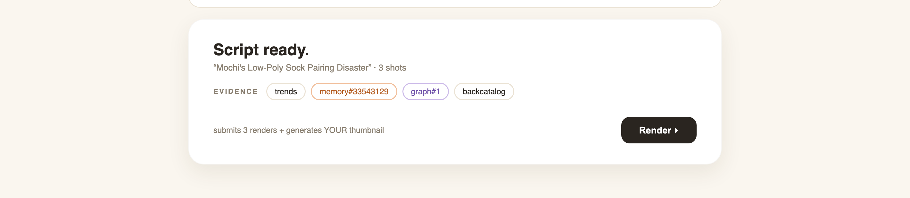

👉🔬 See the recall happen in the raw events — browse only, no commands, no
typing, five clicks:

1. **Web Preview → Change port → 8000**.
2. If the URL says `userId=user`, change that word to `creator` so it reads
   `userId=creator`, and press Enter. (Exactly one `userId`, never two.)
3. Click the **NEW SESSION ▾** picker.
4. Click the newest `run_…_wf` session — this is the lap you just ran.
5. Scroll the event list to the very TOP and find the small
   `State: constraints` chip among the research events:

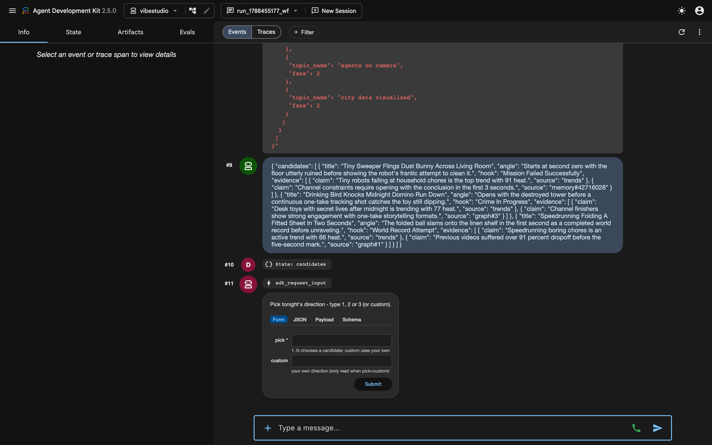

That chip is `read_memory` writing the recalled note into state, BETWEEN
the other research nodes and BEFORE any decision was made. Memory read on
the way to a decision, not in a demo.

👉🌐 Finish the video: pick a direction, **Continue ▸**, and when the
thumbnail card comes, **Approve ▸**.

### Three videos, one channel

👉🌐 Open the **Channel** tab one last time (just browse):

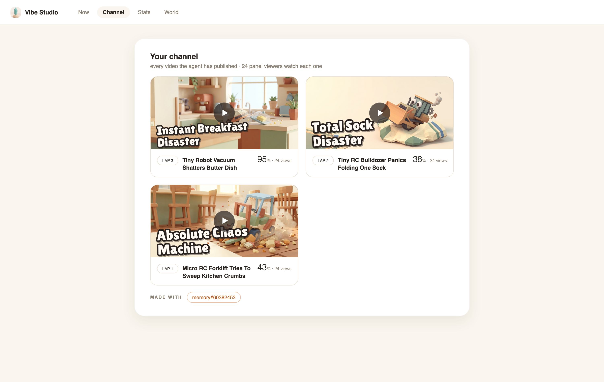

👀 Three cards, in order: the first video (your taste, typed by hand), the
second (form pre-filled, brief citing the graph), the third (script
opening on the conclusion the audience taught it). **The graph never
changed except for the two edges you added — one edge list, three videos, each better,
because each lap woke up knowing more.** And if Setup joined a room, the
room watched your channel grow too — every Finish premiered there,
silently:

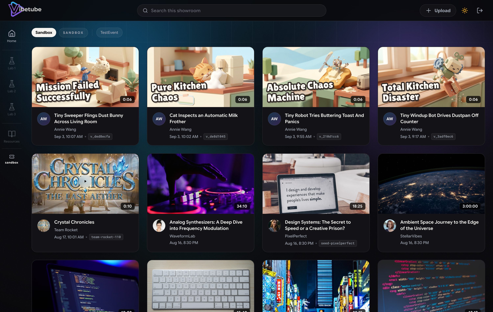

*What you learned:* connect is a resource name, write is one `generate`
call, read is one EDGE — and only the read made durable state change the
agent's behavior. The graph you shipped three videos with was never
edited; it was grown.

<aside class="positive">
<b>What the next video does differently:</b> the script obeys a rule the
channel learned from its own audience — recalled by similarity, before
any decision, cited as <code>memory#</code>.
</aside>

### Read more (optional)

<aside class="positive">
<b>The connect step, by hand.</b> The button runs <code>python -m
agent.bank</code>; type it yourself in tab 1 and it prints the same lines —
run it twice and the second time it says <i>already connected</i>, because
the cached name in <code>runs/memorybank.json</code> is the connection.
</aside>

<aside class="positive">
<b>The write path, by hand — and the flags the button hides.</b> The button
runs <code>python -m agent.learn</code>; type it yourself in tab 1 on any
later lap and it narrates: the row alignment, the three distilled notes,
then <b>consolidation flags</b> — <code>CREATED memory#…</code> for a
genuinely new note, <code>UPDATED</code> when the service merges a new
lesson into an old one instead of piling up duplicates. You write facts;
the service curates them.
</aside>

<aside class="positive">
<b>The read path, by hand.</b> In tab 1:
<code>python -m agent.learn --recall "what should my videos do in the first
seconds?"</code> returns the constraint and the lesson — that is
<code>memories.retrieve</code>, similarity search against the scope. You
asked a QUESTION, not a key. (<code>memories.list</code> is the unranked
ledger Studio's governance view uses — search is for agents, the ledger is
for you.)
</aside>

<aside class="positive">
<b>Three names, one resource.</b> The console says <b>Agent Platform</b>,
the SDK namespace is <code>agent_engines</code>, the resource path says
<code>reasoningEngines</code> — one product renamed twice. Deploying your
AGENT to that platform is a different command (<code>adk deploy
agent_engine</code>) and a different lab; this resource only hosts memory
here.
</aside>

<aside class="positive">
<b>The ADK-native wiring, for production.</b> ADK wraps this same resource
as <code>VertexAiMemoryBankService(project, location, agent_engine_id)</code>
— hand it to the <b>Runner</b> as <code>memory_service</code> (the third
slot beside the <code>session_service</code> from 🪞's Read more), or to
<code>adk web</code> via <code>--memory_service_uri</code>. Raw SDK calls in
this lab so you can see the wire; the wrapper in production.
</aside>

<aside class="positive">
<b>Correct it like an operator.</b>
<code>python -m agent.learn --forget &lt;id&gt;</code> deletes a wrong
lesson; <code>--inject "[CHANNEL_CONSTRAINTS] …"</code> hand-writes one. A
memory you can list, delete, and inject is a memory you can govern.
</aside>

<aside class="positive">
<b>Optional check — run it only if you want proof.</b> In tab 1:
<code>python -m checks.check channel</code>. It asserts the notes exist and
are clean (no ids or row counts leaked in), this lap CITED a memory that
really exists, obeyed the conclusion-first rule, and arrived pre-filled
from user:prefs. Nothing later depends on running this.
</aside>

## 🎉 Congratulations
Duration: 0:02:00

You ran a channel: one idea, three videos, three clicks of judgment each —
with two one-line edits, both of them an EDGE. The point was never
typing: it was seeing exactly where every pause and every byte lives. The
whole story in one table:

| the story beat | the idea to keep |
|---|---|
| ⏳ you drafted a thumbnail and approved it | pending is a **value** in the session log, not a thread — and the answer that ends a wait is usually a **human judgment**, delivered by id |
| 🪞 you revised it without re-describing it | multi-turn is stable because **agent state has an address outside the process** — a callback wrote `user:` keys, and the world kept its own ledger |
| 🔀 you ran the channel as one prompt, then grew the graph | "why a workflow" is a before/after you can feel: parallelism you can see, three candidates in STATE, a pause nothing can talk past |
| 🗺️ you watched the policy gate refuse, then read the real edge list | a refusal is an **edge you can read**, firing BEFORE any money — and the real file's edge list was a recital of the graph you grew |
| 🏁 you approved the real thumbnail | "all done" is **your two lines** (ADK counts nothing for you); after your last judgment, everything else is a worker — the wall and the room, silently |
| 💾 the studio spoke first | lifetime = **where you store it**; `user:prefs` outlives every session, so the welcome screen already knows your taste |
| 🌍 you wired in the audience graph | a graph is a **declared lens** over tables; wiring a new sense cost ONE edge, and the live map grew a node |
| 🧠 you wired in the memory bank | write **distilled notes**, read by **similarity**, recalled into state BEFORE any decision — the last edge closed the loop |

What this lab was, named precisely: **a long-running agent that learns
from its audience.** Not self-learning — no weights moved, no prompt
rewrote itself, the graph never changed after your edge list, and the loop
runs through humans on purpose (you approve, you press Learn, and turning
an outcome into a rule stays judgment work). The improvement channel is
STATE: same graph + richer state = better video, lap after lap, with no
process alive in between. **The thing that evolves is the state, not the
process.**

And the one law that carried everything: **a long-running agent is defined
by where its state lives, because its process is allowed to die.**

### Read more (optional)

Where to go next — each is one seam in code you already read: results by
**webhook** (the same `answer()` call, over HTTP) instead of polling the
farm · a **measures graph** beside `taste_graph` ·
**VertexAiSessionService** + **VertexAiMemoryBankService** for the cloud
rungs.
